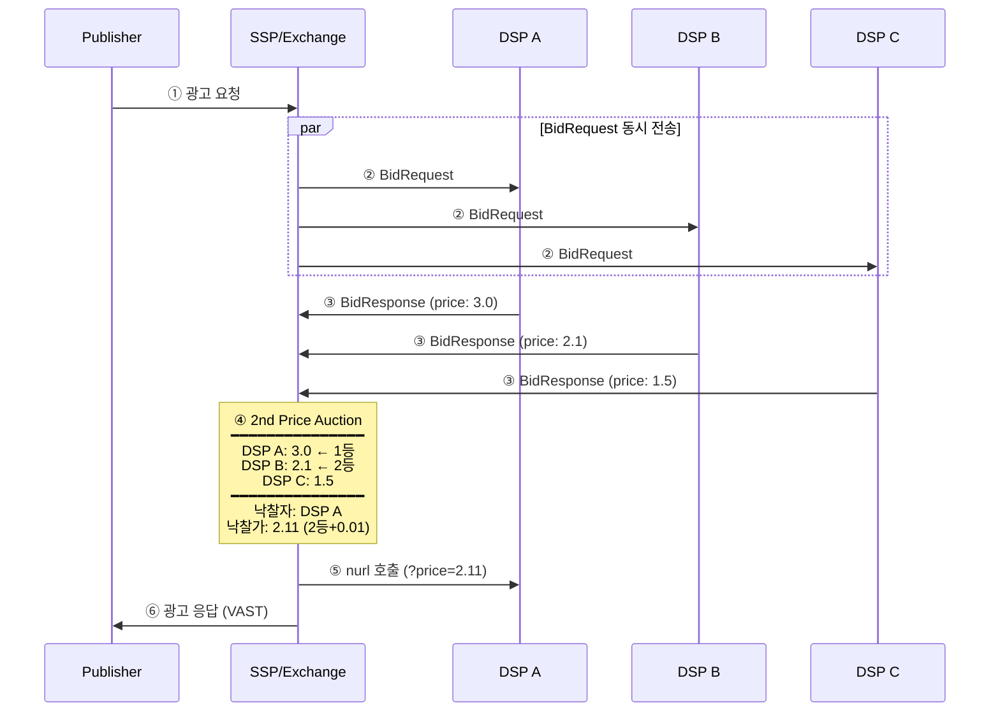

> RTB에서 사용되는 경매 방식 (1st Price, 2nd Price)에 대한 문서.

> **💡 Tip:**
>
> **1st Price Auction** (현재 표준):
> 미술품 경매에서 "500만원!" 외쳤으면 500만원을 그대로 냅니다.
> 단순하고 투명합니다. 다만 구매자들은 "진짜 가치가 500만원인데, 300만원만 불러볼까?" 하고 눈치 게임을 합니다.
> 이것을 **Bid Shading**이라고 합니다.
>
> **2nd Price Auction** (과거 표준):
> eBay 방식입니다. 1등이 낙찰되지만, 2등이 부른 가격 + 약간만 냅니다.
> "나는 500만원까지 괜찮아"라고 솔직하게 적어도 손해가 없어서, 솔직한 입찰을 유도합니다.
> 하지만 경매사가 2등 가격을 속일 수 있다는 문제가 있어서 퇴조했습니다.

## 경매 방식 비교

### 1st Price Auction
가장 높은 입찰자가 **자기 입찰가 그대로** 지불

```
DSP A: 3.0 입찰 → 낙찰 → 3.0 지불
DSP B: 2.1 입찰
DSP C: 1.5 입찰
```

### 2nd Price Auction
가장 높은 입찰자가 낙찰되지만, **2등 입찰가 + α** 만 지불

```
DSP A: 3.0 입찰 → 낙찰 → 2.11 지불 (2등 + 0.01)
DSP B: 2.1 입찰
DSP C: 1.5 입찰

DSP A는 3.0을 입찰했지만 실제로는 2.11만 지불!
```

---

## 시퀀스 다이어그램 (2nd Price)



---

## 왜 2nd Price를 사용했나?

### 솔직한 입찰 유도

```
1st Price 상황:
├─ "내 진짜 가치는 3.0인데..."
├─ "그대로 입찰하면 손해 아냐?"
├─ "2.5로 낮춰볼까?" (bid shading)
└─ 모두가 눈치 게임

2nd Price 상황:
├─ "내 진짜 가치는 3.0이야"
├─ "어차피 2등 가격만 내면 되잖아"
├─ "그냥 3.0 입찰해도 손해 없음"
└─ 솔직하게 입찰
```

---

## 2nd Price의 문제점

### SSP 조작 가능성

```
실제 입찰:
DSP A: 3.0
DSP B: 2.1

악의적 SSP:
"2등이 2.1이라고? 2.9였다고 하면 되지"
→ DSP A에게 2.91 청구 (뻥튀기)
```

DSP 입장에서 2등이 진짜 얼마였는지 검증 불가능.

---

## 현재 업계 트렌드: 1st Price

| | 2nd Price | 1st Price |
|--|-----------|-----------|
| 장점 | 솔직한 입찰 유도 | SSP 조작 방지, 투명 |
| 단점 | SSP 조작 가능 | bid shading 전략 필요 |
| 현재 | 과거 주류 | **현재 주류** |

### Header Bidding과 1st Price 전환

Header Bidding의 확산이 업계의 1st Price 전환을 가속했다. Header Bidding 환경에서는 여러 SSP/Exchange가 동시에 경쟁하며 Publisher에게 최고가를 제시한다. 이 구조에서는 각 Exchange가 독립적으로 경매를 수행하므로 통합된 2nd Price 경매를 운영하기 어렵고, 투명성 요구도 높아졌다. 결과적으로 Google을 포함한 주요 Exchange들이 2019년 전후로 1st Price로 전환했다.

### Bid Shading (1st Price에서의 입찰 최적화)

1st Price 경매에서 DSP는 진짜 가치 그대로 입찰하면 낙찰 후 과다 지불이 발생한다. 이를 방지하기 위해 **Bid Shading** 알고리즘을 사용한다.

```
Bid Shading 목표:
입찰가를 낮춰 지불 비용을 줄이면서도 낙찰 확률을 유지

입력값:
├─ 과거 낙찰 데이터 (win rate vs bid price)
├─ floor price (BidRequest.imp.bidfloor)
├─ ${AUCTION_MIN_TO_WIN} 매크로 (SSP 제공 시)
└─ 경쟁 강도 추정

출력값: 진짜 가치보다 낮은 최적 입찰가
```

---

## BidRequest.at 필드

`BidRequest.at` 필드는 경매 유형을 명시한다.

| 값 | 의미 |
|----|------|
| `1` | 1st Price Auction |
| `2` | 2nd Price Auction (기본값) |

DSP는 이 값을 읽어 입찰 전략을 결정해야 한다. `at=1`이면 Bid Shading 로직을 적용하고, `at=2`이면 진짜 가치에 근접한 가격으로 입찰한다.

---

## Floor Price와 경매 상호작용

`BidRequest.imp.bidfloor`는 해당 노출에 대한 최소 입찰가(Floor Price)다. 이 값 미만의 입찰은 SSP가 경매 전에 필터링한다.

```
Floor Price 상호작용 예시 (1st Price):
├─ bidfloor: 2.0
├─ DSP A: 3.0 입찰 → 낙찰 → 3.0 지불
├─ DSP B: 2.1 입찰 → 참가
├─ DSP C: 1.5 입찰 → bidfloor 미만, 필터링됨

Floor Price 상호작용 예시 (2nd Price):
├─ bidfloor: 2.0
├─ DSP A: 3.0 입찰 → 낙찰 → max(2등+0.01, bidfloor) 지불
├─ DSP A 단독 입찰 시 → 2.01 지불 (bidfloor + 0.01)
```

`bidfloorcur` 필드로 통화를 지정할 수 있으며, 미지정 시 USD가 기본값이다.

---

## ${AUCTION_PRICE} 및 ${AUCTION_MIN_TO_WIN} 매크로

낙찰 시 `nurl`에 실제 낙찰가가 치환되어 전달된다.

```
nurl: https://dsp.com/win?price=${AUCTION_PRICE}
        ↓
호출:  https://dsp.com/win?price=2.11
```

일부 SSP는 `${AUCTION_MIN_TO_WIN}` 매크로도 지원한다. 이 값은 해당 경매에서 낙찰되기 위한 최소 금액으로, DSP가 Bid Shading 모델을 사후 보정하는 데 활용할 수 있다.

```
${AUCTION_MIN_TO_WIN}: 낙찰에 필요했던 최소 입찰가
→ DSP가 실제로 2.5를 냈을 때 최소 2.11이면 됐다면
  다음 유사 경매에서 입찰가를 낮출 수 있음
```
