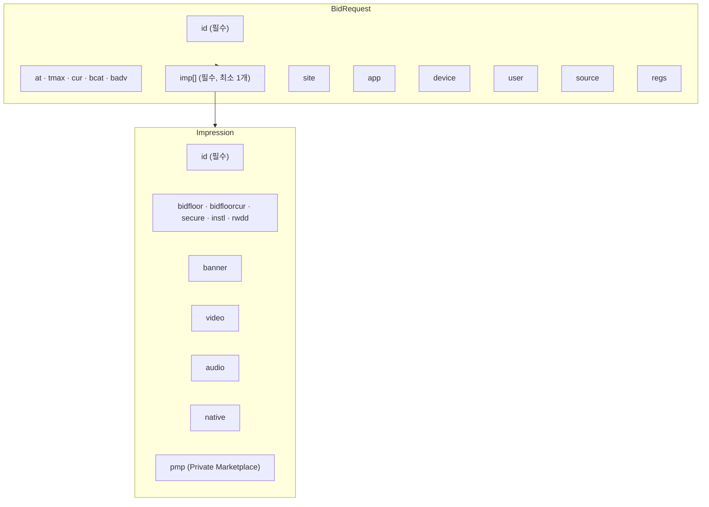
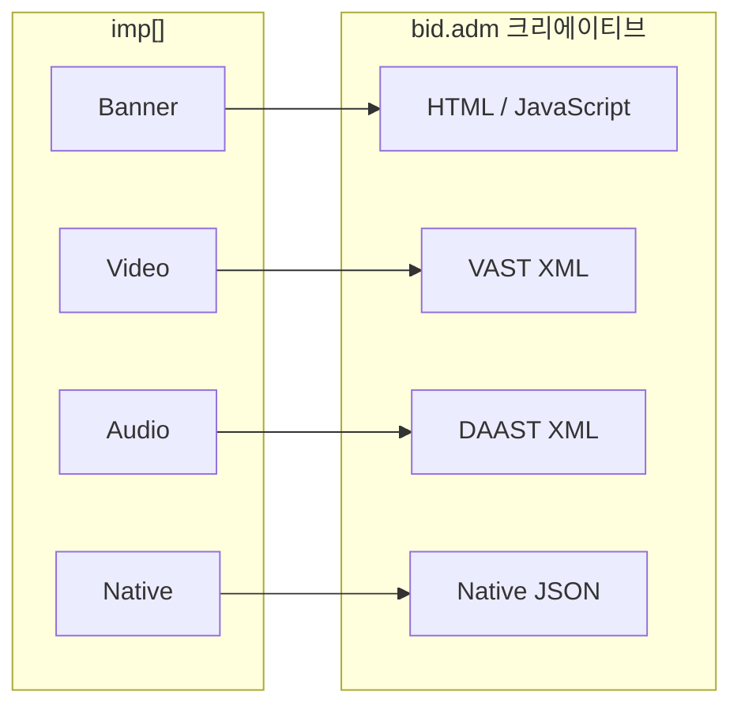

OpenRTB BidRequest는 SSP(Supply-Side Platform)가 DSP(Demand-Side Platform)에게 "지금 이 광고 지면이 경매에 나왔습니다"라고 알리는 요청 메시지다. 하나의 BidRequest 안에는 어떤 지면인지(Imp), 어떤 사이트/앱에서 왔는지(Site/App), 어떤 디바이스의 어떤 사용자인지(Device/User), 그리고 적용해야 할 규제(Regs)와 광고 공급망 정보(Source/SupplyChain)가 모두 담긴다.

이 글은 OpenRTB 2.6 스펙을 기준으로 BidRequest의 주요 객체를 구조와 함께 정리한다.

---

## BidRequest 전체 구조

BidRequest는 크게 세 가지 레이어로 구성된다. 최상위에는 요청 메타데이터와 컨텍스트 객체가 있고, 그 아래에 입찰 대상인 Impression 배열이 있으며, Impression 안에 실제 광고 형식(Banner/Video/Audio/Native)과 거래 조건(PMP/Deal)이 위치한다.



### 최상위 필드

BidRequest 루트에는 요청 식별자, 경매 방식, 허용 통화, 차단 목록 같은 메타데이터가 위치한다.

| 필드 | 타입 | 필수 | 설명 |
|------|------|------|------|
| `id` | string | O | 요청 고유 ID |
| `imp` | object[] | O | Impression 배열 (최소 1개) |
| `site` | object | △ | 웹사이트 정보 |
| `app` | object | △ | 앱 정보 |
| `dooh` | object | △ | 옥외광고(DOOH) 정보 |
| `device` | object | 권장 | 디바이스 정보 |
| `user` | object | 권장 | 사용자 정보 |
| `source` | object | - | 요청 소스 · Supply Chain |
| `regs` | object | - | 규제 및 Privacy 정보 |
| `at` | integer | - | 경매 타입 (1=1st Price, 2=2nd Price) |
| `tmax` | integer | - | 최대 응답 허용 시간 (ms) |
| `cur` | string[] | - | 허용 통화 (ISO-4217) |
| `bcat` | string[] | - | 차단 IAB 카테고리 |
| `badv` | string[] | - | 차단 광고주 도메인 |
| `bapp` | string[] | - | 차단 앱 번들 |

> △ = site, app, dooh 중 최소 하나 필수

---

## Imp 객체

Imp(Impression)는 경매에 나온 **광고 슬롯 하나**를 표현한다. 하나의 BidRequest에 여러 Imp가 포함될 수 있으며, 각 Imp에는 해당 슬롯이 어떤 광고 형식을 수용하는지, 최소 입찰가는 얼마인지, 전면 광고인지 여부 등이 명시된다.

| 필드 | 타입 | 필수 | 설명 |
|------|------|------|------|
| `id` | string | O | Imp 고유 ID |
| `banner` | object | △ | 배너 광고 정보 |
| `video` | object | △ | 비디오 광고 정보 |
| `audio` | object | △ | 오디오 광고 정보 |
| `native` | object | △ | 네이티브 광고 정보 |
| `pmp` | object | - | Private Marketplace 딜 정보 |
| `bidfloor` | float | - | 최소 입찰가 (CPM) |
| `bidfloorcur` | string | - | Floor 통화 (기본: USD) |
| `instl` | integer | - | 전면광고 여부 (0/1) |
| `secure` | integer | - | HTTPS 크리에이티브 필수 여부 (0/1) |
| `rwdd` | integer | - | 리워드 광고 여부 (0/1) |
| `tagid` | string | - | 광고 슬롯 태그 ID |
| `exp` | integer | - | Imp 유효 시간 (초) |

> △ = banner, video, audio, native 중 최소 하나 필수

### PMP (Private Marketplace) / Deal

PMP는 SSP가 특정 DSP에게만 입찰 자격을 부여하는 **우선 거래 경매**다. 퍼블리셔가 사전에 딜(Deal)을 생성하면, 초청받은 DSP만 해당 지면에 입찰할 수 있다. 일반 오픈 경매보다 높은 floor 가격이 적용되며, 프리미엄 인벤토리 보장을 전제로 한 계약 기반 거래다.

| 필드 | 타입 | 설명 |
|------|------|------|
| `pmp.private_auction` | integer | 0=오픈 경매도 허용, 1=딜 참여자만 입찰 가능 |
| `pmp.deals[].id` | string | 딜 식별자 (SSP와 DSP가 사전 합의한 값) |
| `pmp.deals[].bidfloor` | float | 딜별 최소 입찰가 (imp.bidfloor보다 우선 적용) |
| `pmp.deals[].at` | integer | 딜 경매 타입 (1=1st Price, 2=2nd Price, 3=Fixed) |
| `pmp.deals[].wseat` | string[] | 입찰 허용 시트(DSP 식별자) 목록 |

```json
{
  "imp": [{
    "id": "1",
    "banner": {"w": 300, "h": 250},
    "bidfloor": 1.0,
    "pmp": {
      "private_auction": 1,
      "deals": [{
        "id": "deal-vip-xyz",
        "bidfloor": 5.0,
        "bidfloorcur": "USD",
        "at": 1,
        "wseat": ["dsp-001", "dsp-002"]
      }]
    }
  }]
}
```

| 항목 | Open Auction | PMP |
|------|-------------|-----|
| 참여자 | 모든 DSP | 초청받은 DSP만 |
| 가격 | 시장 경쟁가 | 사전 합의된 floor 이상 |
| 접근성 | 제한 없음 | 딜 계약 필요 |
| 지면 품질 | 일반 | 프리미엄 보장 |

---

## 미디어 타입 객체

각 Imp 안에는 해당 슬롯이 수용 가능한 미디어 타입 객체가 하나 이상 포함된다. 동일한 Imp에 Banner와 Video를 함께 넣으면 멀티포맷 입찰을 허용한다는 의미다. DSP는 응답 시 어떤 형식으로 크리에이티브를 제공할지 `bid.mtype`으로 명시한다.



### Banner

배너는 이미지, HTML, 리치미디어 등 디스플레이 광고를 위한 객체다. `format` 배열로 여러 크기를 동시에 허용할 수 있으며, DSP는 그 중 하나를 선택해 응답한다.

| 필드 | 타입 | 설명 |
|------|------|------|
| `w` | integer | 너비 (픽셀) |
| `h` | integer | 높이 (픽셀) |
| `format` | object[] | 허용 크기 배열 (`{w, h}` 형식) |
| `pos` | integer | 광고 위치 (1=Above the Fold, 3=Below the Fold 등) |
| `btype` | integer[] | 차단할 배너 타입 |
| `battr` | integer[] | 차단할 크리에이티브 속성 |
| `mimes` | string[] | 허용 MIME 타입 |
| `api` | integer[] | 지원 API 프레임워크 |

### Video

비디오 객체는 인스트림(Pre-roll, Mid-roll, Post-roll)과 아웃스트림 광고 지면을 표현한다. DSP는 이 정보를 기반으로 적합한 크리에이티브(VAST XML)를 응답한다.

| 필드 | 타입 | 필수 | 설명 |
|------|------|------|------|
| `mimes` | string[] | 권장 | 지원 MIME 타입 (예: `video/mp4`) |
| `minduration` | integer | 권장 | 최소 광고 길이 (초) |
| `maxduration` | integer | 권장 | 최대 광고 길이 (초) |
| `protocols` | integer[] | 권장 | 지원 VAST 버전 목록 |
| `w` | integer | 권장 | 플레이어 너비 (픽셀) |
| `h` | integer | 권장 | 플레이어 높이 (픽셀) |
| `plcmt` | integer | 권장 | 배치 유형 (OpenRTB 2.6, `placement` 대체) |
| `placement` | integer | - | Deprecated. `plcmt` 사용 권장 |
| `linearity` | integer | - | 1=Linear(인스트림), 2=Non-linear(오버레이) |
| `startdelay` | integer | 권장 | 시작 지연 (0=프리롤, 양수=미드롤 시작 초, -1=일반 미드롤, -2=포스트롤) |
| `skip` | integer | - | 스킵 허용 여부 (1=허용, 0=불허) |
| `skipmin` | integer | - | 스킵 버튼 표시를 위한 최소 광고 길이 (초) |
| `skipafter` | integer | - | 광고 시작 후 스킵 가능 시점 (초) |
| `playbackmethod` | integer[] | - | 재생 방식 목록 |
| `api` | integer[] | - | 지원 API 프레임워크 |
| `podid` | string | - | Ad Pod 식별자 (CTV 컨텍스트, OpenRTB 2.6) |
| `podseq` | integer | - | Pod 순서 (0=Any, 1=First, -1=Last) |
| `slotinpod` | integer | - | Pod 내 슬롯 위치 (0=Any, 1=First, -1=Last) |

**plcmt 값** (OpenRTB 2.6에서 `placement` 대체): 1=Instream(프리롤/미드롤/포스트롤), 2=Accompanying Content(아웃스트림), 3=Interstitial(전면), 4=No Content/Standalone

**protocols 주요 값**: 2=VAST 2.0, 3=VAST 3.0, 5=VAST 2.0 Wrapper, 6=VAST 3.0 Wrapper, 7=VAST 4.0, 8=VAST 4.0 Wrapper

**playbackmethod 주요 값**: 1=Autoplay Sound On, 2=Autoplay Sound Off(모바일 표준), 3=Click-to-Play, 6=Viewport 진입 Sound Off

**Ad Pods (CTV)**: CTV 환경에서 연속 재생 광고 블록을 구성할 때 `podid`(슬롯 공유 식별자), `podseq`(Pod 순서), `slotinpod`(슬롯 위치)을 사용한다. `complete: 1`이면 체인 완전, `0`이면 일부 누락.

#### 유형별 설정 요약

| 유형 | `plcmt` | `startdelay` | `skip` | `rwdd` | `playbackmethod` |
|------|---------|-------------|--------|--------|-----------------|
| Pre-roll (인스트림) | 1 | 0 | 1 (skipafter=5) | 0 | 2 (음소거 자동재생) |
| Rewarded | 3 | 0 | 0 | 1 | 3 (클릭 재생) |
| Outstream | 4 | - | 1 | 0 | 2 또는 6 |

**Pre-roll 비디오 요청 예시**

```json
{
  "imp": [{
    "id": "imp-preroll-1",
    "video": {
      "mimes": ["video/mp4"],
      "minduration": 5,
      "maxduration": 30,
      "protocols": [2, 3, 5, 6, 7, 8],
      "w": 1280,
      "h": 720,
      "linearity": 1,
      "plcmt": 1,
      "startdelay": 0,
      "skip": 1,
      "skipmin": 5,
      "skipafter": 5,
      "playbackmethod": [2]
    }
  }]
}
```

### Audio

오디오 광고는 팟캐스트, 스트리밍 음악 서비스 등 오디오 콘텐츠 내 광고 지면을 표현한다. 응답 크리에이티브는 DAAST XML 형식이다.

| 필드 | 타입 | 필수 | 설명 |
|------|------|------|------|
| `mimes` | string[] | 권장 | 지원 MIME 타입 (예: `audio/mpeg`) |
| `minduration` | integer | 권장 | 최소 광고 길이 (초) |
| `maxduration` | integer | 권장 | 최대 광고 길이 (초) |
| `protocols` | integer[] | - | 지원 프로토콜 (9=DAAST 1.0, 10=DAAST 1.0 Wrapper) |
| `startdelay` | integer | - | 시작 지연 (Video와 동일한 규칙) |
| `feed` | integer | - | 피드 타입 (1=Music, 2=FM/AM, 3=Podcast) |
| `stitched` | integer | - | 서버사이드 스티칭 여부 (0/1) |

### Native

네이티브 광고는 피드 내 광고, 콘텐츠 추천 위젯 등 콘텐츠와 자연스럽게 어우러지는 광고 형식이다. 요청 스펙 자체를 JSON 문자열로 직렬화해 `request` 필드에 담는 독특한 구조를 갖는다.

| 필드 | 타입 | 필수 | 설명 |
|------|------|------|------|
| `request` | string | O | Native 요청 스펙 JSON (문자열로 직렬화) |
| `ver` | string | 권장 | Native 스펙 버전 (예: `"1.2"`) |
| `api` | integer[] | - | 지원 API 프레임워크 |
| `battr` | integer[] | - | 차단 크리에이티브 속성 |

```json
{
  "native": {
    "request": "{\"ver\":\"1.2\",\"assets\":[{\"id\":1,\"required\":1,\"img\":{\"type\":3,\"wmin\":300,\"hmin\":157}},{\"id\":2,\"required\":1,\"title\":{\"len\":90}},{\"id\":3,\"data\":{\"type\":2,\"len\":200}}]}",
    "ver": "1.2"
  }
}
```

---

## 컨텍스트 객체

컨텍스트 객체는 광고 요청이 발생한 환경을 DSP에게 알려준다. 어떤 사이트/앱에서 광고가 노출되는지(Site/App), 어떤 디바이스에서 접속했는지(Device), 어떤 사용자인지(User)를 기술한다. 타겟팅 정확도와 직결되는 정보이므로 DSP의 입찰 결정에 큰 영향을 준다.

### Site / App

`site`는 웹 퍼블리셔, `app`은 모바일 앱 퍼블리셔 환경을 담는다. 두 객체는 BidRequest에 동시에 포함될 수 없으며 환경에 따라 하나만 사용한다.

| 필드 | site | app | 설명 |
|------|------|-----|------|
| `id` | O | O | 사이트/앱 ID |
| `name` | O | O | 이름 |
| `domain` | O | O | 도메인 |
| `cat` | O | O | IAB 콘텐츠 카테고리 |
| `publisher` | O | O | 퍼블리셔 정보 (`id`, `name`) |
| `page` | O | - | 현재 페이지 URL |
| `ref` | O | - | 리퍼러 URL |
| `mobile` | O | - | 모바일 최적화 여부 (0/1) |
| `bundle` | - | O | 앱 번들 ID (패키지명) |
| `storeurl` | - | O | 앱스토어 URL |
| `ver` | - | O | 앱 버전 |

```json
{
  "site": {
    "id": "site-123",
    "domain": "news.example.com",
    "cat": ["IAB12"],
    "page": "https://news.example.com/article/123",
    "publisher": {"id": "pub-456", "name": "Example Media"}
  }
}
```

### Device

광고 요청이 발생한 디바이스 정보를 담는다. 타겟팅, 광고 ID 매칭, 위치 기반 광고에 핵심적으로 사용된다.

| 필드 | 타입 | 설명 |
|------|------|------|
| `ua` | string | User-Agent 문자열 |
| `sua` | object | Structured User-Agent (OpenRTB 2.6) |
| `ip` | string | IPv4 주소 |
| `ipv6` | string | IPv6 주소 |
| `geo` | object | 위치 정보 (하단 참조) |
| `devicetype` | integer | 디바이스 타입 (1=Mobile/Tablet, 2=PC, 3=CTV, 4=Phone, 5=Tablet) |
| `make` | string | 제조사 |
| `model` | string | 모델명 |
| `os` | string | OS (예: `iOS`, `Android`) |
| `osv` | string | OS 버전 |
| `language` | string | 언어 코드 (ISO-639-1) |
| `connectiontype` | integer | 연결 타입 (0=Unknown, 1=Ethernet, 2=WiFi, 3~7=Cellular) |
| `ifa` | string | 광고 ID (IDFA/GAID) |
| `dnt` | integer | Do Not Track (0/1) |
| `lmt` | integer | Limit Ad Tracking (0/1) |

### User

광고 수신자인 사용자 정보를 담는다. 타겟팅 세그먼트, 확장 ID(eids), GDPR 동의 문자열 등이 포함된다.

| 필드 | 타입 | 설명 |
|------|------|------|
| `id` | string | Exchange 사용자 ID |
| `buyeruid` | string | DSP가 인식하는 사용자 ID |
| `yob` | integer | 출생년도 |
| `gender` | string | 성별 (M/F/O) |
| `keywords` | string | 관심사 키워드 |
| `geo` | object | 사용자 홈 위치 |
| `data` | object[] | DMP 세그먼트 데이터 |
| `eids` | object[] | 확장 ID 배열 (Universal ID 등) |
| `consent` | string | GDPR TCF 동의 문자열 |

```json
{
  "user": {
    "id": "user-12345",
    "data": [
      {
        "id": "dmp-provider",
        "segment": [{"id": "seg-123"}, {"id": "seg-456"}]
      }
    ],
    "eids": [
      {"source": "liveramp.com", "uids": [{"id": "abc123", "atype": 3}]}
    ]
  }
}
```

### Geo

`device.geo`(현재 위치)와 `user.geo`(홈 위치) 두 곳에 중첩된다. 주요 필드: `lat`/`lon`(위경도), `country`(ISO-3166-1-alpha-3), `region`(ISO-3166-2), `city`, `type`(1=GPS, 2=IP, 3=사용자 제공).

---

## 규제 & 투명성

### Regs — 개인정보 규제 신호

Regs 객체는 해당 요청에 적용되는 개인정보 보호 규제를 명시한다. DSP는 이 정보를 기반으로 타겟팅 방식과 데이터 사용 범위를 결정해야 한다.

| 필드 | 타입 | 설명 |
|------|------|------|
| `coppa` | integer | COPPA(아동 보호법) 적용 여부 (0/1) |
| `gdpr` | integer | GDPR 적용 여부 (0/1) |
| `us_privacy` | string | CCPA 프라이버시 문자열 (예: `"1YNN"`) |
| `gpp` | string | GPP 동의 문자열 |
| `gpp_sid` | integer[] | GPP 섹션 ID 배열 |

Privacy 신호는 세 객체에 분산된다: `regs`(규제 플래그), `user.consent`(TCF 동의 문자열), `device.dnt`/`device.lmt`(디바이스 레벨 추적 제한).

```json
{
  "regs": {
    "coppa": 0,
    "gdpr": 1,
    "us_privacy": "1YNN",
    "gpp": "DBACNYA~CPXxRfAPXxRfAAfKABENB-CgAAAAAAAAAAYgAAAAAAAA~1YNN",
    "gpp_sid": [2, 6]
  },
  "user": {
    "consent": "CPXxRfAPXxRfAAfKABENB-CgAAAAAAAAAAYgAAAAAAAA"
  },
  "device": {
    "dnt": 0,
    "lmt": 0
  }
}
```

### Source & Supply Chain

Supply Chain(schain)은 광고 요청이 거쳐온 모든 중간 거래자(Publisher → SSP → Exchange → DSP)를 투명하게 기록한다. DSP는 이 정보로 요청 경로의 신뢰성을 검증하고 의심스러운 중간자가 있으면 입찰을 거부할 수 있다.

```json
{
  "source": {
    "schain": {
      "complete": 1,
      "ver": "1.0",
      "nodes": [
        {
          "asi": "exchange1.com",
          "sid": "1234",
          "hp": 1,
          "rid": "req-abc",
          "name": "Exchange 1"
        },
        {
          "asi": "exchange2.com",
          "sid": "5678",
          "hp": 1
        }
      ]
    }
  }
}
```

#### schain Node 필드

| 필드 | 타입 | 필수 | 설명 |
|------|------|------|------|
| `asi` | string | O | 인증된 판매자 도메인 |
| `sid` | string | O | 판매자 ID |
| `hp` | integer | O | 헤더비딩 파트너 여부 (0/1) |
| `rid` | string | - | 요청 ID |
| `name` | string | - | 노드 이름 |
| `domain` | string | - | 노드 도메인 |

`complete: 1`은 체인이 완전하다는 의미다. 중간 경로가 누락된 경우 `complete: 0`으로 설정한다.

---

## BidRequest 전체 예시

아래는 모바일 앱에서 발생한 인스트림 비디오 광고 요청의 현실적인 예시다. GDPR 비적용 환경이며, 리워드 광고가 아닌 스킵 가능한 Pre-roll 지면이다.

```json
{
  "id": "1234567890abcdef",
  "at": 1,
  "tmax": 200,
  "cur": ["USD"],
  "imp": [
    {
      "id": "imp-1",
      "tagid": "video-preroll-top",
      "video": {
        "mimes": ["video/mp4", "video/webm"],
        "minduration": 5,
        "maxduration": 30,
        "protocols": [2, 3, 5, 6, 7, 8],
        "w": 1280,
        "h": 720,
        "linearity": 1,
        "plcmt": 1,
        "startdelay": 0,
        "skip": 1,
        "skipmin": 5,
        "skipafter": 5,
        "playbackmethod": [2]
      },
      "bidfloor": 5.0,
      "bidfloorcur": "USD",
      "secure": 1
    }
  ],
  "app": {
    "id": "app-12345",
    "name": "Cool Game",
    "bundle": "com.example.coolgame",
    "storeurl": "https://play.google.com/store/apps/details?id=com.example.coolgame",
    "cat": ["IAB9-30"],
    "ver": "2.0",
    "publisher": {
      "id": "pub-67890",
      "name": "Example Publisher"
    }
  },
  "device": {
    "ua": "Mozilla/5.0 (iPhone; CPU iPhone OS 15_0 like Mac OS X) AppleWebKit/605.1.15",
    "ip": "203.0.113.100",
    "geo": {
      "lat": 37.5665,
      "lon": 126.9780,
      "country": "KOR",
      "region": "11",
      "city": "Seoul"
    },
    "devicetype": 4,
    "make": "Apple",
    "model": "iPhone",
    "os": "iOS",
    "osv": "15.0",
    "language": "ko",
    "connectiontype": 2,
    "ifa": "AEBE52E7-03EE-455A-B3C4-E57283966239",
    "lmt": 0
  },
  "user": {
    "id": "user-abc123",
    "eids": [{"source": "liveramp.com", "uids": [{"id": "lr-uid-xyz", "atype": 3}]}]
  },
  "regs": {
    "coppa": 0,
    "gdpr": 0
  },
  "source": {
    "schain": {
      "complete": 1,
      "ver": "1.0",
      "nodes": [
        {
          "asi": "ssp.example.com",
          "sid": "pub-67890",
          "hp": 1,
          "rid": "1234567890abcdef"
        }
      ]
    }
  }
}
```

---

## 참고 자료

- [OpenRTB 2.6 Specification (GitHub)](https://github.com/InteractiveAdvertisingBureau/openrtb2.x)
- [IAB Tech Lab - OpenRTB](https://iabtechlab.com/standards/openrtb/)
- [IAB VAST 4.2](https://iabtechlab.com/standards/vast/)
- [OpenRTB Native Ads 1.2](https://www.iab.com/guidelines/openrtb-native/)
- [IAB TCF 2.0 (GDPR)](https://iabeurope.eu/tcf-2-0/)
