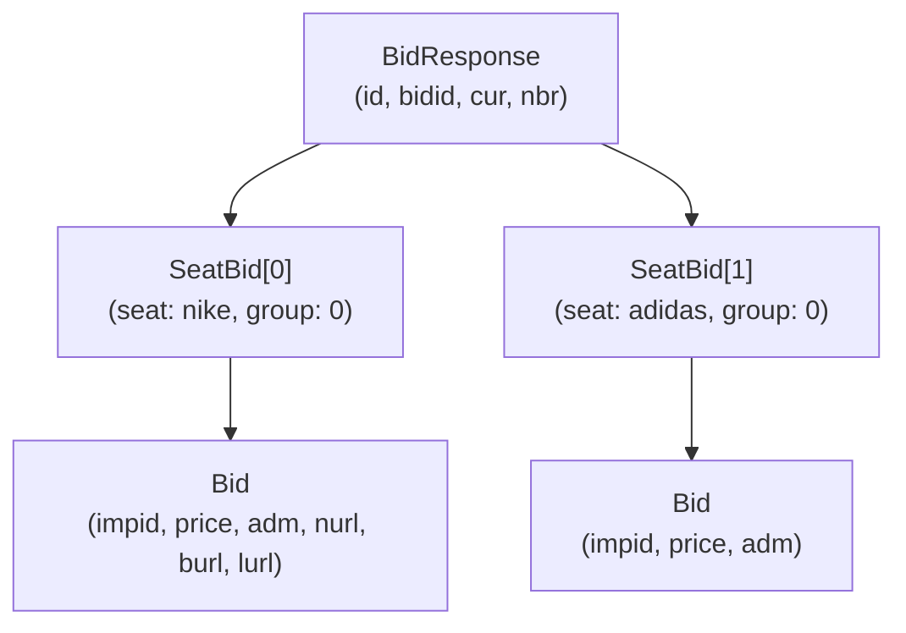
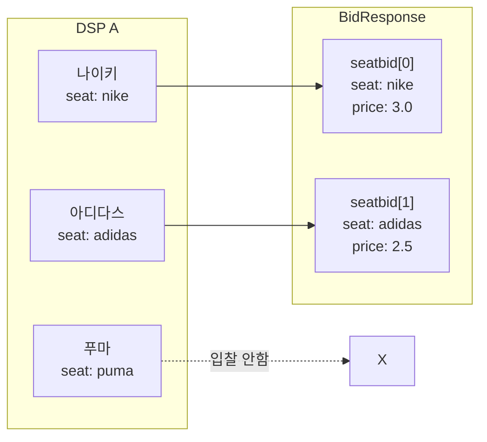
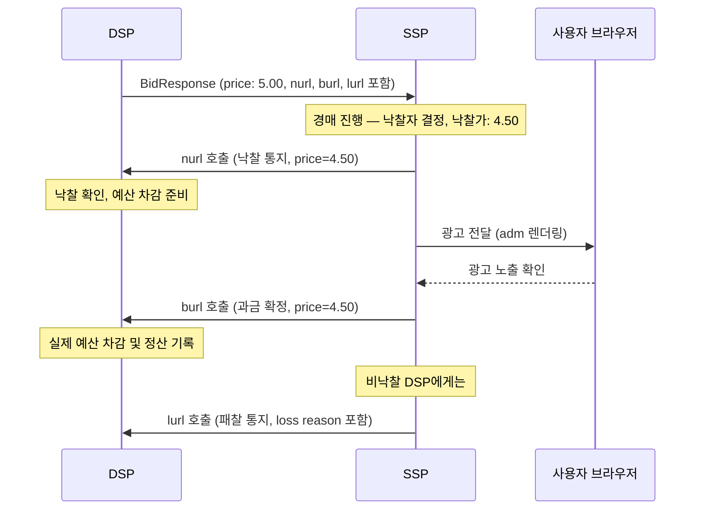

BidRequest가 "이런 광고 공간이 있어요"라는 안내문이라면, BidResponse는 "이 광고를 보여주고 싶어요, 이만큼 낼게요"라는 **입찰서**다. DSP(Demand-Side Platform)는 수십 밀리초 안에 입찰 여부를 결정하고, 이 입찰서를 SSP에 돌려보낸다.

입찰서에는 몇 가지 핵심 질문에 대한 답이 담겨 있다.

- **어떤 지면에 입찰하는가?** (`impid` — BidRequest의 imp.id와 1:1 대응)
- **얼마를 제시하는가?** (`price` — CPM 단위)
- **어떤 광고를 보여줄 것인가?** (`adm` — HTML, VAST XML, Native JSON 등)
- **낙찰/패찰 시 어디로 알릴 것인가?** (`nurl`, `burl`, `lurl`)

이 글은 BidResponse의 전체 구조를 계층 순서대로 살펴보고, 각 레이어의 핵심 개념을 하나의 흐름으로 정리한다.

---

## 전체 계층 구조

BidResponse는 3단계 계층으로 구성된다.



트리 형태로 보면 다음과 같다.

```
BidResponse
├── id            (BidRequest의 id와 동일)
├── bidid         (DSP가 생성한 응답 추적 ID, 선택)
├── cur           (통화, 기본값 "USD")
├── nbr           (No-Bid 이유 코드, No-Bid 시 사용)
├── ext
└── seatbid[]
    ├── seat      (광고주/바이어 식별자)
    ├── group     (묶음 낙찰 여부, 0=독립, 1=all-or-nothing)
    ├── ext
    └── bid[]
        ├── id        (입찰 고유 ID)
        ├── impid     (대응하는 imp.id)
        ├── price     (CPM 입찰가)
        ├── adid      (사전 등록 광고 ID)
        ├── adm       (광고 마크업)
        ├── nurl      (Win Notice URL)
        ├── burl      (Billing Notice URL)
        ├── lurl      (Loss Notice URL)
        ├── adomain[] (광고주 도메인)
        ├── cid       (캠페인 ID)
        ├── crid      (크리에이티브 ID)
        ├── mtype     (미디어 타입, OpenRTB 2.6)
        ├── dealid    (PMP Deal ID)
        ├── w, h      (광고 크기, 픽셀)
        ├── exp       (입찰 만료 시간, 초)
        └── ext
```

---

## BidResponse 최상위 필드

| 필드 | 타입 | 필수 | 설명 |
|------|------|------|------|
| `id` | string | 필수 | BidRequest의 `id`와 동일한 값. SSP가 요청·응답을 매칭하는 열쇠 |
| `seatbid` | object[] | 조건부 | 입찰 목록. 낙찰 의사가 있을 때 포함 |
| `bidid` | string | 선택 | DSP가 자체 생성한 응답 추적 ID |
| `cur` | string | 선택 | 입찰 통화. 기본값 `"USD"` |
| `nbr` | int | 선택 | No-Bid 이유 코드. No-Bid 응답 시 사용 |
| `ext` | object | 선택 | 확장 필드 |

`id` 필드는 반드시 BidRequest의 `id`를 그대로 에코해야 한다. SSP가 응답이 어느 요청에 대응하는지 확인하는 기본 수단이다.

---

## SeatBid — DSP 내 광고주별 묶음

### Seat이란 무엇인가

DSP는 여러 광고주를 대행한다. 부동산 중개사가 여러 고객을 대리해서 같은 매물에 입찰하는 것과 같다.

```
DSP A
├── Seat "advertiser-nike"    (나이키)
├── Seat "advertiser-adidas"  (아디다스)
└── Seat "advertiser-puma"    (푸마)
```

`seat` 필드에 이 식별자를 담으면 SSP는 특정 광고주만 선택적으로 필터링할 수 있다. DSP 전체를 차단하지 않고도 나이키만 특정 매체에서 제외하는 것이 가능해진다.

### SeatBid 필드

| 필드 | 타입 | 필수 | 설명 |
|------|------|------|------|
| `bid` | object[] | 필수 | 해당 seat의 입찰 목록 |
| `seat` | string | 권장 | 광고주/바이어 식별자. 필터링·정산 분리에 사용 |
| `group` | integer | 선택 | `0`(기본): 각 bid는 독립 낙찰 가능. `1`: 이 seatbid의 모든 bid가 동시에 낙찰되어야 함 |
| `ext` | object | 선택 | 확장 필드 |

### group 필드 — 묶음 입찰

`group = 1`은 "이 seatbid 안의 bid가 **모두 낙찰되거나 모두 탈락**해야 한다"는 의미다. 광고주가 배너와 비디오를 동시에 게재하려 할 때, 둘 중 하나만 낙찰되는 상황을 방지하기 위해 사용한다.

```json
{
  "seatbid": [
    {
      "seat": "advertiser-samsung",
      "group": 1,
      "bid": [
        { "id": "bid-1", "impid": "imp-banner", "price": 2.0, "adm": "<div>배너 소재</div>" },
        { "id": "bid-2", "impid": "imp-video",  "price": 3.5, "adm": "<?xml ...><VAST>...</VAST>" }
      ]
    }
  ]
}
```

`imp-banner`와 `imp-video` 중 어느 하나라도 낙찰되지 못하면 전체 seatbid가 무효 처리된다. 단, SSP가 명시적으로 group 입찰을 지원해야 한다. 미지원 SSP는 group 값을 무시하고 개별 bid로 처리할 수 있다.

### 다중 광고주 시나리오

하나의 DSP가 나이키와 아디다스를 동시에 대행할 때 BidResponse는 다음과 같이 구성된다.



SSP는 seatbid 배열을 순회하며 각 bid를 경매에 참여시킨다. `seat` 정보 덕분에 DSP 전체가 아닌 특정 광고주만 블랙리스트 처리할 수 있고, 광고주별 정산 리포팅도 분리된다.

### seat을 활용한 SSP 처리

| 용도 | 설명 |
|------|------|
| **광고주 필터링** | 특정 seat만 블랙리스트 처리 가능 |
| **투명성** | 어떤 광고주가 입찰했는지 파악 |
| **정산 분리** | 광고주별 빌링·리포팅 가능 |
| **경쟁 조정** | 같은 DSP 내 광고주끼리 경쟁 관리 |

---

## Bid 객체 핵심 필드

| 필드 | 타입 | 필수 | 설명 |
|------|------|------|------|
| `id` | string | 필수 | 이 입찰의 고유 ID (DSP 생성) |
| `impid` | string | 필수 | BidRequest의 `imp[].id`와 매칭 |
| `price` | float | 필수 | **CPM** 입찰가 |
| `adid` | string | 선택 | 사전 등록된 광고 참조 ID |
| `adm` | string | 권장 | 광고 마크업 (HTML, VAST XML, Native JSON 등) |
| `nurl` | string | 선택 | Win Notice URL. 낙찰 시 SSP가 서버사이드 호출 |
| `burl` | string | 선택 | Billing Notice URL. 실제 과금 이벤트 시 SSP가 호출 |
| `lurl` | string | 선택 | Loss Notice URL. 낙찰 실패 시 SSP가 서버사이드 호출 |
| `adomain` | string[] | 권장 | 광고주 도메인 목록 (블록리스트 검사에 사용) |
| `cid` | string | 선택 | 캠페인 ID |
| `crid` | string | 권장 | 크리에이티브 ID |
| `mtype` | int | 권장 | 미디어 타입 (OpenRTB 2.6 추가) |
| `dealid` | string | 선택 | PMP Deal ID. BidRequest의 deal.id와 매칭 |
| `w` | int | 권장 | 광고 너비 (픽셀) |
| `h` | int | 권장 | 광고 높이 (픽셀) |
| `exp` | int | 선택 | 입찰 만료 시간 (초). 기본값 3600 |
| `ext` | object | 선택 | 확장 필드 |

`price`는 **CPM(Cost Per Mille)** 단위다. `price: 2.5`는 1,000회 노출당 $2.5를 의미한다. RTB 경매에서 노출 기반 실시간 비교가 표준이기 때문에 CPM이 기본 단위로 정착해 있다.

---

## adm 필드 — 미디어 타입별 광고 마크업

`adm`은 낙찰 후 실제로 보여줄 광고의 본문이다. 경매에서 낙찰된 후 구매자가 실물을 보내주는 것과 같다. 미디어 타입에 관계없이 항상 **단일 문자열(string)** 이다.

### mtype 값 (OpenRTB 2.6)

| mtype | 미디어 타입 | adm 형식 | 내용 |
|-------|-----------|---------|------|
| 1 | Banner | HTML String | 브라우저가 직접 렌더링하는 HTML 태그 |
| 2 | Video | XML String (VAST) | `<VAST>` 또는 `<?xml`로 시작하는 VAST 문서 |
| 3 | Audio | XML String (DAAST) | `<DAAST>`로 시작하는 DAAST 문서 |
| 4 | Native | JSON String | Stringify된 Native Response Object |

OpenRTB 2.6에서는 `bid.mtype`으로 미디어 타입을 명시적으로 선언하도록 권고한다. `mtype`이 있으면 adm 내용을 파싱해 타입을 추론할 필요가 없어진다.

### 1. Banner — HTML String

Publisher 측 렌더러가 이 HTML을 iframe 또는 div에 삽입하여 표시한다.

```json
{
  "id": "bid-1",
  "impid": "imp-1",
  "price": 5.0,
  "mtype": 1,
  "w": 300,
  "h": 250,
  "adm": "<a href='https://adserver.com/click'></a>",
  "adomain": ["advertiser.com"],
  "crid": "creative-123"
}
```

### 2. Video — VAST XML String

`adm`에 VAST(Video Ad Serving Template) XML 문서가 문자열로 포함된다. 클라이언트의 VAST 플레이어가 이를 파싱하여 영상을 재생한다. JSON 문자열 안에 XML을 포함하므로 따옴표(`"`)는 `\"`로 이스케이프된다.

```json
{
  "id": "bid-2",
  "impid": "imp-2",
  "price": 8.0,
  "mtype": 2,
  "adm": "<?xml version=\"1.0\" encoding=\"UTF-8\"?><VAST version=\"4.0\"><Ad><InLine><AdSystem>DSP</AdSystem><AdTitle>Example Video Ad</AdTitle><Creatives><Creative><Linear><Duration>00:00:30</Duration><MediaFiles><MediaFile type=\"video/mp4\" width=\"1280\" height=\"720\">https://cdn.com/video.mp4</MediaFile></MediaFiles></Linear></Creative></Creatives></InLine></Ad></VAST>",
  "adomain": ["advertiser.com"],
  "crid": "creative-video-456"
}
```

### 3. Audio — DAAST XML String

DAAST(Digital Audio Ad Serving Template)는 VAST의 오디오 전용 파생 규격이다.

```json
{
  "id": "bid-3",
  "impid": "imp-3",
  "price": 4.5,
  "mtype": 3,
  "adm": "<DAAST version=\"1.0\"><Ad><InLine><AdSystem>DSP</AdSystem><AdTitle>Example Audio Ad</AdTitle><Creatives><Creative><Linear><Duration>00:00:15</Duration><MediaFiles><MediaFile type=\"audio/mpeg\">https://cdn.com/audio.mp3</MediaFile></MediaFiles></Linear></Creative></Creatives></InLine></Ad></DAAST>",
  "adomain": ["advertiser.com"],
  "crid": "creative-audio-789"
}
```

### 4. Native — JSON String

`adm`에 Native Response Object를 JSON으로 직렬화(Stringify)한 문자열이 포함된다. 수신 측에서 이 문자열을 JSON으로 파싱하면 `assets` 배열이 나온다. **반드시 Stringify해야 한다.** JSON 객체를 그대로 넣으면 OpenRTB 스키마 위반이다.

```json
{
  "id": "bid-4",
  "impid": "imp-4",
  "price": 3.5,
  "mtype": 4,
  "adm": "{\"native\":{\"link\":{\"url\":\"https://advertiser.com/landing\"},\"assets\":[{\"id\":1,\"title\":{\"text\":\"광고 제목\"}},{\"id\":2,\"img\":{\"url\":\"https://cdn.com/img.jpg\",\"w\":1200,\"h\":627}},{\"id\":3,\"data\":{\"value\":\"광고 설명 문구\"}}]}}",
  "adomain": ["advertiser.com"],
  "crid": "native-creative-101"
}
```

adm 문자열을 파싱한 실제 구조:

```json
{
  "native": {
    "link": { "url": "https://advertiser.com/landing" },
    "assets": [
      { "id": 1, "title": { "text": "광고 제목" } },
      { "id": 2, "img":  { "url": "https://cdn.com/img.jpg", "w": 1200, "h": 627 } },
      { "id": 3, "data": { "value": "광고 설명 문구" } }
    ]
  }
}
```

### adm 타입 감지 (mtype 미지정 시)

`mtype`이 명시되지 않은 레거시 응답을 처리해야 할 때는 adm 내용 기반으로 감지한다.

```
1. bid.mtype 필드 확인 (1=Banner, 2=Video, 3=Audio, 4=Native)
   → 명시된 경우 해당 형식으로 파싱

2. mtype 미지정 시 adm 내용 기반 감지:
   - "<VAST" 또는 "<?xml"로 시작 → Video (VAST XML)
   - "<DAAST"로 시작              → Audio (DAAST XML)
   - "{"로 시작하고 "assets" 포함  → Native (JSON String)
   - 그 외                        → Banner (HTML String)
```

---

## URL 생명주기 — nurl / burl / lurl

입찰서를 제출한 후 세 가지 결과 알림이 서버 간(S2S) 방식으로 전달된다.

- **nurl** — 경매에서 "낙찰!"을 외치는 순간. 아직 돈이 빠져나가지 않는다.
- **burl** — 광고가 실제로 사용자에게 보여진 후 계좌에서 돈이 빠져나가는 순간.
- **lurl** — "아쉽지만 이번엔 떨어졌습니다" 통보. 왜 떨어졌는지 사유도 전달된다.

nurl(낙찰 알림)과 burl(과금)은 시점이 다르다. 낙찰되었다고 바로 과금하지 않고, 광고가 실제로 화면에 보여진 후에 과금한다.

### 비교표

| 필드 | 풀네임 | 호출 주체 | 호출 시점 | 역할 |
|------|--------|----------|----------|------|
| `nurl` | Notice URL | SSP 서버 | 경매 낙찰 직후 | 낙찰 통지, 예산·로그 관리 |
| `burl` | Billing URL | SSP 서버 | 광고 노출 확인 후 | 재무적 청구 기준점 (OpenRTB 2.5+) |
| `lurl` | Loss URL | SSP 서버 | 경매 패배 시 | 패찰 통지, 패찰 이유 전달 |

`burl`이 없는 경우에만 `nurl`이 청구 대리 역할을 한다. 세 URL 모두 클라이언트(브라우저)가 아닌 **SSP 서버가 직접 호출**한다.

### 시퀀스 다이어그램



### 매크로 치환

nurl/burl/lurl에는 매크로가 포함되며 SSP가 호출 시 실제 값으로 치환한다.

```
https://dsp.com/win?price=${AUCTION_PRICE}&bid=${AUCTION_BID_ID}
           ↓ SSP가 치환
https://dsp.com/win?price=4.50&bid=bid-123
```

| 매크로 | 설명 |
|--------|------|
| `${AUCTION_PRICE}` | 최종 낙찰가 (Clearing Price). 암호화 전송 권고 |
| `${AUCTION_ID}` | 경매 식별자 (BidRequest.id) |
| `${AUCTION_BID_ID}` | 입찰 식별자 (BidResponse.bidid) |
| `${AUCTION_IMP_ID}` | 노출 슬롯 식별자 (imp.id) |
| `${AUCTION_SEAT_ID}` | DSP 시트 식별자 |
| `${AUCTION_AD_ID}` | 광고 식별자 (bid.adid) |
| `${AUCTION_LOSS}` | 패찰 이유 코드 (lurl 전용) |
| `${AUCTION_CURRENCY}` | 통화 |

`${AUCTION_PRICE}`는 평문 전송 시 중간자 공격에 노출될 수 있다. 실제 구현에서는 AES-128 암호화 후 Base64URL 인코딩된 형태로 전송하는 것이 일반적이다.

### nurl의 Proxy 방식 (부록)

일반적으로 DSP는 `adm` 필드에 광고 마크업을 직접 포함한다. 그러나 페이로드 크기 절감 또는 보안 목적으로 `adm`을 비워두고 `nurl`만 전달하는 방식도 허용된다. 이 경우 SSP가 `nurl`을 호출하면 DSP가 HTTP 응답 본문으로 `adm`을 반환한다.

```
일반 방식: BidResponse.adm에 HTML/XML/JSON 직접 포함
Proxy 방식: BidResponse.adm 비워둠 → nurl 호출 응답으로 adm 반환
```

Proxy 방식은 DSP 응답 지연이 광고 노출에 직접 영향을 미치므로 주의가 필요하다.

---

## No-Bid 응답

DSP가 입찰하지 않을 경우 두 가지 방법으로 응답한다.

**방법 1: HTTP 204 No Content** — 가장 단순한 방법. 응답 본문 없이 204만 반환한다.

**방법 2: HTTP 200 + nbr 코드**

```json
{
  "id": "req-123",
  "nbr": 8
}
```

SSP 구현 시 `seatbid`가 빈 배열인 경우도 No-Bid로 처리해야 한다.

### nbr (No-Bid Reason) 코드

| 값 | 의미 |
|----|------|
| 0 | Unknown Error |
| 1 | Technical Error |
| 2 | Invalid Request |
| 3 | Known Web Spider |
| 4 | Suspected Non-Human Traffic |
| 5 | Cloud/Data Center/Proxy IP |
| 6 | Unsupported Device |
| 7 | Blocked Publisher or Site |
| 8 | Unmatched User |
| 9 | Daily Reader Cap Met |
| 10 | Daily Domain Cap Met |

---

## 실전 검증 체크리스트

BidResponse 파싱 및 처리 로직 구현 시 확인해야 할 항목이다.

**필수 필드 검증**
- [ ] `id`가 BidRequest의 `id`와 일치하는가
- [ ] `seatbid[].bid[].impid`가 BidRequest의 `imp[].id` 중 하나와 매칭되는가
- [ ] `price`가 0 이상의 유효한 숫자인가
- [ ] `price`가 해당 imp의 `bidfloor`를 충족하는가

**광고 마크업 검증**
- [ ] `adm` 또는 사전 등록 `adid` 중 하나가 반드시 있는가
- [ ] `mtype`과 `adm` 내용이 일치하는가 (비디오 imp에 Banner adm 혼입 방지)
- [ ] `adomain`이 블록리스트에 없는가

**URL 처리**
- [ ] `nurl` 호출은 낙찰 확정 직후 서버사이드에서 수행하는가
- [ ] `nurl` 호출 전 `${AUCTION_PRICE}` 등 매크로를 실제 값으로 치환했는가
- [ ] `burl`과 `nurl`의 호출 시점을 정확히 구분하고 있는가
- [ ] `lurl`은 비낙찰 시 서버사이드에서 호출하는가
- [ ] `nurl` 중복 호출(네트워크 재시도)에 대한 멱등성(Idempotency) 처리가 있는가

**PMP Deal 처리**
- [ ] Deal 입찰인 경우 `dealid`가 BidRequest의 `imp[].pmp.deals[].id`와 매칭되는가
- [ ] Deal 입찰가가 `deal.bidfloor`를 충족하는가

**No-Bid 처리**
- [ ] HTTP 204와 `nbr` 포함 200 응답 모두 No-Bid로 처리하는가
- [ ] `seatbid`가 빈 배열인 경우도 No-Bid로 처리하는가

---

## 완전한 JSON 예시

### Banner 단일 입찰

```json
{
  "id": "req-banner-123",
  "bidid": "dsp-resp-456",
  "cur": "USD",
  "seatbid": [{
    "seat": "seat-001",
    "bid": [{
      "id": "bid-001",
      "impid": "imp-1",
      "price": 1.75,
      "mtype": 1,
      "w": 300,
      "h": 250,
      "adm": "<a href='https://adserver.com/click'></a>",
      "adomain": ["advertiser.com"],
      "cid": "campaign-99",
      "crid": "creative-banner-01",
      "nurl": "https://dsp.com/win?price=${AUCTION_PRICE}&bid=${AUCTION_BID_ID}",
      "burl": "https://dsp.com/bill?price=${AUCTION_PRICE}"
    }]
  }]
}
```

### Video 입찰 (VAST in adm, 전체 URL 포함)

```json
{
  "id": "req-video-123",
  "cur": "USD",
  "seatbid": [{
    "seat": "seat-001",
    "bid": [{
      "id": "bid-video-001",
      "impid": "imp-video-1",
      "price": 4.50,
      "mtype": 2,
      "w": 1280,
      "h": 720,
      "adm": "<?xml version=\"1.0\"?><VAST version=\"4.0\">...</VAST>",
      "adomain": ["brand.com"],
      "crid": "creative-video-01",
      "nurl": "https://dsp.com/win?price=${AUCTION_PRICE}",
      "burl": "https://dsp.com/bill?price=${AUCTION_PRICE}",
      "lurl": "https://dsp.com/loss?reason=${AUCTION_LOSS}"
    }]
  }]
}
```

### Multi-Seat 응답 (다중 광고주 동시 입찰)

```json
{
  "id": "req-multi-123",
  "cur": "USD",
  "seatbid": [
    {
      "seat": "seat-brand-a",
      "group": 0,
      "bid": [{
        "id": "bid-a-001",
        "impid": "imp-1",
        "price": 3.20,
        "mtype": 1,
        "adm": "<div>나이키 배너</div>",
        "adomain": ["nike.com"],
        "crid": "creative-a-01"
      }]
    },
    {
      "seat": "seat-brand-b",
      "group": 0,
      "bid": [{
        "id": "bid-b-001",
        "impid": "imp-1",
        "price": 2.80,
        "mtype": 1,
        "adm": "<div>아디다스 배너</div>",
        "adomain": ["adidas.com"],
        "crid": "creative-b-01"
      }]
    }
  ]
}
```

### No-Bid 응답

```json
{
  "id": "req-123",
  "nbr": 8
}
```
