> **💡 Tip:** OpenRTB의 전체 흐름은 **온라인 경매 택배** 시스템과 닮아 있습니다.
>
> 1. **주문 접수 (광고 요청):** 쇼핑몰(Publisher)이 "이 자리에 광고 넣어줘"라고 물류센터(SSP)에 의뢰합니다.
> 2. **경매 (입찰):** 물류센터(SSP)가 여러 판매자(DSP)에게 "이 자리 얼마에 살래?"라고 묻고, 가장 높은 가격을 써낸 판매자가 낙찰됩니다.
> 3. **배송 (광고 전달):** 낙찰된 광고 소재(adm)가 택배(SSP → 클라이언트)로 배달됩니다.
> 4. **수취 확인 (렌더링 + 트래킹):** 받는 사람(브라우저/SDK)이 박스를 열고(렌더링), 받았다고 사인합니다(노출 트래킹).
> 5. **정산 (과금):** 수취 확인이 완료된 후 물류센터(SSP)가 판매자(DSP) 계좌에서 대금을 청구합니다(burl 호출).
> 6. **방문 (클릭):** 광고를 보고 마음에 들면 판매자의 가게(랜딩 페이지)를 직접 방문합니다.
>
> 핵심: **경매는 서버끼리, 광고 전달은 클라이언트로, 과금은 렌더링 이후** 입니다.

---

## 전체 흐름 시퀀스 다이어그램

```mermaid
sequenceDiagram
    participant PUB as Publisher<br/>(웹/앱)
    participant SSP as SSP 서버
    participant DSP as DSP 서버
    participant CLI as 클라이언트<br/>(브라우저/SDK)
    participant LP as 랜딩 페이지

    PUB->>SSP: ① 광고 요청 (지면 정보, 유저 정보)
    SSP->>DSP: ② BidRequest (서버→서버)
    DSP->>SSP: ③ BidResponse (nurl, lurl, burl, adm 포함)
    Note over SSP: ④ 경매 실행 / 낙찰자 선정
    SSP->>DSP: ⑤ nurl 호출 (서버→서버, 낙찰 알림)
    SSP->>DSP: ⑥ lurl 호출 (서버→서버, 패찰 알림)
    Note over SSP: ⑦ adm 내 매크로 치환 + SSP 트래커 삽입
    SSP->>CLI: ⑧ adm 전달 (광고 소재)
    Note over CLI: ⑨ 광고 렌더링
    CLI->>DSP: ⑩ 노출 트래킹 (클라이언트→서버)
    CLI->>SSP: ⑪ 렌더링 완료 콜백
    SSP->>DSP: ⑫ burl 호출 (서버→서버, 과금)
    CLI->>DSP: ⑬ 클릭 트래커 (클릭 시)
    DSP->>LP: ⑬ 리다이렉트 → 랜딩 페이지
```

---

## 단계별 상세

### 1단계: 광고 요청 (Publisher → SSP → DSP)

| 호출 방향 | 구분 |
|---|---|
| Publisher → SSP | 서버-클라이언트 또는 서버-서버 |
| SSP → DSP | **서버-서버** |

- Publisher(웹페이지, 앱)가 페이지 로드 시 SSP에 광고 슬롯 정보를 전송합니다.
- SSP는 수집한 지면 정보(크기, 위치)와 유저 정보(디바이스, 위치 등)를 바탕으로 **BidRequest**를 구성해 연동된 DSP들에게 동시에 전송합니다.
- 이 구간은 모두 **서버 간 통신**입니다. 브라우저는 관여하지 않습니다.

### 2단계: 입찰 및 경매 (DSP → SSP, 낙찰/패찰)

| 호출 방향 | 구분 |
|---|---|
| DSP → SSP (BidResponse) | **서버-서버** |
| SSP → DSP (nurl, lurl) | **서버-서버** |

- DSP는 BidRequest를 분석해 입찰 여부와 금액을 결정하고 **BidResponse**를 반환합니다.
  - BidResponse에는 `price`(입찰가), `adm`(광고 소재), `nurl`(낙찰 알림 URL), `lurl`(패찰 알림 URL), `burl`(과금 URL)이 포함됩니다.
- SSP는 모든 DSP의 응답을 수집해 **경매**를 실행하고 낙찰자를 선정합니다.
- 낙찰된 DSP에게 **nurl**을, 패찰된 DSP에게 **lurl**을 SSP 서버가 직접 호출합니다.

> **ℹ️ Info:** `nurl`은 "낙찰됐어요" 알림이고, `burl`은 "이제 돈 받을게요" 과금 신호입니다. 둘은 다릅니다.

### 3단계: 광고 전달 (SSP → 클라이언트)

| 호출 방향 | 구분 |
|---|---|
| SSP → 클라이언트 | **서버-클라이언트** |

- SSP는 낙찰된 광고 소재(`adm`) 안에 있는 **매크로를 치환**합니다.
  - 예: `${AUCTION_PRICE}` → 실제 낙찰가
- SSP 자체 트래킹 픽셀도 `adm` 안에 삽입합니다.
- 완성된 `adm`이 클라이언트(브라우저 또는 앱 SDK)로 내려갑니다.

### 4단계: 렌더링 및 트래킹 (클라이언트)

| 호출 방향 | 구분 |
|---|---|
| 클라이언트 → DSP (노출 트래킹) | **클라이언트-서버** |
| 클라이언트 → SSP (렌더링 완료 콜백) | **클라이언트-서버** |

- 클라이언트가 `adm`을 파싱해 광고를 화면에 **렌더링**합니다.
- 렌더링 과정에서 `adm` 안에 삽입된 트래킹 URL들이 자동 호출됩니다.
  - DSP의 노출 트래킹 픽셀 → **클라이언트가 DSP 서버에 직접 호출**
  - SSP 트래커 → **클라이언트가 SSP 서버에 직접 호출**

### 5단계: 과금 (SSP → DSP)

| 호출 방향 | 구분 |
|---|---|
| SSP → DSP (burl) | **서버-서버** |

- SSP는 렌더링 완료 콜백을 수신한 후 **burl**을 DSP에 호출합니다.
- `burl` 호출이 실제 **과금의 기준**입니다.
- 이 호출은 SSP 서버가 수행하며, 클라이언트는 관여하지 않습니다.

### 6단계: 클릭 (클라이언트 → 랜딩 페이지)

| 호출 방향 | 구분 |
|---|---|
| 클라이언트 → DSP 클릭 트래커 | **클라이언트-서버** |
| DSP → 랜딩 페이지 | 리다이렉트 |

- 유저가 광고를 클릭하면 클라이언트가 DSP의 클릭 트래킹 URL을 호출합니다.
- DSP는 클릭을 기록한 후 유저를 랜딩 페이지로 리다이렉트합니다.

---

## 한눈에 보기 테이블

| 단계 | 호출 주체 | 대상 | 프로토콜 | 목적 |
|---|---|---|---|---|
| ① 광고 요청 | Publisher | SSP | HTTP | 광고 슬롯 정보 전달 |
| ② BidRequest | SSP 서버 | DSP 서버 | HTTP (OpenRTB) | 입찰 요청 |
| ③ BidResponse | DSP 서버 | SSP 서버 | HTTP (OpenRTB) | 입찰가 + 광고 소재 응답 |
| ④ 경매 | SSP 서버 | (내부 처리) | - | 낙찰자 선정 |
| ⑤ nurl | SSP 서버 | DSP 서버 | HTTP | 낙찰 알림 |
| ⑥ lurl | SSP 서버 | DSP 서버 | HTTP | 패찰 알림 |
| ⑦ 매크로 치환 | SSP 서버 | (내부 처리) | - | adm 완성 |
| ⑧ adm 전달 | SSP 서버 | 클라이언트 | HTTP | 광고 소재 전달 |
| ⑨ 렌더링 | 클라이언트 | (내부 처리) | - | 광고 화면 출력 |
| ⑩ 노출 트래킹 | 클라이언트 | DSP 서버 | HTTP (픽셀) | 노출 기록 |
| ⑪ 렌더링 콜백 | 클라이언트 | SSP 서버 | HTTP | 렌더링 완료 신호 |
| ⑫ burl | SSP 서버 | DSP 서버 | HTTP | **과금** |
| ⑬ 클릭 | 클라이언트 | DSP 클릭 트래커 | HTTP | 클릭 기록 + 랜딩 이동 |

---

## 미디어 타입별 차이

### Banner
- `adm`은 HTML/JavaScript 코드입니다.
- 클라이언트가 iframe 또는 div에 삽입해 렌더링합니다.
- 노출 트래킹은 `` 픽셀 태그 자동 로드로 처리됩니다.

### Video
- `adm`은 VAST XML 형식입니다.
- 클라이언트(비디오 플레이어)가 VAST를 파싱해 영상을 재생하고 각 이벤트(impression, complete 등)마다 별도 트래킹 URL을 호출합니다.
- 노출 기준이 "재생 시작" 또는 "재생 2초 이상" 등으로 세분화됩니다.

### Native
- `adm`은 JSON 형식으로 제목, 이미지 URL, 설명 등 구조화된 데이터입니다.
- 클라이언트가 직접 UI를 조합해 렌더링하며, 노출 트래킹 URL을 별도로 호출합니다.
- 광고가 지면 콘텐츠처럼 보이도록 Publisher가 스타일을 적용합니다.

---

## 흔한 오해 Q&A

**Q. nurl이 호출되면 과금인가요?**

아닙니다. `nurl`은 낙찰 **알림**일 뿐입니다. 실제 과금 기준은 `burl` 호출입니다. `nurl` 직후에는 아직 광고가 렌더링되지 않은 상태이므로 과금이 발생하지 않습니다.

---

**Q. 클라이언트가 burl을 호출하나요?**

아닙니다. `burl`은 **SSP 서버**가 DSP 서버에 호출합니다. 클라이언트(브라우저/SDK)는 렌더링 완료 콜백만 SSP에 보낼 뿐, burl 자체는 서버 간 통신입니다. 이 구조 덕분에 클라이언트 조작으로 과금을 임의로 발생시킬 수 없습니다.

---

**Q. adm 안의 트래킹 URL은 누가 호출하나요?**

**클라이언트**가 호출합니다. `adm`을 렌더링하는 과정에서 브라우저나 SDK가 소재 안에 포함된 `` 픽셀, JavaScript 코드 등을 실행하며 트래킹 URL에 자동으로 HTTP 요청을 보냅니다.
