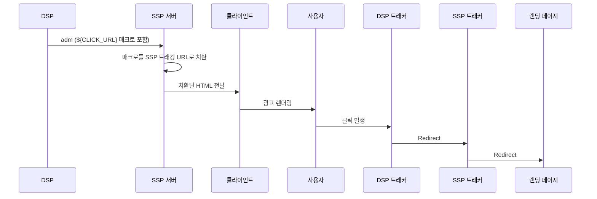

HTML Banner 광고에서 SSP가 클릭을 집계하기 어려운 이유와 업계 표준 해결책을 정리한 문서.
OpenRTB 미디어 타입별 트래킹 완전 정리가 미디어 타입별 비교 개요를 다룬다면, 이 문서는 Banner 클릭 문제에 한정하여 각 해결책을 깊이 있게 다룬다.

> **💡 Tip: 비유로 이해하기**
> 왜 배너 광고의 클릭 트래킹이 유독 어려울까요? 우편물에 비유해 봅시다.
>
> **네이티브/비디오 광고**: 봉투 안에 "클릭하면 여기 연락, 여기 연락" 목록이 들어 있습니다.
> SSP가 자기 연락처를 목록에 추가하면 끝입니다. 간단하죠.
>
> **배너 광고**: 이미 인쇄된 포스터입니다. 포스터에 하나의 QR코드(링크)만 찍혀 있고,
> 그 QR코드는 DSP 서버로 바로 연결됩니다. SSP가 자기 QR코드를 끼워넣을 방법이 없습니다.
>
> 이 문서는 "이미 인쇄된 포스터에 SSP의 QR코드를 끼워넣는 4가지 방법"을 설명합니다.

---

## 왜 Banner 클릭 집계는 유독 어려운가

| 미디어 타입 | SSP 클릭 집계 난이도 | 이유 |
|------------|-------------------|------|
| **Video (VAST)** | 쉬움 | VAST XML 내 `<ClickTracking>` 태그에 SSP URL 추가 가능 |
| **Native** | 쉬움 | BidResponse의 `link.url` 필드에 직접 SSP Redirect URL 삽입 가능 |
| **Banner (HTML adm)** | 어려움 | DSP가 완성된 HTML을 반환하며, `<a href>` 링크가 DSP URL로 하드코딩됨 |

Banner는 DSP가 `adm` 필드에 렌더링 준비된 HTML을 넘기기 때문에, SSP가 클릭 경로에 개입할 구조적 진입점이 없다. 이것이 Banner 클릭 처리가 별도 설계를 요구하는 핵심 이유다.

---

## 1. 일반적인 처리 방식 (DSP 중심)

OpenRTB 표준에서 DSP는 `adm` 필드를 통해 완성된 HTML을 반환하며, 이 안에는 이미 DSP 측의 트래킹 로직이 포함되어 있다.

- **SSP의 역할:** 전달받은 HTML을 그대로 렌더링(Rendering)만 수행
- **DSP의 역할:** 광고 소재(Image), 클릭 트래커(Click Tracker), 노출 픽셀(Impression Pixel)을 모두 HTML 내에 포함하여 전달

**DSP가 반환하는 `adm` HTML 예시:**

```html
<div>
    <a href="https://dsp-click-tracker.com?redirect=LANDING_PAGE_URL">
        
    </a>
    
</div>
```

---

## 2. SSP 측 집계 시 발생하는 이슈

SSP가 단순히 렌더링만 하는 것이 아니라, 자체적으로 Impression과 Click을 집계해야 할 경우 다음과 같은 차이가 발생한다.

| 구분 | 집계 난이도 | 설명 |
|------|-----------|------|
| **Impression** | 쉬움 | HTML 렌더링 시점에 별도로 SSP 트래커(Event URL 등)를 호출하여 해결 가능 |
| **Click** | 어려움 | HTML 내부의 `<a>` 태그 링크가 DSP URL로 하드코딩되어 있어 SSP가 개입하기 어려움 |

---

## 3. 업계 표준 Click Tracking 해결책

### 방법 1. Click Macro 활용 (가장 일반적 / 표준)

DSP가 SSP의 클릭 트래킹 URL을 삽입할 수 있는 매크로(Macro)를 `adm` 내에 포함하여 전달하는 방식이다.

**작동 원리:**

1. DSP: `href`에 SSP 매크로(`${CLICK_URL}`)를 포함하여 전송
2. SSP 서버: 렌더링 전 해당 매크로를 실제 SSP 트래킹 URL로 치환(Replace)
3. 클라이언트: 치환된 HTML을 렌더링하여 사용자에게 노출

**Click Macro 흐름:**



**URL 치환 예시:**

```
DSP 원본: https://dsp-tracker.com?ssp_click=${CLICK_URL}&redirect=LANDING_URL
           ↓ (SSP 서버가 치환)
최종 형태: https://dsp-tracker.com?ssp_click=https%3A%2F%2Fssp-tracker.com%2Fclick&redirect=LANDING_URL
```

**클릭 시 이동 경로:** 사용자 → DSP 트래커 → SSP 트래커 → 랜딩 URL

---

### 방법 2. Redirect Wrapping (SSP가 클릭 URL을 감싸는 방식)

DSP가 Click Macro를 지원하지 않는 경우, SSP가 DSP 클릭 URL 자체를 자사 Redirect URL의 파라미터로 감싸는 방식이다.

```
SSP Redirect URL: https://ssp-tracker.com/click?redirect=https%3A%2F%2Fdsp-tracker.com%2F...
```

- SSP가 DSP의 `adm` HTML 내 `<a href>` 값을 파싱하여 수정해야 하므로, HTML 구조에 의존성이 생긴다.
- HTML 구조가 복잡하거나 JavaScript로 동적 생성되는 경우 적용이 어렵다.
- Click Macro가 표준화된 경우에는 이 방법보다 방법 1이 권장된다.

---

### 방법 3. HTML Wrapping (DOM 개입)

SSP가 DSP의 HTML을 특정 컨테이너 요소로 감싸서 클릭 이벤트를 가로채는 방식이다.

```html
<!-- SSP가 생성하는 Wrapper -->
<div onclick="trackSSPClick(); return false;">
    <!-- DSP adm HTML이 여기에 삽입됨 -->
    ${DSP_ADM_HTML}
</div>
```

```javascript
function trackSSPClick() {
    // SSP 클릭 트래킹 비동기 호출
    navigator.sendBeacon('https://ssp-tracker.com/click');
}
```

- DSP HTML이 `event.stopPropagation()`을 사용하거나, 클릭 이벤트가 자식 요소에서 소비되는 경우 작동하지 않을 수 있다.
- iframe으로 렌더링되는 경우 DOM 접근 자체가 불가능하다.
- 가장 구현이 단순하지만 신뢰성이 낮아 주요 해결책으로는 적합하지 않다.

---

### 방법 4. MRAID (모바일 앱 환경)

MRAID SDK를 사용하는 모바일 앱 환경에서는 SDK 레벨에서 클릭 이벤트를 제어한다.

- `mraid.open(url)` 함수가 호출될 때 SSP SDK가 이를 감지하여 트래킹을 수행한다.
- 앱 내 WebView에 MRAID.js가 주입되어 있어야 한다.
- 웹 브라우저 환경에서는 적용 불가하다.

---

## 4. 결론 및 실무 적용 가이드

### 요약 Q&A

| 질문 | 답변 |
|------|------|
| **모든 OpenRTB 시스템의 문제인가?** | 아니다. 표준상 DSP가 자체적으로 처리하므로 SSP가 클릭을 집계하지 않는다면 문제없다. |
| **SSP도 클릭 집계가 꼭 필요한가?** | 빌링, 리포팅, 어뷰징 탐지 등을 위해 집계가 필요하다면 Click Macro 방식이 업계 표준이다. |
| **Click Macro를 DSP가 지원 안 하면?** | Redirect Wrapping으로 대체하되, HTML 구조 의존성 리스크를 감수해야 한다. |
| **모바일 앱 환경이라면?** | MRAID SDK 연동을 우선 검토한다. |

### 권장 구현 순서

신규 시스템 설계 시 또는 DSP 연동 단계별 대응 전략:

| 순위 | 방법 | 적용 조건 |
|------|------|---------|
| **1순위** | Click Macro 표준 가이드 제공 | 신규 DSP 연동 시, 표준 준수 DSP |
| **2순위** | Redirect Wrapping | Click Macro 미지원 DSP, HTML `<a href>` 구조가 단순한 경우 |
| **3순위** | MRAID | 모바일 앱 환경, MRAID SDK 탑재 지면 |
| **최후 수단** | HTML Wrapping | 위 방법 모두 불가 시, 신뢰성 낮음 |

### 순수 HTML Banner 지원 구현 시 고려사항

Native 구조 + Redirect URL 방식을 우회책으로 사용하다가 순수 HTML `adm`을 지원하려면 다음 구현이 필요하다.

1. **서버 사이드:** Click Macro 지원 기능 개발
   - DSP 연동 가이드 문서에 `${CLICK_URL}` 매크로 스펙 명시
   - BidResponse 수신 후 `adm` 내 매크로 치환 로직 구현
2. **클라이언트 사이드:** SDK 내 WebView에서 클릭 이벤트를 인터셉트하는 로직 추가
   - 앱 환경의 경우 MRAID.js 주입 또는 WebViewClient의 `shouldOverrideUrlLoading` 활용
