> OpenRTB 2.x의 4가지 미디어 타입이 AdCOM/OpenRTB 3.0에서 3가지 광고 타입으로 재구성된 이유와 구조적 차이를 분석한 문서입니다.

> **💡 Tip: 비유로 이해하기**
> OpenRTB 2.x에서는 광고를 **4개 상자**(배너, 비디오, 오디오, 네이티브)로 분류합니다.
> OpenRTB 3.0에서는 "배너와 네이티브는 결국 같은 **화면에 보이는 것**이잖아?"라며
> **3개 상자**(디스플레이, 비디오, 오디오)로 합쳤습니다.
>
> | 2.x (4개 상자) | 3.0 (3개 상자) |
> |---------------|---------------|
> | Banner → | Display |
> | Native → | Display |
> | Video → | Video |
> | Audio → | Audio |
>
> 현재 업계의 95%+ 는 2.x를 사용합니다. 3.0은 "미래를 이해하기 위한 참고"로 읽어주세요.

> **⚠️ Warning: 실무 적용 시 주의**
> **이 문서의 AdCOM/OpenRTB 3.0 내용은 개념 이해용입니다.**

| 구분 | OpenRTB 2.x | AdCOM/OpenRTB 3.0 |
|------|-------------|-------------------|
| **업계 채택률** | **~95%+** | ~5% 미만 |
| **Prebid Server** | **사용** | 미사용 |
| **대부분의 SSP/DSP** | **사용** | 미사용 |

### 호환성

```
OpenRTB 2.x:
  bid.adm = "문자열 마크업"     ← 실무에서 사용
  bid.mtype = 1, 2, 3, 4

AdCOM/OpenRTB 3.0:
  bid.media.ad.display = {...}  ← 구조화된 객체 (실무 미사용)
  bid.media.ad.video = {...}
```

**OpenRTB 2.x에서는 `Ad.display`, `Ad.video` 같은 AdCOM 구조체를 사용할 수 없습니다.**

실무 관련 내용은 섹션 7, 8을 참고하세요.

---

## 목차

1. [핵심 변화 요약](#1-핵심-변화-요약)
2. [왜 Banner + Native = Display인가?](#2-왜-banner--native--display인가)
3. [OpenRTB 2.x 구조 상세](#3-openrtb-2x-구조-상세)
4. [AdCOM / OpenRTB 3.0 구조 상세](#4-adcom--openrtb-30-구조-상세)
5. [매핑 상세: 2.x ↔ 3.0](#5-매핑-상세-2x--30)
6. [Display 내부의 비디오: 3가지 케이스](#6-display-내부의-비디오-3가지-케이스)
7. [OpenRTB 2.x에서의 처리](#7-openrtb-2x에서의-처리-현재-대부분-사용)
8. [서버 개발자를 위한 실무 가이드](#8-서버-개발자를-위한-실무-가이드)
9. [요약 다이어그램](#9-요약-다이어그램)
10. [핵심 정리](#10-핵심-정리)
11. [심화: Native VideoAsset vs Video Ad](#11-심화-native-videoasset-vs-video-ad)

---

## 1. 핵심 변화 요약

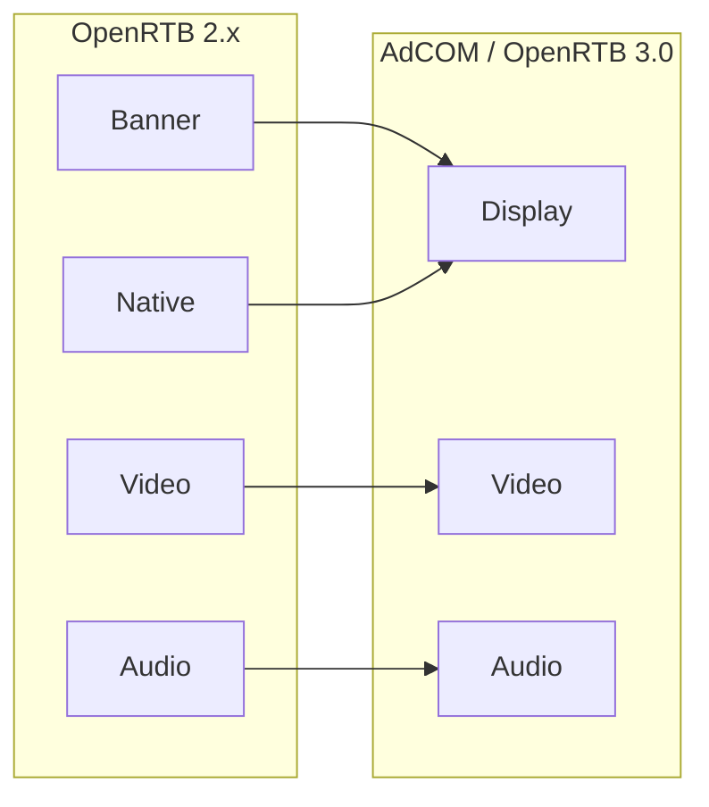

| OpenRTB 2.x | AdCOM (OpenRTB 3.0) | 변화 |
|-------------|---------------------|------|
| Banner | Display.banner | 통합 |
| Native | Display.native | 통합 |
| Video | Video | 유지 |
| Audio | Audio | 유지 |

**4개 → 3개**: Banner와 Native가 **Display**로 통합됨

---

## 2. 왜 Banner + Native = Display인가?

### 2.1 렌더링 관점에서의 분류

광고가 **어디서 렌더링되는가**를 기준으로 분류:

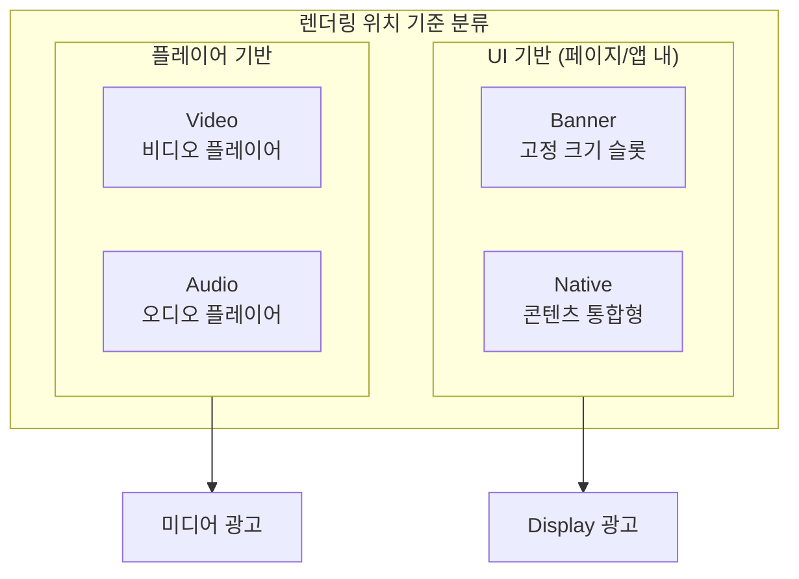

| 분류 | 렌더링 위치 | 특징 |
|------|------------|------|
| **Display** | 페이지/앱 UI | DOM에 삽입, 레이아웃의 일부 |
| **Video** | 비디오 플레이어 | 플레이어가 제어, 전체화면 가능 |
| **Audio** | 오디오 플레이어 | 플레이어가 제어, 백그라운드 재생 |

### 2.2 기술적 공통점

**Banner와 Native의 공통점:**

```
┌─────────────────────────────────────────────────────────┐
│                    웹페이지 / 앱 화면                    │
│                                                         │
│  ┌─────────────────┐    ┌─────────────────────────────┐ │
│  │    Banner Ad    │    │       Native Ad             │ │
│  │  ┌───────────┐  │    │  ┌─────┐                    │ │
│  │  │   300x250 │  │    │  │ IMG │  Title             │ │
│  │  │   이미지   │  │    │  └─────┘  Description       │ │
│  │  └───────────┘  │    │           [CTA Button]      │ │
│  └─────────────────┘    └─────────────────────────────┘ │
│                                                         │
│  일반 콘텐츠...                                          │
└─────────────────────────────────────────────────────────┘
```

1. **DOM 삽입**: 둘 다 HTML DOM의 일부로 렌더링
2. **레이아웃 통합**: 페이지 레이아웃에 맞춰 배치
3. **클릭 처리**: 표준 웹 이벤트로 클릭 추적
4. **정적 크기**: 고정된 영역 내에서 표시

**Video/Audio와의 차이점:**

| 특성 | Display (Banner/Native) | Video/Audio |
|------|------------------------|-------------|
| 렌더링 컨텍스트 | DOM/UI | 플레이어 |
| 재생 제어 | 없음 (정적) | 재생/일시정지/스킵 |
| 전체화면 | 불가 | 가능 |
| 시간 기반 | 아니오 | 예 (duration) |
| 트래킹 이벤트 | Impression, Click | Start, 25%, 50%, 75%, Complete |

### 2.3 응답 포맷의 유사성

**Banner 응답:**
```json
{
  "adm": "<div><a href='...'></a></div>"
}
```

**Native 응답:**
```json
{
  "adm": "{\"assets\":[{\"img\":{\"url\":\"...\"}},{\"title\":{\"text\":\"...\"}}],\"link\":{\"url\":\"...\"}}"
}
```

둘 다 **마크업/구조화된 데이터**를 반환 → **Display**로 통합 가능

**Video 응답:**
```json
{
  "adm": "<?xml version=\"1.0\"?><VAST>...</VAST>"
}
```

완전히 다른 포맷 (VAST XML) → 별도 타입 유지

---

## 3. OpenRTB 2.x 구조 상세

### 3.1 BidRequest 구조

```
BidRequest
└── imp[]
    ├── id
    ├── banner {        ← 미디어 타입 1
    │   ├── w, h
    │   ├── format[]
    │   └── battr[]
    │   }
    ├── video {         ← 미디어 타입 2
    │   ├── mimes[]
    │   ├── minduration
    │   ├── maxduration
    │   ├── protocols[]
    │   └── w, h
    │   }
    ├── audio {         ← 미디어 타입 3
    │   ├── mimes[]
    │   ├── minduration
    │   └── maxduration
    │   }
    └── native {        ← 미디어 타입 4
        ├── request     (Native Request JSON string)
        └── ver
        }
```

### 3.2 BidResponse 구조

```
BidResponse
└── seatbid[]
    └── bid[]
        ├── impid
        ├── price
        ├── adm          ← 미디어 타입에 따라 포맷이 다름
        ├── mtype        ← 1=Banner, 2=Video, 3=Audio, 4=Native
        └── ext
```

### 3.3 mtype과 adm 포맷 매핑

| mtype | 미디어 타입 | adm 포맷 | 예시 |
|-------|-----------|----------|------|
| 1 | Banner | HTML/JS | `<div></div>` |
| 2 | Video | VAST XML | `<VAST version="3.0">...</VAST>` |
| 3 | Audio | DAAST XML | `<DAAST version="1.0">...</DAAST>` |
| 4 | Native | Native JSON | `{"assets":[...],"link":{...}}` |

---

## 4. AdCOM / OpenRTB 3.0 구조 상세

### 4.1 핵심 철학 변화

OpenRTB 3.0은 **관심사의 분리(Separation of Concerns)**를 도입:

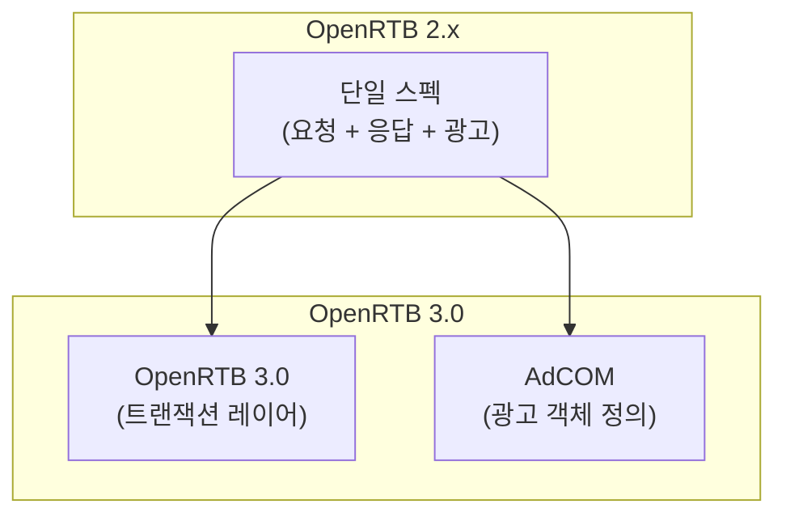

- **OpenRTB 3.0**: 경매 트랜잭션 처리 (요청/응답 흐름)
- **AdCOM**: 광고 객체 자체의 정의 (Ad, Placement, Context)

### 4.2 AdCOM Ad 객체 구조

```
Ad
├── id
├── adomain[]
├── cat[]
├── display {                    ← Display 광고 타입
│   ├── mime
│   ├── w, h
│   ├── banner {                 ← Banner 서브타입
│   │   ├── img
│   │   └── link
│   │   }
│   ├── native {                 ← Native 서브타입
│   │   └── asset[] {
│   │       ├── title {}
│   │       ├── img {}
│   │       ├── video {}         ← VideoAsset (Native 구성요소)
│   │       └── data {}
│   │       }
│   │   }
│   └── adm                      ← 일반 마크업
│   }
├── video {                      ← Video 광고 타입
│   ├── mime
│   ├── api
│   └── adm                      ← VAST XML
│   }
└── audio {                      ← Audio 광고 타입
    ├── mime
    ├── api
    └── adm                      ← DAAST XML
    }
```

### 4.3 Placement (광고 슬롯) 구조

요청 측에서는 **Placement** 객체로 광고 슬롯을 정의:

```
Placement
├── display {                    ← Display 슬롯
│   ├── w, h
│   ├── unit                     ← 1=Banner, 2=Banner+Interstitial, ...
│   ├── nativefmt {              ← Native 포맷 정의
│   │   └── asset[]
│   │   }
│   └── ...
│   }
├── video {                      ← Video 슬롯
│   ├── mimes[]
│   ├── mindur, maxdur
│   └── ...
│   }
└── audio {                      ← Audio 슬롯
    ├── mimes[]
    ├── mindur, maxdur
    └── ...
    }
```

---

## 5. 매핑 상세: 2.x ↔ 3.0

### 5.1 Request 매핑

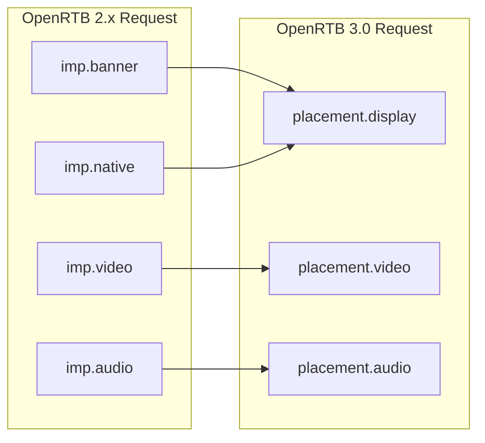

| OpenRTB 2.x | OpenRTB 3.0 (Placement) |
|-------------|------------------------|
| `imp.banner` | `placement.display` (unit=banner) |
| `imp.native` | `placement.display` (nativefmt 포함) |
| `imp.video` | `placement.video` |
| `imp.audio` | `placement.audio` |

### 5.2 Response 매핑

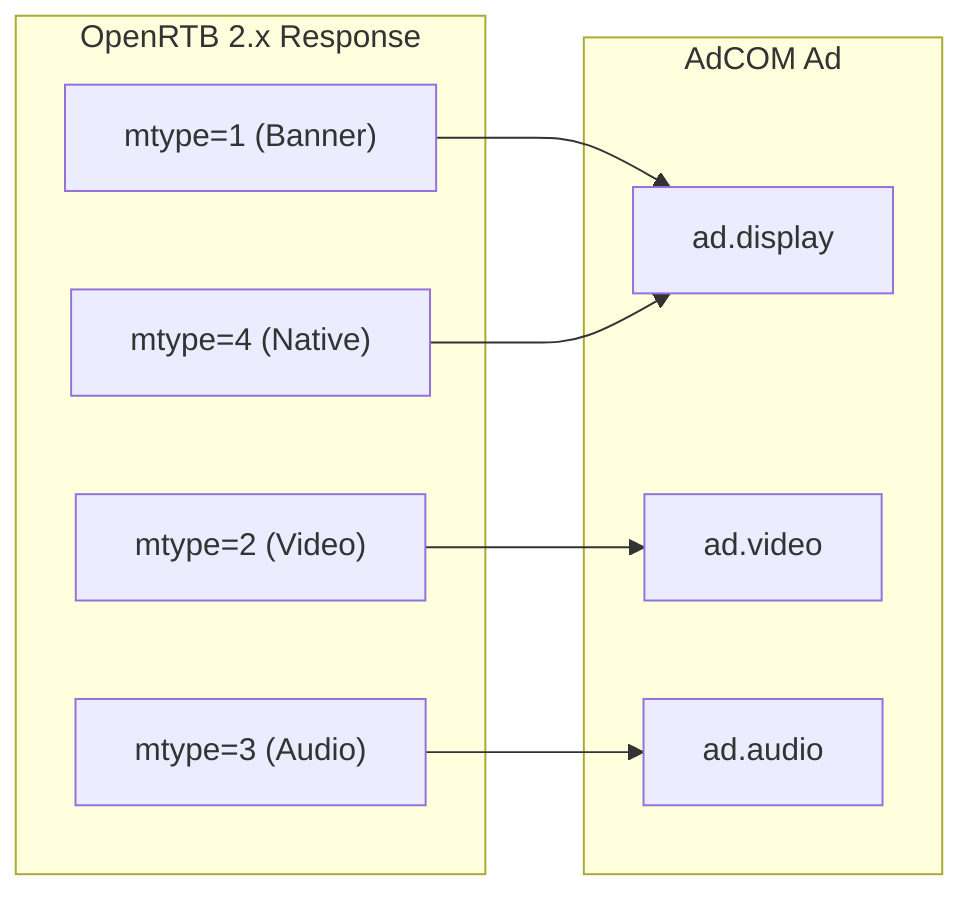

### 5.3 구체적인 예시

**OpenRTB 2.x Banner Request:**
```json
{
  "imp": [{
    "id": "1",
    "banner": {
      "w": 300,
      "h": 250,
      "format": [{"w": 300, "h": 250}]
    }
  }]
}
```

**OpenRTB 3.0 Equivalent:**
```json
{
  "item": [{
    "id": "1",
    "spec": {
      "placement": {
        "display": {
          "w": 300,
          "h": 250,
          "displayfmt": [{"w": 300, "h": 250}]
        }
      }
    }
  }]
}
```

**OpenRTB 2.x Native Request:**
```json
{
  "imp": [{
    "id": "1",
    "native": {
      "request": "{\"assets\":[{\"id\":1,\"img\":{\"type\":3}}]}"
    }
  }]
}
```

**OpenRTB 3.0 Equivalent:**
```json
{
  "item": [{
    "id": "1",
    "spec": {
      "placement": {
        "display": {
          "nativefmt": {
            "asset": [{
              "id": 1,
              "img": {"type": 3}
            }]
          }
        }
      }
    }
  }]
}
```

---

## 6. Display 내부의 비디오: 3가지 케이스

### 6.1 전체 그림

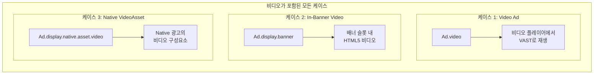

### 6.2 케이스별 상세

#### 케이스 1: Video Ad (`Ad.video`)

```
┌─────────────────────────────────────┐
│         Video Player                │
│  ┌─────────────────────────────┐   │
│  │                             │   │
│  │     [광고 영상 재생중]        │   │
│  │                             │   │
│  │       advancement: 15/30    │   │
│  └─────────────────────────────┘   │
│  ▶️ ━━━━━━━━━━━━━━━━━━ [Skip Ad]   │
└─────────────────────────────────────┘
```

- **목적**: 비디오 콘텐츠 전/중/후 광고
- **포맷**: VAST XML
- **제어**: 비디오 플레이어가 담당
- **트래킹**: start, firstQuartile, midpoint, thirdQuartile, complete

#### 케이스 2: In-Banner Video (`Ad.display.banner`)

```
┌───────────────────────────────────────────┐
│  웹페이지                                  │
│                                           │
│  콘텐츠...                                 │
│                                           │
│  ┌─────────────────┐                      │
│  │ [300x250 배너]  │  ← 배너 슬롯         │
│  │  ┌───────────┐  │                      │
│  │  │ ▶️ 비디오  │  │  ← HTML5 비디오     │
│  │  └───────────┘  │                      │
│  └─────────────────┘                      │
│                                           │
│  콘텐츠...                                 │
└───────────────────────────────────────────┘
```

- **목적**: 배너 슬롯 내 동영상 광고
- **포맷**: HTML5/JS (VAST 아님)
- **제어**: 광고 자체 스크립트
- **adm**: `<video src="...">` 또는 JS 기반 플레이어

#### 케이스 3: Native VideoAsset (`Ad.display.native.asset.video`)

```
┌───────────────────────────────────────────┐
│  앱 피드                                   │
│                                           │
│  ┌─────────────────────────────────────┐  │
│  │  Sponsored                          │  │
│  │  ┌─────────────────────────────┐    │  │
│  │  │                             │    │  │
│  │  │  ▶️ [비디오 프리뷰]          │    │  │ ← VideoAsset
│  │  │     자동재생, 음소거         │    │  │
│  │  │                             │    │  │
│  │  └─────────────────────────────┘    │  │
│  │                                     │  │
│  │  새로운 게임 출시!                   │  │ ← Title Asset
│  │  지금 다운로드하세요                 │  │ ← Data Asset
│  │  [설치하기]                         │  │ ← CTA
│  └─────────────────────────────────────┘  │
│                                           │
│  일반 피드 아이템...                       │
└───────────────────────────────────────────┘
```

- **목적**: Native 광고의 시각적 요소로 비디오 포함
- **포맷**: 비디오 URL (`curl`) 또는 인라인 (`adm`)
- **제어**: 앱/SDK가 담당
- **특징**: 다른 Native Asset들과 함께 구성

### 6.3 비교 표

| 구분              | Video Ad    | In-Banner Video     | Native VideoAsset               |
| --------------- | ----------- | ------------------- | ------------------------------- |
| **AdCOM 경로**    | `ad.video`  | `ad.display.banner` | `ad.display.native.asset.video` |
| **광고 타입**       | Video       | Display             | Display                         |
| **슬롯 유형**       | 비디오 플레이어    | 배너 슬롯               | Native 영역                       |
| **포맷**          | VAST XML    | HTML5/JS            | Video URL                       |
| **mtype (2.x)** | 2           | 1                   | 4                               |
| **플레이어**        | 외부 플레이어     | 자체 내장               | 앱 제공                            |
| **예시**          | YouTube 프리롤 | 리치미디어 배너            | 인스타 피드 광고                       |

---

## 7. OpenRTB 2.x에서의 처리 (현재 대부분 사용)

### 7.1 멀티포맷 Impression

하나의 Impression에 여러 미디어 타입 가능:

```json
{
  "imp": [{
    "id": "1",
    "banner": {"w": 300, "h": 250},
    "video": {"mimes": ["video/mp4"]},
    "native": {"request": "..."}
  }]
}
```

**비더는 하나를 선택하여 응답:**

```json
{
  "seatbid": [{
    "bid": [{
      "impid": "1",
      "mtype": 2,
      "adm": "<VAST>...</VAST>"
    }]
  }]
}
```

### 7.2 mtype 결정 플로우

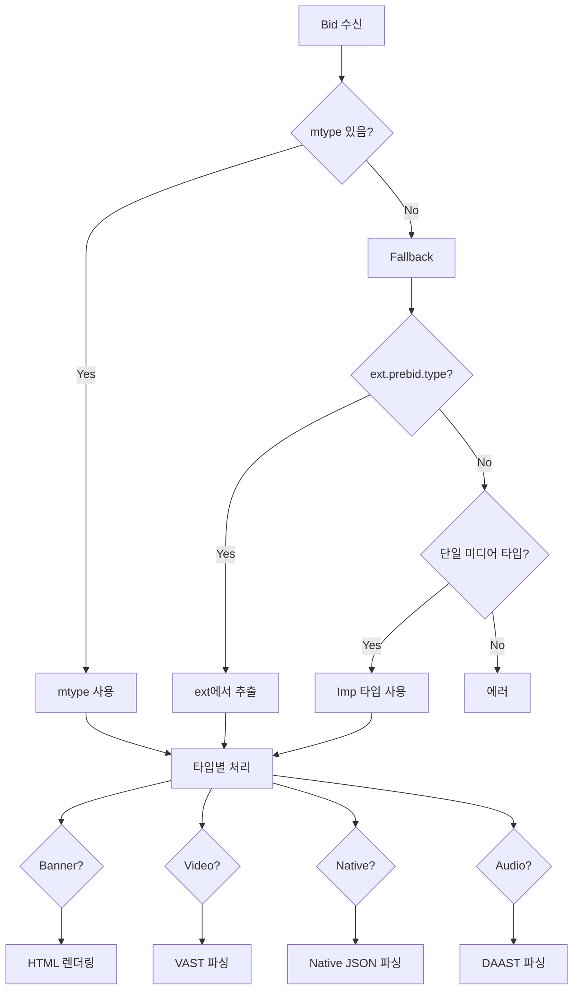

---

## 8. 서버 개발자를 위한 실무 가이드

### 8.1 타입별 adm 처리

```go
func processAdM(bid Bid, mtype int) (Creative, error) {
    switch mtype {
    case 1: // Banner
        return processBannerAdM(bid.AdM)  // HTML 그대로 사용

    case 2: // Video
        return processVideoAdM(bid.AdM)   // VAST XML 파싱

    case 3: // Audio
        return processAudioAdM(bid.AdM)   // DAAST XML 파싱

    case 4: // Native
        return processNativeAdM(bid.AdM)  // Native JSON 파싱

    default:
        return nil, errors.New("unknown mtype")
    }
}

func processNativeAdM(adm string) (Creative, error) {
    var native NativeResponse
    if err := json.Unmarshal([]byte(adm), &native); err != nil {
        return nil, err
    }

    // VideoAsset이 있는지 확인
    for _, asset := range native.Assets {
        if asset.Video != nil {
            // Native 내 VideoAsset 처리
            // 이것은 Video Ad가 아니라 Native의 구성요소!
        }
    }

    return &native, nil
}
```

### 8.2 캐싱 전략

| 미디어 타입 | 캐시 키 | 추가 캐시 |
|------------|--------|----------|
| Banner | `hb_cache_id` | - |
| Video | `hb_cache_id` | `hb_uuid` (VAST 전용) |
| Audio | `hb_cache_id` | - |
| Native | `hb_cache_id` | - |

**Video만 별도 VAST 캐시가 필요한 이유:**
- 비디오 플레이어가 VAST URL을 직접 호출
- JSON wrapper 없이 순수 VAST XML 필요

### 8.3 검증 체크리스트

```go
func validateBid(bid Bid, imp Impression) []error {
    var errs []error

    switch bid.MType {
    case 1: // Banner
        if imp.Banner == nil {
            errs = append(errs, errors.New("banner bid but no banner in imp"))
        }
        if !isHTML(bid.AdM) {
            errs = append(errs, errors.New("banner adm should be HTML"))
        }

    case 2: // Video
        if imp.Video == nil {
            errs = append(errs, errors.New("video bid but no video in imp"))
        }
        if !isVAST(bid.AdM) {
            errs = append(errs, errors.New("video adm should be VAST"))
        }

    case 4: // Native
        if imp.Native == nil {
            errs = append(errs, errors.New("native bid but no native in imp"))
        }
        if !isNativeJSON(bid.AdM) {
            errs = append(errs, errors.New("native adm should be JSON"))
        }
    }

    return errs
}
```

---

## 9. 요약 다이어그램

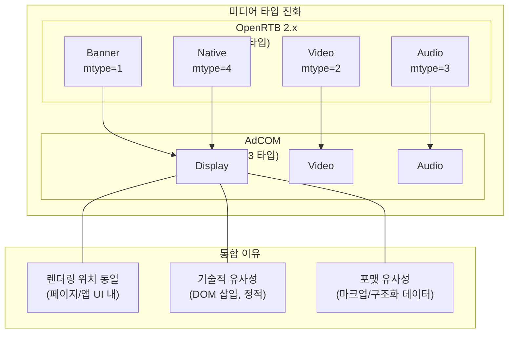

---

## 10. 핵심 정리

### 10.1 기억해야 할 것

| 개념 | OpenRTB 2.x | AdCOM/3.0 |
|------|-------------|-----------|
| Banner | `imp.banner` / mtype=1 | `ad.display.banner` |
| Native | `imp.native` / mtype=4 | `ad.display.native` |
| Video | `imp.video` / mtype=2 | `ad.video` |
| Audio | `imp.audio` / mtype=3 | `ad.audio` |

### 10.2 혼동하지 말 것

| 이것은... | 이것이 아니다 |
|----------|-------------|
| `ad.display.native.asset.video` (VideoAsset) | `ad.video` (Video Ad) |
| In-Banner Video (HTML5) | Video Ad (VAST) |
| Native 내 비디오 구성요소 | 독립 비디오 광고 |

### 10.3 분류 기준

**"어디서 재생되는가?"**

- **페이지/앱 UI 안** → Display (Banner, Native)
- **비디오 플레이어 안** → Video
- **오디오 플레이어 안** → Audio

---

## 11. 심화: Native VideoAsset vs Video Ad

### 11.1 왜 헷갈리는가?

둘 다 "비디오"를 포함하지만, **완전히 다른 개념**입니다:

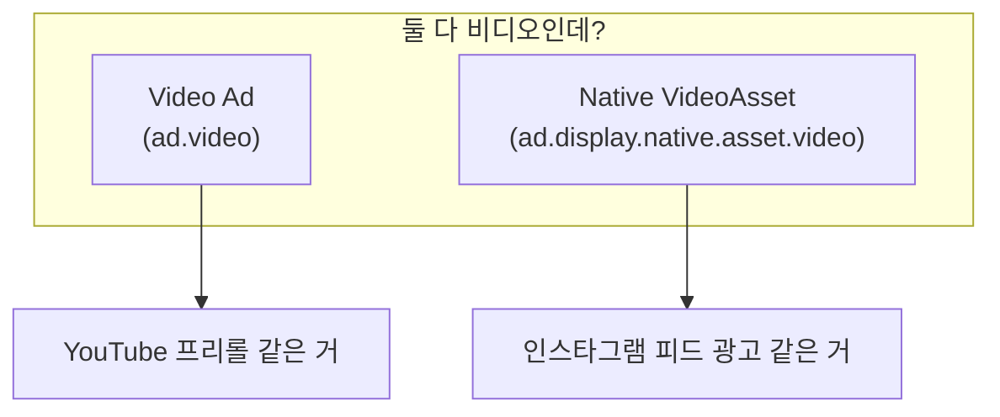

### 11.2 근본적 차이: "무엇의 일부인가?"

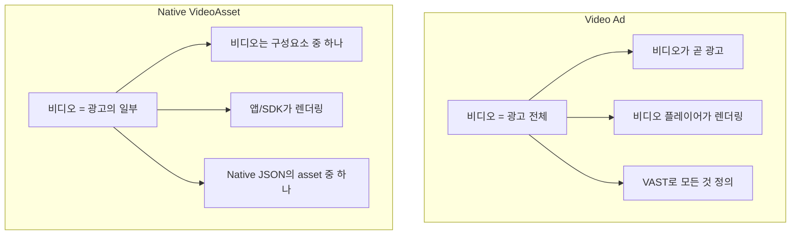

| 관점 | Video Ad | Native VideoAsset |
|------|----------|-------------------|
| **비디오의 역할** | 광고 **전체** | 광고의 **일부** |
| **다른 요소** | 없음 (비디오가 전부) | Title, Image, CTA 등과 함께 |
| **독립성** | 독립적 | 다른 Asset에 의존 |

### 11.3 구조적 차이

**Video Ad 구조:**
```
Ad
└── video                    ← 이것이 광고 전체
    ├── adm: "<VAST>..."
    ├── mime: "video/mp4"
    └── ... (비디오 관련 속성만)
```

**Native Ad with VideoAsset 구조:**
```
Ad
└── display
    └── native
        └── asset[]          ← 여러 구성요소
            ├── [0] title    ← 제목
            ├── [1] img      ← 이미지
            ├── [2] video    ← 비디오 (구성요소 중 하나!)
            ├── [3] data     ← 설명
            └── [4] data     ← CTA 텍스트
```

### 11.4 렌더링 비교

**Video Ad 렌더링:**
```
┌─────────────────────────────────────────────────┐
│              Video Player (전체 화면)            │
│  ┌───────────────────────────────────────────┐  │
│  │                                           │  │
│  │                                           │  │
│  │            [광고 영상 재생]                 │  │
│  │                                           │  │
│  │                                           │  │
│  │                                           │  │
│  └───────────────────────────────────────────┘  │
│  ▶ ━━━━━━━━━━━━━━━━━━━━━━━━━━ 0:15/0:30 [Skip]  │
│                                                 │
│  Learn More    광고주명                         │
└─────────────────────────────────────────────────┘

→ 비디오가 광고의 전부. VAST가 모든 것을 정의.
```

**Native VideoAsset 렌더링:**
```
┌─────────────────────────────────────────────────┐
│  앱 피드                                         │
│                                                 │
│  ┌───────────────────────────────────────────┐  │
│  │  Sponsored · 광고주명                      │  │
│  │                                           │  │
│  │  ┌─────────────────────────────────────┐  │  │
│  │  │                                     │  │  │
│  │  │     ▶ [비디오 프리뷰]               │  │  │ ← VideoAsset
│  │  │        자동재생, 음소거              │  │  │    (구성요소 중 하나)
│  │  │                                     │  │  │
│  │  └─────────────────────────────────────┘  │  │
│  │                                           │  │
│  │  새로운 게임이 출시되었습니다!             │  │ ← Title Asset
│  │  지금 바로 다운로드하세요                  │  │ ← Data Asset
│  │                                           │  │
│  │  [설치하기]                               │  │ ← CTA Asset
│  └───────────────────────────────────────────┘  │
│                                                 │
│  일반 피드 아이템...                             │
└─────────────────────────────────────────────────┘

→ 비디오는 여러 요소 중 하나. Native JSON이 레이아웃 정의.
```

### 11.5 포맷 차이

**Video Ad (VAST XML):**
```xml
<?xml version="1.0"?>
<VAST version="3.0">
  <Ad id="12345">
    <InLine>
      <AdSystem>DSP</AdSystem>
      <AdTitle>Video Ad</AdTitle>
      <Impression><![CDATA[https://track/imp]]></Impression>
      <Creatives>
        <Creative>
          <Linear>
            <Duration>00:00:30</Duration>
            <TrackingEvents>
              <Tracking event="start">...</Tracking>
              <Tracking event="firstQuartile">...</Tracking>
              <Tracking event="midpoint">...</Tracking>
              <Tracking event="thirdQuartile">...</Tracking>
              <Tracking event="complete">...</Tracking>
            </TrackingEvents>
            <VideoClicks>
              <ClickThrough>https://landing.page</ClickThrough>
            </VideoClicks>
            <MediaFiles>
              <MediaFile type="video/mp4" width="1920" height="1080">
                https://cdn.example.com/video.mp4
              </MediaFile>
            </MediaFiles>
          </Linear>
        </Creative>
      </Creatives>
    </InLine>
  </Ad>
</VAST>
```

**Native with VideoAsset (Native JSON):**
```json
{
  "ver": "1.2",
  "assets": [
    {
      "id": 1,
      "title": {
        "text": "새로운 게임 출시!"
      }
    },
    {
      "id": 2,
      "img": {
        "url": "https://cdn.example.com/icon.png",
        "w": 80,
        "h": 80,
        "type": 1
      }
    },
    {
      "id": 3,
      "video": {
        "vasttag": "<VAST>...</VAST>"
      }
    },
    {
      "id": 4,
      "data": {
        "type": 2,
        "value": "지금 다운로드하세요"
      }
    },
    {
      "id": 5,
      "data": {
        "type": 12,
        "value": "설치하기"
      }
    }
  ],
  "link": {
    "url": "https://click.example.com"
  },
  "imptrackers": ["https://track/imp"]
}
```

> **주목:** Native VideoAsset 안에도 `vasttag`로 VAST를 포함할 수 있지만, 이는 **Native 광고의 한 구성요소**로 재생됩니다.

### 11.6 트래킹 차이

**Video Ad 트래킹:**
```
이벤트           시점
─────────────────────────
impression    → 광고 로드 시
start         → 재생 시작
firstQuartile → 25% 재생
midpoint      → 50% 재생
thirdQuartile → 75% 재생
complete      → 100% 재생
skip          → 스킵 클릭
clickThrough  → CTA 클릭
```

**Native VideoAsset 트래킹:**
```
Native 레벨:
  - imptrackers → 광고 노출 시
  - link.clicktrackers → 클릭 시

VideoAsset 레벨 (vasttag 포함 시):
  - VAST 내 트래킹 이벤트
  - 하지만 Native 전체 클릭과 별개
```

### 11.7 사용자 경험 차이

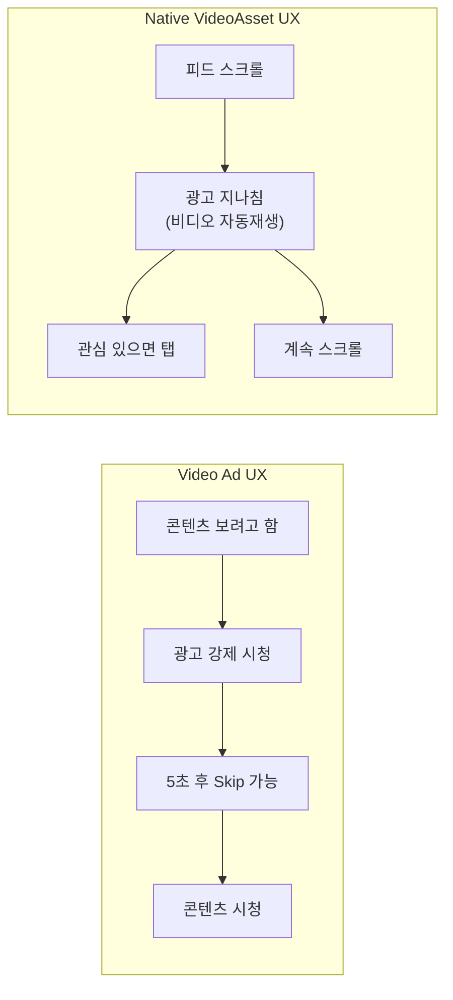

| 측면 | Video Ad | Native VideoAsset |
|------|----------|-------------------|
| **강제성** | 시청 강제 (스킵 전까지) | 자연스러운 노출 |
| **소리** | 기본 ON (또는 OFF) | 보통 음소거 |
| **상호작용** | 플레이어 컨트롤 | 피드 스크롤/탭 |
| **목적** | 메시지 전달 | 관심 유도 |

### 11.8 요청/응답 플로우 차이

**Video Ad:**
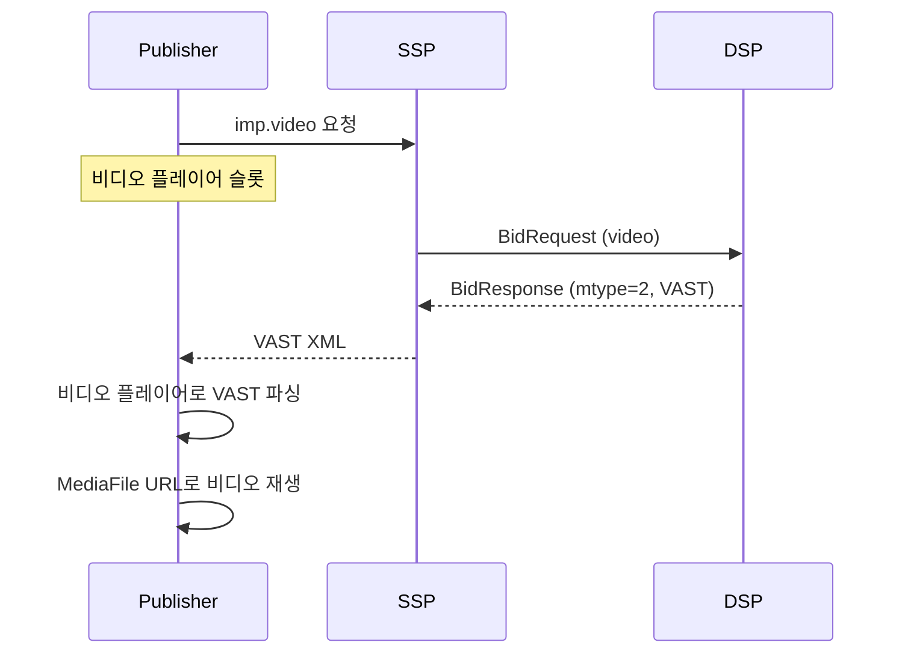

**Native with VideoAsset:**
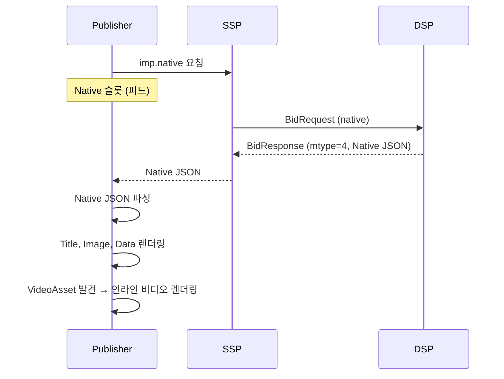

### 11.9 코드로 보는 차이

```go
func renderAd(bid Bid) {
    switch bid.MType {
    case 2: // Video Ad
        vast := parseVAST(bid.AdM)
        videoPlayer.load(vast.MediaFiles[0].URL)
        videoPlayer.play()
        // 플레이어가 모든 것 담당

    case 4: // Native Ad
        native := parseNativeJSON(bid.AdM)

        // 여러 Asset을 각각 렌더링
        renderTitle(native.Assets.Title)
        renderIcon(native.Assets.Icon)
        renderMainImage(native.Assets.MainImage)
        renderDescription(native.Assets.Description)
        renderCTA(native.Assets.CTA)

        // VideoAsset이 있으면 인라인으로 렌더링
        if native.Assets.Video != nil {
            inlineVideo := createInlineVideo(native.Assets.Video)
            inlineVideo.autoplay = true
            inlineVideo.muted = true
            layout.addView(inlineVideo)
        }
    }
}
```

### 11.10 정리: 핵심 차이점

```
┌─────────────────────────────────────────────────────────────┐
│                     Video Ad (mtype=2)                      │
├─────────────────────────────────────────────────────────────┤
│  • 비디오 = 광고 그 자체                                     │
│  • 비디오 플레이어에서 재생                                   │
│  • VAST XML 포맷                                            │
│  • 강제 시청 (스킵 가능할 수도)                               │
│  • 전체 화면 또는 플레이어 전체 점유                          │
│  • 25/50/75/100% 쿼타일 트래킹                              │
└─────────────────────────────────────────────────────────────┘

┌─────────────────────────────────────────────────────────────┐
│              Native VideoAsset (mtype=4 내부)                │
├─────────────────────────────────────────────────────────────┤
│  • 비디오 = 광고의 구성요소 중 하나                           │
│  • 피드/콘텐츠 내 인라인 재생                                 │
│  • Native JSON 내 asset으로 포함                            │
│  • 자연스러운 노출 (스크롤하며 지나감)                         │
│  • Title, Image, CTA 등과 함께 배치                         │
│  • Native 레벨 impression 트래킹                            │
└─────────────────────────────────────────────────────────────┘
```

**한 문장 요약:**
> **Video Ad**는 "비디오 광고"이고, **Native VideoAsset**은 "비디오가 포함된 Native 광고"이다.

---

## 참고 자료

- [OpenRTB 2.6 Specification](https://github.com/InteractiveAdvertisingBureau/openrtb2.x)
- [OpenRTB 3.0 Specification](https://github.com/InteractiveAdvertisingBureau/openrtb)
- [AdCOM 1.0 Specification](https://github.com/InteractiveAdvertisingBureau/AdCOM)
- [OpenRTB Native Ads 1.2](https://www.iab.com/guidelines/openrtb-native/)
- [IAB VAST 4.2](https://iabtechlab.com/standards/vast/)
- [IAB Tech Lab](https://iabtechlab.com/)
