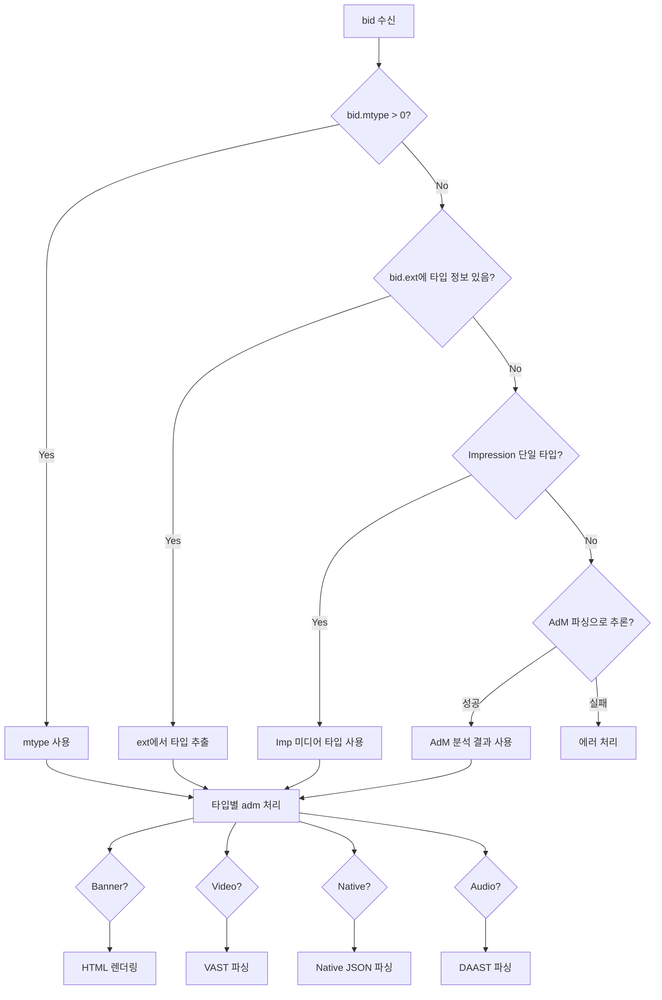
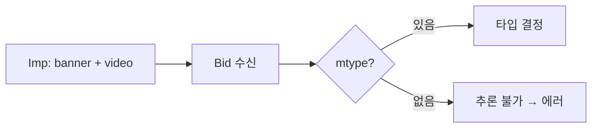
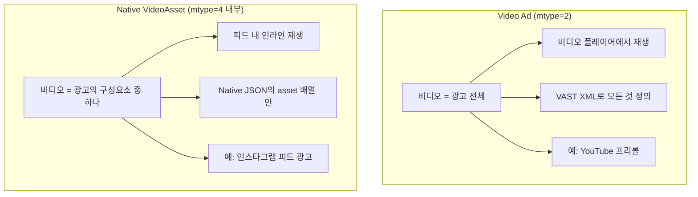

OpenRTB 경매에서 bid를 수신한 SSP는 그 bid가 Banner인지, Video인지, Native인지 알아야 한다. 잘못된 타입으로 판단하면 광고가 깨지거나 트래킹이 누락된다. 이 글은 실무에서 자주 맞닥뜨리는 mtype 판별 문제와 그 대응 전략을 정리한다.

---

## 1. 왜 미디어 타입 판별이 어려운가

하나의 Impression에 DSP가 Banner와 Video를 동시에 응찰할 수 있는 **멀티포맷 Impression**이 일반적으로 사용된다.

```json
{
  "imp": [{
    "id": "1",
    "banner": {"w": 300, "h": 250},
    "video": {"mimes": ["video/mp4"], "w": 300, "h": 250}
  }]
}
```

DSP는 이 중 하나를 선택해 응답한다. SSP 입장에서는 받은 bid가 Banner 응답인지 Video 응답인지 명시적으로 알아야 이후 처리(adm 파싱, 트래킹, 캐싱)를 올바르게 할 수 있다.

문제는 `bid.mtype` 필드가 **권장(Recommended) 필드**라는 점이다. 없어도 스펙 위반이 아니다. 레거시 DSP나 OpenRTB 2.4 기반 비더는 mtype을 아예 보내지 않는 경우가 많다.

---

## 2. mtype 필드

`bid.mtype`은 OpenRTB 2.6에서 추가된 필드로, bid의 마크업 타입을 명시한다.

| OpenRTB 버전 | mtype 상태 |
|-------------|-----------|
| 2.5 이하 | 없음 |
| 2.6 | 추가됨 (권장, Recommended) |

mtype 값 정의:

| mtype 값 | 미디어 타입 | adm 포맷 | 예시 |
|---------|-----------|----------|------|
| 1 | Banner | HTML/JS | `<div></div>` |
| 2 | Video | VAST XML | `<VAST version="3.0">...</VAST>` |
| 3 | Audio | DAAST XML | `<DAAST version="1.0">...</DAAST>` |
| 4 | Native | Native JSON | `{"assets":[...],"link":{...}}` |

mtype이 있으면 가장 신뢰도 높은 타입 정보다. 무조건 우선 사용한다.

---

## 3. mtype이 없을 때 Fallback 전략 체인

mtype이 없는 bid를 받았다고 해서 바로 에러 처리하면 안 된다. 순차적으로 시도할 수 있는 fallback이 있다.

### 우선순위 요약

| 우선순위 | 방법 | 신뢰도 | 설명 |
|---------|------|--------|------|
| 1 | `bid.mtype` | 높음 | OpenRTB 표준 필드 |
| 2 | `bid.ext.prebid.type` | 높음 | Prebid 확장 |
| 3 | `bid.ext.mediaType` | 중간 | 일부 비더 확장 |
| 4 | Imp 단일 타입 추론 | 중간 | 멀티포맷이 아닌 경우만 |
| 5 | AdM 콘텐츠 파싱 | 낮음 | 최후의 수단 |

### 전략 1: Extension 필드

Prebid Server는 `bid.ext.prebid.type`을 fallback으로 사용한다. 일부 비더는 mtype 대신 이 필드를 채워 보낸다.

```json
{
  "seatbid": [{
    "bid": [{
      "id": "bid-1",
      "impid": "imp-1",
      "price": 2.50,
      "adm": "...",
      "ext": {
        "prebid": {
          "type": "banner"
        }
      }
    }]
  }]
}
```

### 전략 2: Impression 기반 추론

요청한 Impression에 단일 미디어 타입만 있으면 그것을 사용한다. 멀티포맷이면 추론할 수 없다.

```go
func inferMediaType(bid Bid, imp Impression) MediaType {
    types := []MediaType{}

    if imp.Banner != nil { types = append(types, Banner) }
    if imp.Video != nil  { types = append(types, Video) }
    if imp.Audio != nil  { types = append(types, Audio) }
    if imp.Native != nil { types = append(types, Native) }

    if len(types) == 1 {
        return types[0]  // 단일 타입이면 확정
    }

    return Unknown  // 복수 타입이면 추론 불가
}
```

### 전략 3: AdM 콘텐츠 파싱

adm 문자열을 직접 분석해 타입을 추론한다. 가장 신뢰도가 낮으므로 최후의 수단이다.

| 패턴 | 추론 타입 |
|------|----------|
| `<VAST` 또는 `<?xml...VAST` | Video |
| `<DAAST` | Audio |
| JSON + `"assets"` 배열 | Native |
| HTML/JavaScript | Banner |

```go
func inferFromAdM(adm string) MediaType {
    trimmed := strings.TrimSpace(adm)

    if strings.HasPrefix(trimmed, "<?xml") || strings.HasPrefix(trimmed, "<VAST") {
        return Video
    }

    if strings.HasPrefix(trimmed, "{") {
        var native map[string]interface{}
        if json.Unmarshal([]byte(adm), &native) == nil {
            if _, ok := native["assets"]; ok {
                return Native
            }
        }
    }

    return Banner
}
```

---

## 4. Response 처리 플로우차트



---

## 5. 멀티포맷 Impression 처리

멀티포맷 Impression에서 mtype이 없으면 Imp 기반 추론이 불가능하다. 이 경우 **반드시 mtype이 있어야** 타입을 확정할 수 있다.



비더(adapter) 개발 시 응답에 mtype을 반드시 설정해야 하는 이유가 여기 있다.

```go
func getBidType(bid openrtb2.Bid) openrtb_ext.BidType {
    switch bid.MType {
    case openrtb2.MarkupBanner:
        return openrtb_ext.BidTypeBanner
    case openrtb2.MarkupVideo:
        return openrtb_ext.BidTypeVideo
    case openrtb2.MarkupAudio:
        return openrtb_ext.BidTypeAudio
    case openrtb2.MarkupNative:
        return openrtb_ext.BidTypeNative
    default:
        return inferBidType(bid)  // fallback
    }
}
```

mtype을 결정할 수 없는 경우의 권장 처리:

- 해당 bid만 건너뛰기 (다른 유효한 bid는 처리)
- 에러 로그 기록
- 메트릭 수집 (타입 파싱 실패 비율 모니터링)

### 상황별 처리 요약

| 상황 | 권장 처리 |
|------|----------|
| `mtype > 0` | 그대로 사용 |
| `mtype = 0`, ext 있음 | ext에서 타입 추출 |
| 단일 미디어 타입 Imp | Imp 타입 사용 |
| 멀티포맷 + mtype 없음 | 에러 처리 |
| AdM 분석 필요 | 최후의 수단으로만 |

---

## 6. Native VideoAsset vs Video Ad

실무에서 가장 많이 혼동하는 케이스다. 둘 다 "비디오"를 포함하지만 완전히 다른 개념이다.

### 핵심 차이: 비디오가 광고 전체인가, 일부인가



| 관점 | Video Ad | Native VideoAsset |
|------|----------|-------------------|
| 비디오의 역할 | 광고 전체 | 광고의 일부 (asset 중 하나) |
| 다른 요소 | 없음 | Title, Image, CTA 등과 함께 |
| adm 포맷 | VAST XML | Native JSON (내부에 vasttag 포함 가능) |
| mtype 값 | 2 | 4 |
| 강제성 | 시청 강제 (스킵 가능) | 자연스러운 노출 |
| 소리 | 기본 ON | 보통 음소거 |
| 트래킹 | 25/50/75/100% 쿼타일 | Native 레벨 impression |

### adm 포맷 비교

**Video Ad (VAST XML):**
```xml
<?xml version="1.0"?>
<VAST version="3.0">
  <Ad id="12345">
    <InLine>
      <Creatives>
        <Creative>
          <Linear>
            <Duration>00:00:30</Duration>
            <TrackingEvents>
              <Tracking event="start">...</Tracking>
              <Tracking event="complete">...</Tracking>
            </TrackingEvents>
            <MediaFiles>
              <MediaFile type="video/mp4">
                https://cdn.example.com/video.mp4
              </MediaFile>
            </MediaFiles>
          </Linear>
        </Creative>
      </Creatives>
    </InLine>
  </Ad>
</VAST>
```

**Native Ad with VideoAsset (Native JSON):**
```json
{
  "ver": "1.2",
  "assets": [
    {"id": 1, "title": {"text": "새로운 게임 출시!"}},
    {"id": 2, "img": {"url": "https://cdn.example.com/icon.png", "w": 80, "h": 80}},
    {"id": 3, "video": {"vasttag": "<VAST>...</VAST>"}},
    {"id": 4, "data": {"type": 2, "value": "지금 다운로드하세요"}},
    {"id": 5, "data": {"type": 12, "value": "설치하기"}}
  ],
  "link": {"url": "https://click.example.com"},
  "imptrackers": ["https://track/imp"]
}
```

Native VideoAsset 안에도 `vasttag`로 VAST를 포함할 수 있지만, 이는 Native 광고의 한 구성요소로 재생된다. Video Ad가 아니다.

### 코드로 보는 차이

```go
func renderAd(bid Bid) {
    switch bid.MType {
    case 2: // Video Ad
        vast := parseVAST(bid.AdM)
        videoPlayer.load(vast.MediaFiles[0].URL)
        videoPlayer.play()
        // 플레이어가 모든 것 담당

    case 4: // Native Ad
        native := parseNativeJSON(bid.AdM)

        renderTitle(native.Assets.Title)
        renderIcon(native.Assets.Icon)
        renderMainImage(native.Assets.MainImage)
        renderDescription(native.Assets.Description)
        renderCTA(native.Assets.CTA)

        // VideoAsset이 있으면 인라인으로 렌더링
        if native.Assets.Video != nil {
            inlineVideo := createInlineVideo(native.Assets.Video)
            inlineVideo.autoplay = true
            inlineVideo.muted = true
            layout.addView(inlineVideo)
        }
    }
}
```

**한 문장 요약:** Video Ad는 "비디오 광고"이고, Native VideoAsset은 "비디오가 포함된 Native 광고"이다.

---

## 7. Prebid Server 참고 구현

Prebid Server의 `exchange/utils.go`는 이 전략을 그대로 구현하고 있다.

```go
func getMediaTypeForBid(bid openrtb2.Bid) (BidType, error) {
    mType := bid.MType

    // 1. mtype이 있으면 우선 사용
    if mType > 0 {
        switch mType {
        case openrtb2.MarkupBanner:
            return BidTypeBanner, nil
        case openrtb2.MarkupVideo:
            return BidTypeVideo, nil
        case openrtb2.MarkupAudio:
            return BidTypeAudio, nil
        case openrtb2.MarkupNative:
            return BidTypeNative, nil
        default:
            return "", fmt.Errorf("invalid mType: %d", mType)
        }
    }

    // 2. Fallback: bid.ext.prebid.type 확인
    return getPrebidMediaTypeForBid(bid)
}

func getPrebidMediaTypeForBid(bid openrtb2.Bid) (BidType, error) {
    if bid.Ext != nil {
        var bidExt ExtBid
        if json.Unmarshal(bid.Ext, &bidExt) == nil {
            if bidExt.Prebid != nil {
                return ParseBidType(bidExt.Prebid.Type)
            }
        }
    }

    return "", errors.New("failed to parse bid mediatype")
}
```

Prebid Server는 Imp 기반 추론과 AdM 파싱을 adapter 레벨로 위임한다. 각 비더 adapter의 `MakeBids()` 함수에서 타입을 `TypedBid.BidType`으로 명시해 반환하도록 설계되어 있다.

---

## 핵심 원칙

1. mtype이 있으면 무조건 신뢰
2. Fallback은 순차적으로 시도
3. 확실하지 않으면 에러 처리 (잘못된 타입보다 에러가 낫다)
4. 비더 adapter 개발 시 mtype 필수 반환
5. Native 안의 VideoAsset은 Video Ad가 아니다
