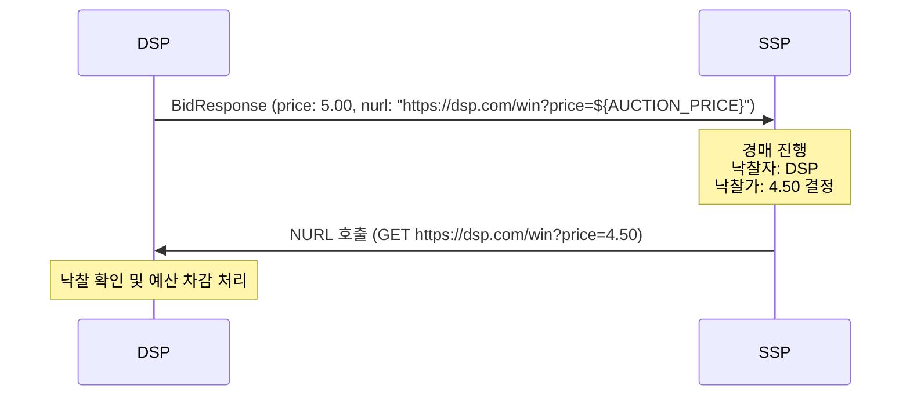

**NURL**은 **Notice URL**의 약자로, 프로그래매틱 광고(OpenRTB) 입찰 과정에서 낙찰 사실을 DSP(광고 구매자)에게 서버 간(S2S) 방식으로 통지하는 URL이다.

> **💡 Tip:** 경매장에서 "낙찰!"이라고 외치면, 경매사가 낙찰자에게 전화를 걸어 알려주죠?
> "축하합니다, 250만원에 낙찰되었습니다."
>
> NURL이 바로 그 전화입니다.
> SSP(경매사)가 DSP(구매자)에게 "당신이 이겼고, 최종 가격은 이것입니다"라고 알려주는 URL이죠.
>
> **중요한 점**: 이 전화는 "낙찰 알림"이지, "결제 완료"가 아닙니다.
> 실제 결제(과금)는 burl이라는 별도의 알림으로 처리됩니다.

---

## NURL 개요

SSP는 경매 완료 후 낙찰된 DSP의 `nurl` 필드에 지정된 주소를 서버에서 직접 호출한다. 이 호출을 통해 DSP는 다음 두 가지 정보를 얻는다.

1. **낙찰 확인 (Win Notification)** - 해당 입찰이 1등으로 선정되었음을 인지
2. **최종 낙찰가 수신 (Clearing Price)** - DSP가 입찰한 가격과 실제 지불 가격은 다를 수 있으며, SSP가 매크로를 통해 최종 가격을 전달

---

## 작동 흐름



### 단계별 설명

1. **DSP → SSP (BidResponse)**: DSP는 입찰가와 함께 `nurl` 필드에 낙찰 통지를 받을 URL을 포함하여 응답한다. URL에는 `${AUCTION_PRICE}` 매크로가 포함된다.
2. **SSP (경매 진행)**: 모든 입찰가를 수집한 후 낙찰자를 결정하고 최종 낙찰가를 산정한다.
3. **SSP → DSP (NURL 호출)**: SSP 서버가 `${AUCTION_PRICE}` 매크로를 실제 낙찰가로 치환한 후 해당 URL을 서버 측에서 직접 호출한다.
4. **DSP (수신 처리)**: 낙찰 사실과 가격을 기록하고 예산을 차감한다.

---

## NURL vs BURL vs LURL 비교

| 필드 | 풀네임 | 호출 주체 | 호출 시점 | 역할 |
|------|--------|----------|----------|------|
| **nurl** | Notice URL | SSP 서버 | 경매 낙찰 직후 | 낙찰 통지, 예산/로그 관리 |
| **burl** | Billing URL | SSP 서버 | 광고 노출 확인 후 (OpenRTB 2.5+) | 재무적 청구 기준점 |
| **lurl** | Loss URL | SSP 서버 | 경매 패배 시 | 패찰 통지, 패찰 이유 전달 |

**중요**: NURL은 낙찰 통지 목적이며 청구(billing)의 기준점이 아니다. 실제 과금 기준은 BURL이며, BURL이 없는 경우에만 NURL이 청구 대리 역할을 한다.

---

## 매크로 치환

SSP는 NURL 호출 시 다음 매크로를 실제 값으로 치환하여 전달한다.

| 매크로 | 설명 |
|--------|------|
| `${AUCTION_PRICE}` | 최종 낙찰가 (Clearing Price). 암호화 전송이 권고됨 |
| `${AUCTION_ID}` | 경매 식별자 (BidRequest.id) |
| `${AUCTION_BID_ID}` | 입찰 식별자 (BidResponse.bidid) |
| `${AUCTION_IMP_ID}` | 노출 슬롯 식별자 (imp.id) |
| `${AUCTION_SEAT_ID}` | DSP 시트 식별자 |
| `${AUCTION_AD_ID}` | 광고 식별자 (bid.adid) |
| `${AUCTION_LOSS}` | 패찰 이유 코드 (lurl 전용) |

`${AUCTION_PRICE}`는 평문 전송 시 중간자 공격에 노출될 수 있으므로, 실제 구현에서는 암호화(예: AES-128)하여 Base64URL 인코딩된 형태로 전송하는 것이 일반적이다.

---

## adm 반환 방식 (Proxy 방식)

일반적으로 DSP는 BidResponse의 `adm` 필드에 광고 마크업을 직접 포함하여 전송한다. 그러나 페이로드 크기 절감 또는 보안 목적으로 `adm`을 비워두고 `nurl`만 전달하는 방식도 허용된다.

이 경우 SSP가 `nurl`을 호출하면, DSP는 그 HTTP 응답 본문으로 광고 마크업(`adm`)을 반환한다. SSP는 이 응답을 Publisher에게 전달한다.

```
일반 방식: BidResponse.adm에 HTML/JSON 직접 포함
Proxy 방식: BidResponse.adm 비워둠 → nurl 호출 응답으로 adm 반환
```

---

## OpenRTB JSON 예시

```json
{
  "id": "auction-12345",
  "seatbid": [
    {
      "bid": [
        {
          "id": "bid-1",
          "impid": "imp-1",
          "price": 5.00,
          "nurl": "https://dsp.example.com/win?auction_id=${AUCTION_ID}&price=${AUCTION_PRICE}",
          "adm": "<a href='https://ad.example.com/click'></a>",
          "adomain": ["advertiser.com"],
          "crid": "creative-001",
          "w": 300,
          "h": 250
        }
      ]
    }
  ]
}
```

---

## 구현 시 주의사항

- **NURL은 반드시 SSP 서버가 호출한다.** 클라이언트(브라우저)가 직접 호출하지 않는다.
- **타임아웃 처리**: SSP는 일반적으로 NURL 호출에 짧은 타임아웃(수백 ms)을 적용한다. DSP는 응답을 빠르게 반환해야 한다.
- **멱등성(Idempotency)**: 네트워크 재시도로 인해 NURL이 중복 호출될 수 있다. DSP는 동일한 auction_id에 대한 중복 처리를 방어해야 한다.
- **AUCTION_PRICE 암호화**: 평문 전송을 피하고 암호화된 가격 토큰을 사용할 것을 권고한다.
- **Proxy 방식 주의**: `adm`을 nurl 응답으로 반환하는 경우, SSP의 응답 지연이 광고 노출에 직접 영향을 미친다.
