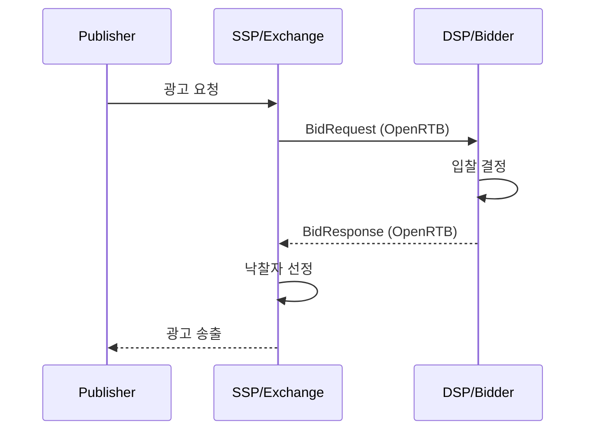
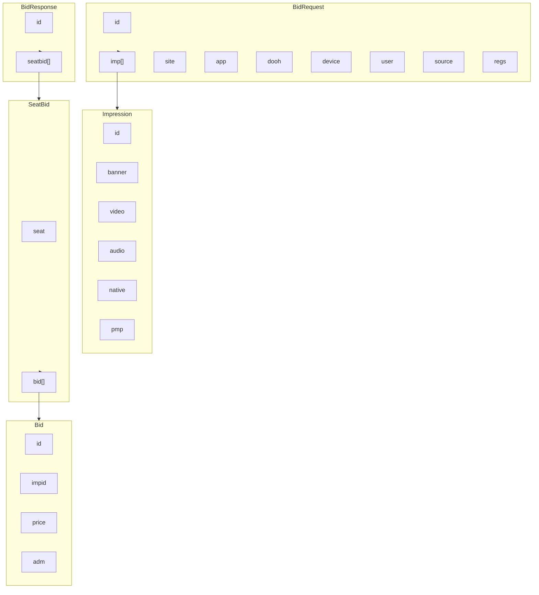
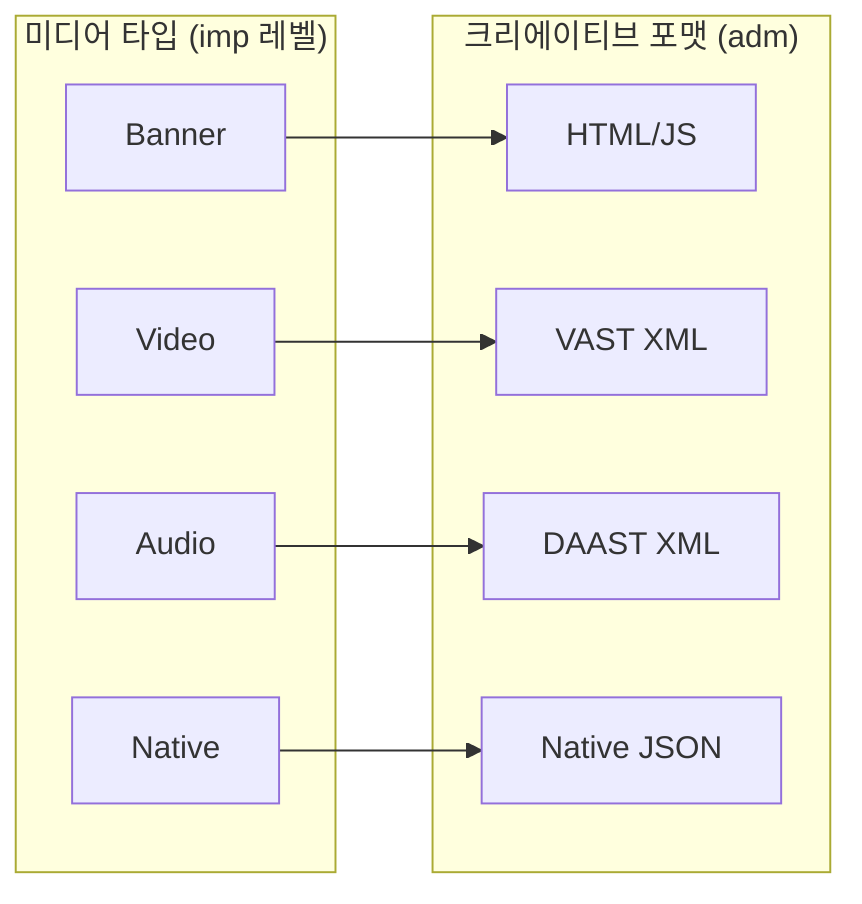
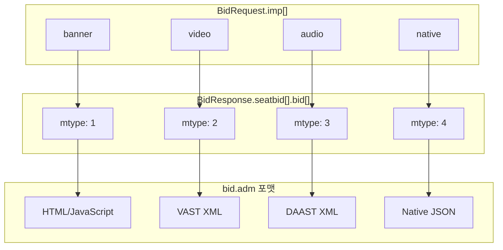
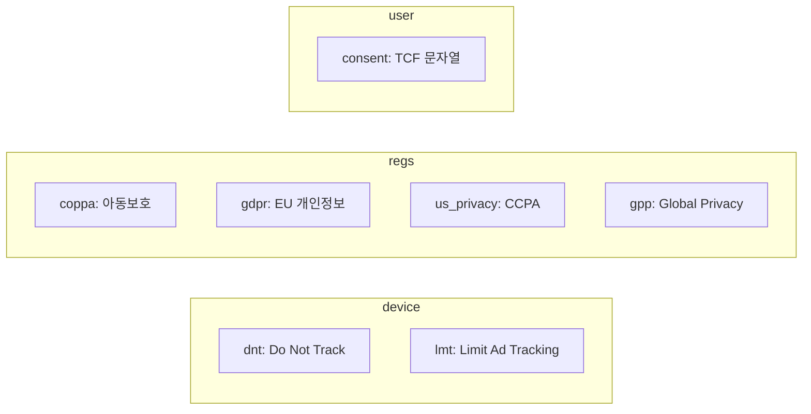
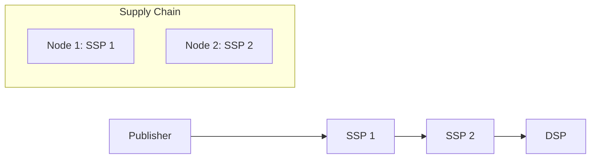
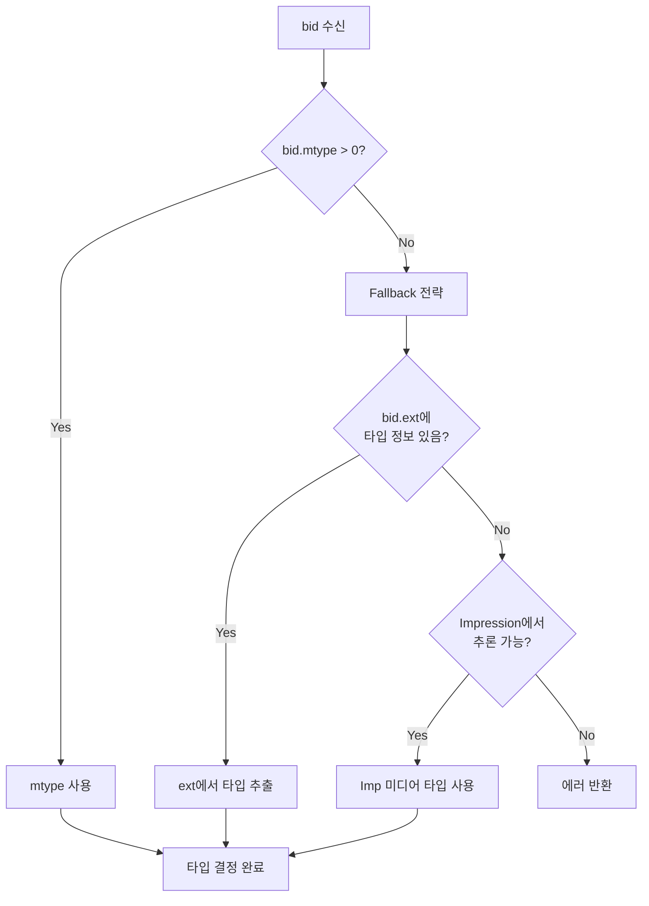
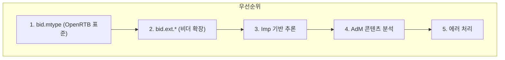
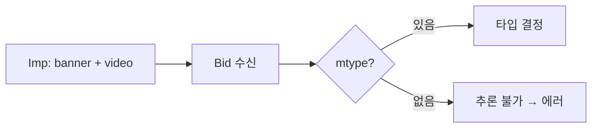

> OpenRTB (Open Real-Time Bidding)는 IAB Tech Lab에서 정의한 프로그래매틱 광고 거래의 표준 프로토콜입니다. 이 문서는 OpenRTB 2.6 스펙을 기준으로 작성되었습니다.

> **💡 Tip:** OpenRTB를 처음 접한다면, **온라인 광고 경매장의 표준 규칙서**라고 생각하세요.
> 경매장에 물건(광고 지면)이 나오면, 여러 구매자(DSP)가 동시에 입찰하고, 가장 높은 가격을 부른 구매자가 낙찰됩니다.
> 이 문서는 그 규칙서의 모든 내용을 정리한 것입니다.

---

## 목차

1. [개요](#1-개요)
2. [전체 구조](#2-전체-구조)
3. [BidRequest](#3-bidrequest)
4. [Impression (Imp)](#4-impression-imp)
5. [미디어 타입](#5-미디어-타입)
6. [컨텍스트 객체](#6-컨텍스트-객체)
7. [BidResponse](#7-bidresponse)
8. [크리에이티브 포맷](#8-크리에이티브-포맷)
9. [Privacy & 규제](#9-privacy--규제)
10. [Supply Chain](#10-supply-chain)
11. [주요 Enum 값](#11-주요-enum-값)
12. [실제 요청/응답 예시](#12-실제-요청응답-예시)
13. [서버 엔지니어 관점: MType 처리](#13-서버-엔지니어-관점-mtype-처리)

---

## 1. 개요

### 1.1 OpenRTB란?

OpenRTB는 **SSP(Supply-Side Platform)와 DSP(Demand-Side Platform) 간의 실시간 광고 입찰**을 위한 표준 프로토콜입니다.



> 여러분이 뉴스 앱을 열었습니다. 기사 사이에 광고 공간이 보입니다.
> 그 순간, 뒤에서 이런 일이 벌어집니다:
> 1. 앱의 광고 서버(SSP)가 "지금 이 사용자에게 보여줄 광고 공간이 있어요"라고 외칩니다
> 2. 수십 개의 광고 구매 플랫폼(DSP)이 동시에 "우리 광고를 보여주세요, 이만큼 낼게요"라고 응답합니다
> 3. 가장 높은 금액을 부른 DSP의 광고가 선택됩니다
> 4. 여러분의 화면에 광고가 나타납니다
>
> 이 전체 과정이 **0.1초** 안에 일어납니다. 여러분이 기사를 읽기 시작하기도 전에요.

### 1.2 버전 히스토리

| 버전 | 주요 변경 |
|------|----------|
| 2.0 | 초기 버전 |
| 2.3 | Native 광고 지원 |
| 2.4 | Audio 광고 지원 |
| 2.5 | GDPR, SupplyChain 추가 |
| 2.6 | Ad Pods (CTV), Structured User-Agent, DOOH |

### 1.3 핵심 원칙

- **Impression 단위**: 광고 슬롯(Imp) 하나당 하나의 입찰
- **실시간**: 일반적으로 100-200ms 내 응답 필요
- **확장 가능**: `ext` 필드로 커스텀 데이터 전달

---

## 2. 전체 구조

### 2.1 객체 계층



### 2.2 필수 관계

```
BidRequest
├── id (필수)
├── imp[] (필수, 최소 1개)
│   ├── id (필수)
│   └── banner|video|audio|native (최소 1개)
├── site|app|dooh (최소 1개)
└── ext (선택)

BidResponse
├── id (필수, request.id와 동일)
└── seatbid[] (선택, 없으면 no-bid)
    └── bid[] (필수)
        ├── id (필수)
        ├── impid (필수, request.imp[].id와 매칭)
        └── price (필수)
```

---

## 3. BidRequest

### 3.1 최상위 필드

| 필드       | 타입       | 필수  | 설명                               |
| -------- | -------- | --- | -------------------------------- |
| `id`     | string   | O   | 요청 고유 ID                         |
| `imp`    | object[] | O   | Impression 배열 (최소 1개)            |
| `site`   | object   | △   | 웹사이트 정보                          |
| `app`    | object   | △   | 앱 정보                             |
| `dooh`   | object   | △   | 옥외광고 정보                          |
| `device` | object   | 권장  | 디바이스 정보                          |
| `user`   | object   | 권장  | 사용자 정보                           |
| `source` | object   | -   | 요청 소스 정보                         |
| `regs`   | object   | -   | 규제/Privacy 정보                    |
| `test`   | integer  | -   | 테스트 모드 (0=실제, 1=테스트)             |
| `at`     | integer  | -   | 경매 타입 (1=1st Price, 2=2nd Price) |
| `tmax`   | integer  | -   | 최대 응답 시간 (ms)                    |
| `cur`    | string[] | -   | 허용 통화 (ISO-4217)                 |
| `bcat`   | string[] | -   | 차단 카테고리 (IAB)                    |
| `badv`   | string[] | -   | 차단 광고주 도메인                       |
| `bapp`   | string[] | -   | 차단 앱 번들                          |
| `ext`    | object   | -   | 확장 필드                            |

> △ = site, app, dooh 중 최소 하나 필수

### 3.2 예시

```json
{
  "id": "req-123456",
  "imp": [/* ... */],
  "site": {
    "id": "site-001",
    "domain": "example.com",
    "page": "https://example.com/article/123"
  },
  "device": {
    "ua": "Mozilla/5.0...",
    "ip": "192.168.1.1"
  },
  "user": {
    "id": "user-abc"
  },
  "at": 1,
  "tmax": 120,
  "cur": ["USD"]
}
```

---

## 4. Impression (Imp)

> **💡 Tip:** Impression은 경매에 나온 **물건 하나**입니다.
> 하나의 웹페이지에 광고 공간이 3개 있으면, 경매에 물건 3개(imp 3개)가 나온 것입니다.
> 각 물건(imp)에는 "이 공간은 배너 광고가 들어갈 수 있어요" 또는 "비디오 광고가 들어갈 수 있어요"라는 설명이 붙어 있습니다.

### 4.1 필드

| 필드 | 타입 | 필수 | 설명 |
|------|------|------|------|
| `id` | string | O | Imp 고유 ID |
| `banner` | object | △ | 배너 광고 정보 |
| `video` | object | △ | 비디오 광고 정보 |
| `audio` | object | △ | 오디오 광고 정보 |
| `native` | object | △ | 네이티브 광고 정보 |
| `pmp` | object | - | Private Marketplace 딜 |
| `bidfloor` | float | - | 최소 입찰가 (CPM) |
| `bidfloorcur` | string | - | Floor 통화 (기본: USD) |
| `instl` | integer | - | 전면광고 여부 (0/1) |
| `tagid` | string | - | 광고 슬롯 태그 ID |
| `secure` | integer | - | HTTPS 필수 여부 (0/1) |
| `rwdd` | integer | - | 리워드 광고 여부 (0/1) |
| `exp` | integer | - | 만료 시간 (초) |
| `ext` | object | - | 확장 필드 |

> △ = banner, video, audio, native 중 최소 하나 필수

### 4.2 예시

```json
{
  "id": "imp-1",
  "banner": {
    "w": 300,
    "h": 250,
    "format": [
      {"w": 300, "h": 250},
      {"w": 320, "h": 50}
    ]
  },
  "bidfloor": 0.5,
  "bidfloorcur": "USD",
  "secure": 1
}
```

### 4.3 PMP (Private Marketplace)

> **💡 Tip:** 오픈 경매는 누구나 참여하는 공개 경매, PMP는 VIP 초청 경매입니다.
> 퍼블리셔가 특정 DSP에게만 "우리 프리미엄 지면에 우선 입찰권을 드릴게요"라고 제안하는 구조입니다.

PMP(Private Marketplace)는 SSP가 특정 DSP만 참여할 수 있도록 설정한 **우선 거래 경매**입니다. 퍼블리셔가 딜(Deal)을 생성하면 초청받은 DSP만 해당 지면에 입찰할 수 있으며, 일반 오픈 경매보다 높은 가격과 프리미엄 지면 보장을 받을 수 있습니다.

#### Deal 필드 테이블

| 필드 | 타입 | 설명 |
|------|------|------|
| `pmp.private_auction` | integer | 0=오픈 경매도 허용, 1=딜 참여자만 입찰 가능 |
| `pmp.deals[].id` | string | 딜 식별자 (SSP와 DSP가 사전 합의한 값) |
| `pmp.deals[].bidfloor` | float | 딜별 최소 입찰가 (imp.bidfloor보다 우선) |
| `pmp.deals[].at` | integer | 딜 경매 타입 (1=1st Price, 2=2nd Price, 3=Fixed) |
| `pmp.deals[].wseat` | string[] | 입찰 허용 시트(DSP 식별자) 목록 |

#### BidRequest — Deal 전달 예시

```json
{
  "id": "req-pmp-001",
  "imp": [{
    "id": "1",
    "banner": {"w": 300, "h": 250},
    "bidfloor": 1.0,
    "pmp": {
      "private_auction": 1,
      "deals": [{
        "id": "deal-vip-xyz",
        "bidfloor": 5.0,
        "bidfloorcur": "USD",
        "at": 1,
        "wseat": ["dsp-001", "dsp-002"]
      }]
    }
  }]
}
```

#### BidResponse — dealid로 매칭

DSP는 낙찰받은 딜의 ID를 `bid.dealid` 필드에 명시해서 응답합니다. SSP는 이 값으로 어느 딜로 낙찰되었는지 확인합니다.

```json
{
  "id": "req-pmp-001",
  "seatbid": [{
    "seat": "dsp-001",
    "bid": [{
      "id": "bid-1",
      "impid": "1",
      "price": 6.50,
      "dealid": "deal-vip-xyz",
      "adm": "<div>...</div>"
    }]
  }]
}
```

#### PMP vs Open Auction 비교

| 항목 | Open Auction | PMP (Private Marketplace) |
|------|-------------|--------------------------|
| 참여자 | 모든 DSP | 초청받은 DSP만 |
| 가격 | 시장 경쟁가 | 사전 합의된 floor 이상 |
| 접근성 | 제한 없음 | 딜 계약 필요 |
| 지면 품질 | 일반 | 프리미엄 보장 |

---

## 5. 미디어 타입

### 5.1 개요



### 5.2 Banner

디스플레이 광고 (이미지, HTML, 리치미디어)

| 필드       | 타입        | 설명            |
| -------- | --------- | ------------- |
| `w`      | integer   | 너비 (픽셀)       |
| `h`      | integer   | 높이 (픽셀)       |
| `format` | object[]  | 허용 크기 배열      |
| `btype`  | integer[] | 차단할 배너 타입     |
| `battr`  | integer[] | 차단할 크리에이티브 속성 |
| `pos`    | integer   | 광고 위치         |
| `mimes`  | string[]  | 허용 MIME 타입    |
| `api`    | integer[] | 지원 API 프레임워크  |

```json
{
  "banner": {
    "w": 300,
    "h": 250,
    "format": [
      {"w": 300, "h": 250},
      {"w": 300, "h": 600}
    ],
    "pos": 1,
    "battr": [13, 14]
  }
}
```

### 5.3 Video

비디오 광고 (인스트림, 아웃스트림)

| 필드               | 타입        | 필수  | 설명                           |
| ---------------- | --------- | --- | ---------------------------- |
| `mimes`          | string[]  | O   | 지원 MIME (예: video/mp4)       |
| `minduration`    | integer   | 권장  | 최소 길이 (초)                    |
| `maxduration`    | integer   | 권장  | 최대 길이 (초)                    |
| `protocols`      | integer[] | 권장  | 지원 프로토콜 (VAST 버전)            |
| `w`              | integer   | 권장  | 플레이어 너비                      |
| `h`              | integer   | 권장  | 플레이어 높이                      |
| `startdelay`     | integer   | -   | 시작 지연 (프리롤/미드롤)              |
| `plcmt`          | integer   | 권장  | 배치 유형 (OpenRTB 2.6, placement 대체) |
| `placement`      | integer   | -   | 배치 유형 (Deprecated, plcmt 사용 권장) |
| `linearity`      | integer   | -   | 선형성 (1=Linear, 2=Non-linear) |
| `skip`           | integer   | -   | 스킵 가능 여부                     |
| `skipmin`        | integer   | -   | 스킵 가능 최소 길이                  |
| `skipafter`      | integer   | -   | 스킵 가능 시점 (초)                 |
| `playbackmethod` | integer[] | -   | 재생 방식                        |
| `api`            | integer[] | -   | 지원 API                       |

**protocols 값:**

| 값 | 설명 |
|----|------|
| 1 | VAST 1.0 |
| 2 | VAST 2.0 |
| 3 | VAST 3.0 |
| 4 | VAST 1.0 Wrapper |
| 5 | VAST 2.0 Wrapper |
| 6 | VAST 3.0 Wrapper |
| 7 | VAST 4.0 |
| 8 | VAST 4.0 Wrapper |
| 9 | DAAST 1.0 |
| 10 | DAAST 1.0 Wrapper |
| 11 | VAST 4.2 |
| 12 | VAST 4.2 Wrapper |

```json
{
  "video": {
    "mimes": ["video/mp4", "video/webm"],
    "minduration": 5,
    "maxduration": 30,
    "protocols": [2, 3, 5, 6],
    "w": 640,
    "h": 360,
    "linearity": 1,
    "skip": 1,
    "skipafter": 5
  }
}
```

### 5.4 Audio

오디오 광고 (팟캐스트, 스트리밍 음악 등)

| 필드 | 타입 | 필수 | 설명 |
|------|------|------|------|
| `mimes` | string[] | O | 지원 MIME (예: audio/mpeg) |
| `minduration` | integer | 권장 | 최소 길이 (초) |
| `maxduration` | integer | 권장 | 최대 길이 (초) |
| `protocols` | integer[] | - | 지원 프로토콜 |
| `startdelay` | integer | - | 시작 지연 |
| `feed` | integer | - | 피드 타입 |
| `stitched` | integer | - | 서버사이드 스티칭 (0/1) |

```json
{
  "audio": {
    "mimes": ["audio/mpeg", "audio/mp4"],
    "minduration": 5,
    "maxduration": 30,
    "protocols": [9, 10]
  }
}
```

### 5.5 Native

네이티브 광고 (피드 내 광고, 콘텐츠 추천 등)

| 필드 | 타입 | 필수 | 설명 |
|------|------|------|------|
| `request` | string | O | Native 요청 JSON (문자열) |
| `ver` | string | 권장 | Native 스펙 버전 |
| `api` | integer[] | - | 지원 API |
| `battr` | integer[] | - | 차단 속성 |

```json
{
  "native": {
    "request": "{\"ver\":\"1.2\",\"assets\":[{\"id\":1,\"required\":1,\"img\":{\"type\":3,\"wmin\":300,\"hmin\":157}},{\"id\":2,\"required\":1,\"title\":{\"len\":90}},{\"id\":3,\"data\":{\"type\":2,\"len\":200}}]}",
    "ver": "1.2"
  }
}
```

---

## 6. 컨텍스트 객체

### 6.1 Site (웹사이트)

| 필드 | 타입 | 설명 |
|------|------|------|
| `id` | string | 사이트 ID |
| `name` | string | 사이트 이름 |
| `domain` | string | 도메인 |
| `cat` | string[] | 콘텐츠 카테고리 (IAB) |
| `page` | string | 페이지 URL |
| `ref` | string | 리퍼러 URL |
| `publisher` | object | 퍼블리셔 정보 |
| `content` | object | 콘텐츠 정보 |
| `keywords` | string | 키워드 |
| `mobile` | integer | 모바일 사이트 여부 (0/1) |

```json
{
  "site": {
    "id": "site-123",
    "name": "Example News",
    "domain": "news.example.com",
    "cat": ["IAB12", "IAB12-1"],
    "page": "https://news.example.com/article/123",
    "ref": "https://google.com",
    "publisher": {
      "id": "pub-456",
      "name": "Example Media"
    }
  }
}
```

### 6.2 App (앱)

| 필드 | 타입 | 설명 |
|------|------|------|
| `id` | string | 앱 ID |
| `name` | string | 앱 이름 |
| `bundle` | string | 번들 ID (패키지명) |
| `domain` | string | 앱 도메인 |
| `storeurl` | string | 앱스토어 URL |
| `cat` | string[] | 카테고리 |
| `ver` | string | 앱 버전 |
| `publisher` | object | 퍼블리셔 정보 |
| `paid` | integer | 유료 앱 여부 (0/1) |

```json
{
  "app": {
    "id": "app-789",
    "name": "Cool Game",
    "bundle": "com.example.coolgame",
    "storeurl": "https://play.google.com/store/apps/details?id=com.example.coolgame",
    "cat": ["IAB9-30"],
    "ver": "2.1.0",
    "publisher": {
      "id": "pub-456"
    }
  }
}
```

### 6.3 Device (디바이스)

| 필드 | 타입 | 설명 |
|------|------|------|
| `ua` | string | User-Agent 문자열 |
| `sua` | object | Structured User-Agent |
| `ip` | string | IPv4 주소 |
| `ipv6` | string | IPv6 주소 |
| `geo` | object | 위치 정보 |
| `devicetype` | integer | 디바이스 타입 |
| `make` | string | 제조사 |
| `model` | string | 모델명 |
| `os` | string | OS |
| `osv` | string | OS 버전 |
| `w` | integer | 화면 너비 |
| `h` | integer | 화면 높이 |
| `language` | string | 언어 코드 |
| `carrier` | string | 통신사 |
| `connectiontype` | integer | 연결 타입 |
| `ifa` | string | 광고 ID (IDFA/GAID) |
| `dnt` | integer | Do Not Track (0/1) |
| `lmt` | integer | Limit Ad Tracking (0/1) |

```json
{
  "device": {
    "ua": "Mozilla/5.0 (iPhone; CPU iPhone OS 15_0 like Mac OS X)...",
    "ip": "203.0.113.50",
    "geo": {
      "lat": 37.5665,
      "lon": 126.9780,
      "country": "KOR",
      "region": "11",
      "city": "Seoul"
    },
    "devicetype": 1,
    "make": "Apple",
    "model": "iPhone",
    "os": "iOS",
    "osv": "15.0",
    "w": 375,
    "h": 812,
    "language": "ko",
    "connectiontype": 2,
    "ifa": "AEBE52E7-03EE-455A-B3C4-E57283966239",
    "lmt": 0
  }
}
```

### 6.4 User (사용자)

| 필드 | 타입 | 설명 |
|------|------|------|
| `id` | string | Exchange 사용자 ID |
| `buyeruid` | string | 비더별 사용자 ID |
| `yob` | integer | 출생년도 |
| `gender` | string | 성별 (M/F/O) |
| `keywords` | string | 관심사 키워드 |
| `geo` | object | 사용자 위치 (홈) |
| `data` | object[] | 데이터 세그먼트 |
| `eids` | object[] | 확장 ID 배열 |
| `consent` | string | GDPR 동의 문자열 |

```json
{
  "user": {
    "id": "user-12345",
    "buyeruid": "dsp-user-67890",
    "yob": 1990,
    "gender": "M",
    "data": [
      {
        "id": "dmp-provider",
        "name": "Data Provider",
        "segment": [
          {"id": "seg-123", "name": "Tech Enthusiast"},
          {"id": "seg-456", "name": "High Income"}
        ]
      }
    ],
    "eids": [
      {
        "source": "liveramp.com",
        "uids": [{"id": "abc123", "atype": 3}]
      }
    ]
  }
}
```

### 6.5 Geo (위치)

| 필드 | 타입 | 설명 |
|------|------|------|
| `lat` | float | 위도 (-90 ~ 90) |
| `lon` | float | 경도 (-180 ~ 180) |
| `type` | integer | 위치 소스 타입 |
| `accuracy` | integer | 정확도 (미터) |
| `country` | string | 국가 코드 (ISO-3166-1-alpha-3) |
| `region` | string | 지역 코드 (ISO-3166-2) |
| `city` | string | 도시명 |
| `zip` | string | 우편번호 |
| `metro` | string | 메트로 코드 |

---

## 7. BidResponse

> **💡 Tip:** BidResponse는 구매자가 제출하는 **입찰서**입니다.
> "이 물건(impid)에 대해, 이 금액(price)으로, 이 광고(adm)를 보여주고 싶습니다."
> 하나의 DSP가 여러 광고주를 대행할 수 있으므로, 입찰서를 광고주별로 묶어서 제출합니다(SeatBid).

### 7.1 최상위 필드

| 필드 | 타입 | 필수 | 설명 |
|------|------|------|------|
| `id` | string | O | 요청 ID와 동일 |
| `seatbid` | object[] | - | SeatBid 배열 |
| `bidid` | string | - | 비더 생성 응답 ID |
| `cur` | string | - | 입찰 통화 (기본: USD) |
| `customdata` | string | - | 커스텀 데이터 |
| `nbr` | integer | - | No-bid 사유 코드 |
| `ext` | object | - | 확장 필드 |

### 7.2 SeatBid

| 필드 | 타입 | 필수 | 설명 |
|------|------|------|------|
| `bid` | object[] | O | Bid 배열 |
| `seat` | string | - | 비더/시트 식별자 |
| `group` | integer | - | 그룹 입찰 (0/1) |
| `ext` | object | - | 확장 필드 |

### 7.3 Bid

| 필드 | 타입 | 필수 | 설명 |
|------|------|------|------|
| `id` | string | O | Bid 고유 ID |
| `impid` | string | O | 대응하는 Imp ID |
| `price` | float | O | 입찰가 (CPM) |
| `adid` | string | - | 광고 ID |
| `nurl` | string | - | Win Notice URL |
| `burl` | string | - | Billing Notice URL |
| `lurl` | string | - | Loss Notice URL |
| `adm` | string | - | 크리에이티브 마크업 |
| `adomain` | string[] | - | 광고주 도메인 |
| `bundle` | string | - | 앱 번들 ID |
| `iurl` | string | - | 크리에이티브 이미지 URL |
| `cid` | string | - | 캠페인 ID |
| `crid` | string | - | 크리에이티브 ID |
| `cat` | string[] | - | IAB 카테고리 |
| `attr` | integer[] | - | 크리에이티브 속성 |
| `dealid` | string | - | PMP 딜 ID |
| `w` | integer | - | 크리에이티브 너비 |
| `h` | integer | - | 크리에이티브 높이 |
| `mtype` | integer | - | 마크업 타입 |
| `exp` | integer | - | 만료 시간 (초) |
| `ext` | object | - | 확장 필드 |

**mtype (Markup Type) 값:**

| 값 | 설명 |
|----|------|
| 1 | Banner (HTML/JS) |
| 2 | Video (VAST) |
| 3 | Audio (DAAST) |
| 4 | Native |

### 7.4 예시

```json
{
  "id": "req-123456",
  "seatbid": [
    {
      "seat": "dsp-001",
      "bid": [
        {
          "id": "bid-abc",
          "impid": "imp-1",
          "price": 2.50,
          "adid": "ad-12345",
          "adm": "<div>...</div>",
          "adomain": ["advertiser.com"],
          "cid": "campaign-001",
          "crid": "creative-001",
          "w": 300,
          "h": 250,
          "mtype": 1
        }
      ]
    }
  ],
  "cur": "USD"
}
```

---

## 8. 크리에이티브 포맷

### 8.1 미디어 타입과 크리에이티브 포맷 관계



### 8.2 Banner → HTML/JS

```html
<div id="ad-container">
  <a href="https://click.example.com/abc123" target="_blank">
    
  </a>
  
</div>
```

### 8.3 Video → VAST XML

```xml
<?xml version="1.0" encoding="UTF-8"?>
<VAST version="3.0">
  <Ad id="12345">
    <InLine>
      <AdSystem>DSP Name</AdSystem>
      <AdTitle>Video Ad</AdTitle>
      <Impression><![CDATA[https://track.example.com/imp]]></Impression>
      <Creatives>
        <Creative>
          <Linear>
            <Duration>00:00:15</Duration>
            <TrackingEvents>
              <Tracking event="start"><![CDATA[https://track.example.com/start]]></Tracking>
              <Tracking event="complete"><![CDATA[https://track.example.com/complete]]></Tracking>
            </TrackingEvents>
            <VideoClicks>
              <ClickThrough><![CDATA[https://landing.example.com]]></ClickThrough>
            </VideoClicks>
            <MediaFiles>
              <MediaFile type="video/mp4" width="640" height="360" bitrate="2000">
                <![CDATA[https://cdn.example.com/video.mp4]]>
              </MediaFile>
            </MediaFiles>
          </Linear>
        </Creative>
      </Creatives>
    </InLine>
  </Ad>
</VAST>
```

### 8.4 Native → Native JSON

```json
{
  "ver": "1.2",
  "assets": [
    {
      "id": 1,
      "img": {
        "url": "https://cdn.example.com/main.jpg",
        "w": 1200,
        "h": 627,
        "type": 3
      }
    },
    {
      "id": 2,
      "title": {
        "text": "Amazing App - Download Now!"
      }
    },
    {
      "id": 3,
      "data": {
        "value": "The best productivity app",
        "type": 2
      }
    }
  ],
  "link": {
    "url": "https://click.example.com/abc123",
    "clicktrackers": ["https://track.example.com/click"]
  },
  "imptrackers": ["https://track.example.com/imp"]
}
```

---

## 9. Privacy & 규제

> **💡 Tip:** Privacy 규제는 "이 경매 참가자에 대한 개인정보를 어디까지 공유할 수 있는지"를 정하는 규칙입니다.
> GDPR은 "EU 시민의 정보는 동의 없이 사용하면 안 됩니다"
> COPPA는 "어린이 대상 서비스에서는 개인정보를 수집하면 안 됩니다"
> 광고 경매에서도 이 규칙을 지켜야 합니다.

### 9.1 Regs 객체

| 필드 | 타입 | 설명 |
|------|------|------|
| `coppa` | integer | 아동 보호법 적용 (0/1) |
| `gdpr` | integer | GDPR 적용 (0/1) |
| `us_privacy` | string | CCPA 문자열 |
| `gpp` | string | GPP 동의 문자열 |
| `gpp_sid` | integer[] | GPP 섹션 ID 배열 |

### 9.2 Privacy 신호



### 9.3 예시

```json
{
  "regs": {
    "coppa": 0,
    "gdpr": 1,
    "us_privacy": "1YNN",
    "gpp": "DBACNYA~CPXxRfAPXxRfAAfKABENB-CgAAAAAAAAAAYgAAAAAAAA~1YNN",
    "gpp_sid": [2, 6]
  },
  "user": {
    "consent": "CPXxRfAPXxRfAAfKABENB-CgAAAAAAAAAAYgAAAAAAAA"
  },
  "device": {
    "dnt": 0,
    "lmt": 0
  }
}
```

---

## 10. Supply Chain

### 10.1 개요

Supply Chain (schain)은 광고 요청이 거쳐온 모든 중간자를 투명하게 기록합니다.



### 10.2 구조

```json
{
  "source": {
    "schain": {
      "complete": 1,
      "ver": "1.0",
      "nodes": [
        {
          "asi": "exchange1.com",
          "sid": "1234",
          "hp": 1,
          "rid": "req-abc",
          "name": "Exchange 1",
          "domain": "exchange1.com"
        },
        {
          "asi": "exchange2.com",
          "sid": "5678",
          "hp": 1
        }
      ]
    }
  }
}
```

### 10.3 Node 필드

| 필드 | 타입 | 필수 | 설명 |
|------|------|------|------|
| `asi` | string | O | 인증된 판매자 도메인 |
| `sid` | string | O | 판매자 ID |
| `hp` | integer | O | 헤더비딩 파트너 (0/1) |
| `rid` | string | - | 요청 ID |
| `name` | string | - | 노드 이름 |
| `domain` | string | - | 노드 도메인 |

---

## 11. 주요 Enum 값

### 11.1 Device Type

| 값 | 설명 |
|----|------|
| 1 | Mobile/Tablet |
| 2 | Personal Computer |
| 3 | Connected TV |
| 4 | Phone |
| 5 | Tablet |
| 6 | Connected Device |
| 7 | Set Top Box |

### 11.2 Connection Type

| 값 | 설명 |
|----|------|
| 0 | Unknown |
| 1 | Ethernet |
| 2 | WiFi |
| 3 | Cellular (Unknown) |
| 4 | Cellular (2G) |
| 5 | Cellular (3G) |
| 6 | Cellular (4G) |
| 7 | Cellular (5G) |

### 11.3 Ad Position

| 값 | 설명 |
|----|------|
| 0 | Unknown |
| 1 | Above the Fold |
| 2 | (Deprecated) |
| 3 | Below the Fold |
| 4 | Header |
| 5 | Footer |
| 6 | Sidebar |
| 7 | Full Screen |

### 11.4 Banner Ad Type

| 값 | 설명 |
|----|------|
| 1 | XHTML Text Ad |
| 2 | XHTML Banner Ad |
| 3 | JavaScript |
| 4 | iframe |

### 11.5 Creative Attribute

| 값 | 설명 |
|----|------|
| 1 | Audio (Auto-Play) |
| 2 | Audio (User Initiated) |
| 3 | Expandable (Auto) |
| 4 | Expandable (User Click) |
| 5 | Expandable (User Rollover) |
| 6 | In-Banner Video (Auto-Play) |
| 7 | In-Banner Video (User Initiated) |
| 8 | Pop |
| 9 | Provocative/Suggestive |
| 10 | Shaky/Flashing/Flickering |
| 11 | Surveys |
| 12 | Text Only |
| 13 | User Interactive |
| 14 | Windows Dialog or Alert |
| 15 | Audio (On/Off Toggle) |
| 16 | Ad Provides Skip Button |
| 17 | Adobe Flash |

### 11.6 Video Playback Method

| 값 | 설명 |
|----|------|
| 1 | Auto-Play, Sound On |
| 2 | Auto-Play, Sound Off |
| 3 | Click-to-Play |
| 4 | Mouse-Over |
| 5 | Viewport Sound On |
| 6 | Viewport Sound Off |

### 11.7 No-Bid Reason (NBR)

| 값 | 설명 |
|----|------|
| 0 | Unknown Error |
| 1 | Technical Error |
| 2 | Invalid Request |
| 3 | Known Web Spider |
| 4 | Suspected Non-Human Traffic |
| 5 | Cloud/Proxy/VPN IP |
| 6 | Unsupported Device |
| 7 | Blocked Publisher |
| 8 | Unmatched User |
| 9 | Daily Reader Cap |
| 10 | Daily Domain Cap |

---

## 12. 실제 요청/응답 예시

### 12.1 웹 배너 요청

```json
{
  "id": "80ce30c53c16e6ede735f123ef6e32361bfc7b22",
  "at": 1,
  "cur": ["USD"],
  "imp": [
    {
      "id": "1",
      "tagid": "banner-top",
      "banner": {
        "w": 300,
        "h": 250,
        "pos": 1,
        "battr": [13, 14]
      },
      "bidfloor": 0.5,
      "bidfloorcur": "USD"
    }
  ],
  "site": {
    "id": "102855",
    "domain": "example.com",
    "cat": ["IAB3-1"],
    "page": "https://example.com/article/123",
    "publisher": {
      "id": "8953",
      "name": "Example Publisher"
    }
  },
  "device": {
    "ua": "Mozilla/5.0 (Windows NT 10.0; Win64; x64) AppleWebKit/537.36",
    "ip": "203.0.113.50",
    "geo": {
      "country": "USA",
      "region": "CA",
      "city": "San Francisco"
    },
    "language": "en"
  },
  "user": {
    "id": "55816b39711f9b5acf3b90e313ed29e51665623f"
  },
  "tmax": 120
}
```

### 12.2 배너 응답

```json
{
  "id": "80ce30c53c16e6ede735f123ef6e32361bfc7b22",
  "seatbid": [
    {
      "seat": "512",
      "bid": [
        {
          "id": "1",
          "impid": "1",
          "price": 2.50,
          "adid": "314159",
          "nurl": "https://dsp.example.com/win?id=${AUCTION_ID}&price=${AUCTION_PRICE}",
          "adm": "<a href=\"https://click.example.com\"></a>",
          "adomain": ["advertiser.com"],
          "iurl": "https://cdn.example.com/ad.jpg",
          "cid": "campaign123",
          "crid": "creative456",
          "cat": ["IAB3-1"],
          "w": 300,
          "h": 250,
          "mtype": 1
        }
      ]
    }
  ],
  "bidid": "dsp-response-123",
  "cur": "USD"
}
```

### 12.3 모바일 앱 비디오 요청

```json
{
  "id": "1234567890abcdef",
  "at": 1,
  "tmax": 200,
  "imp": [
    {
      "id": "1",
      "video": {
        "mimes": ["video/mp4", "video/webm"],
        "minduration": 5,
        "maxduration": 30,
        "protocols": [2, 3, 5, 6],
        "w": 640,
        "h": 360,
        "linearity": 1,
        "skip": 1,
        "skipafter": 5,
        "playbackmethod": [1, 2]
      },
      "bidfloor": 5.0,
      "bidfloorcur": "USD"
    }
  ],
  "app": {
    "id": "app-12345",
    "name": "Cool Game",
    "bundle": "com.example.coolgame",
    "cat": ["IAB9-30"],
    "ver": "2.0",
    "publisher": {
      "id": "pub-67890"
    }
  },
  "device": {
    "ua": "Mozilla/5.0 (iPhone; CPU iPhone OS 15_0 like Mac OS X)",
    "ip": "203.0.113.100",
    "ifa": "AEBE52E7-03EE-455A-B3C4-E57283966239",
    "devicetype": 1,
    "make": "Apple",
    "model": "iPhone",
    "os": "iOS",
    "osv": "15.0",
    "w": 375,
    "h": 812,
    "connectiontype": 2,
    "lmt": 0
  },
  "user": {
    "id": "user-abc123"
  },
  "regs": {
    "coppa": 0,
    "gdpr": 0
  }
}
```

### 12.4 비디오 응답 (VAST)

```json
{
  "id": "1234567890abcdef",
  "seatbid": [
    {
      "seat": "video-dsp",
      "bid": [
        {
          "id": "video-bid-1",
          "impid": "1",
          "price": 15.00,
          "adm": "<?xml version=\"1.0\" encoding=\"UTF-8\"?><VAST version=\"3.0\"><Ad id=\"12345\"><InLine><AdSystem>DSP</AdSystem><AdTitle>Video Ad</AdTitle><Impression><![CDATA[https://track.example.com/imp]]></Impression><Creatives><Creative><Linear><Duration>00:00:15</Duration><MediaFiles><MediaFile type=\"video/mp4\" width=\"640\" height=\"360\"><![CDATA[https://cdn.example.com/video.mp4]]></MediaFile></MediaFiles></Linear></Creative></Creatives></InLine></Ad></VAST>",
          "adomain": ["advertiser.com"],
          "cid": "video-camp-1",
          "crid": "video-creative-1",
          "w": 640,
          "h": 360,
          "mtype": 2
        }
      ]
    }
  ],
  "cur": "USD"
}
```

---

## 13. 서버 엔지니어 관점: MType 처리

### 13.1 mtype은 항상 제공되는가?

**아니오.** `bid.mtype`은 **권장(Recommended)** 필드이지 필수(Required)가 아닙니다.

| OpenRTB 버전 | mtype 상태 |
|-------------|-----------|
| 2.5 이하 | 없음 |
| 2.6 | 추가됨 (권장, Recommended) |

> **현실:** 많은 비더(DSP)가 여전히 mtype을 제공하지 않습니다. 특히 레거시 시스템이나 OpenRTB 2.4 기반 비더들.

### 13.2 처리 전략



### 13.3 Fallback 전략

#### 전략 1: Extension 필드 사용

Prebid Server는 `bid.ext.prebid.type`을 fallback으로 사용합니다.

```json
{
  "seatbid": [{
    "bid": [{
      "id": "bid-1",
      "impid": "imp-1",
      "price": 2.50,
      "adm": "...",
      // mtype 없음!
      "ext": {
        "prebid": {
          "type": "banner"  // Fallback 타입
        }
      }
    }]
  }]
}
```

#### 전략 2: Impression 기반 추론

요청한 Impression에 단일 미디어 타입만 있으면 그것을 사용:

```go
// 의사 코드
func inferMediaType(bid Bid, imp Impression) MediaType {
    types := []MediaType{}

    if imp.Banner != nil { types = append(types, Banner) }
    if imp.Video != nil  { types = append(types, Video) }
    if imp.Audio != nil  { types = append(types, Audio) }
    if imp.Native != nil { types = append(types, Native) }

    if len(types) == 1 {
        return types[0]  // 단일 타입이면 확정
    }

    return Unknown  // 복수 타입이면 추론 불가
}
```

#### 전략 3: AdM 콘텐츠 분석

AdM의 내용을 파싱하여 타입 추론:

| 패턴 | 추론 타입 |
|------|----------|
| `<VAST` 또는 `<?xml...VAST` | Video |
| `<DAAST` | Audio |
| JSON + `"assets"` 배열 | Native |
| HTML/JavaScript | Banner |

```go
func inferFromAdM(adm string) MediaType {
    trimmed := strings.TrimSpace(adm)

    // VAST XML 체크
    if strings.HasPrefix(trimmed, "<?xml") || strings.HasPrefix(trimmed, "<VAST") {
        return Video
    }

    // Native JSON 체크
    if strings.HasPrefix(trimmed, "{") {
        var native map[string]interface{}
        if json.Unmarshal([]byte(adm), &native) == nil {
            if _, ok := native["assets"]; ok {
                return Native
            }
        }
    }

    // 기본값: Banner (HTML)
    return Banner
}
```

### 13.4 Prebid Server 구현 분석

**파일:** `exchange/utils.go`

```go
func getMediaTypeForBid(bid openrtb2.Bid) (BidType, error) {
    mType := bid.MType

    // 1. mtype이 있으면 우선 사용
    if mType > 0 {
        switch mType {
        case openrtb2.MarkupBanner:  // 1
            return BidTypeBanner, nil
        case openrtb2.MarkupVideo:   // 2
            return BidTypeVideo, nil
        case openrtb2.MarkupAudio:   // 3
            return BidTypeAudio, nil
        case openrtb2.MarkupNative:  // 4
            return BidTypeNative, nil
        default:
            return "", fmt.Errorf("invalid mType: %d", mType)
        }
    }

    // 2. Fallback: bid.ext.prebid.type 확인
    return getPrebidMediaTypeForBid(bid)
}

func getPrebidMediaTypeForBid(bid openrtb2.Bid) (BidType, error) {
    if bid.Ext != nil {
        var bidExt ExtBid
        if json.Unmarshal(bid.Ext, &bidExt) == nil {
            if bidExt.Prebid != nil {
                return ParseBidType(bidExt.Prebid.Type)
            }
        }
    }

    // 타입을 알 수 없음
    return "", errors.New("failed to parse bid mediatype")
}
```

### 13.5 권장 처리 순서



| 우선순위 | 방법 | 신뢰도 | 설명 |
|---------|------|--------|------|
| 1 | `bid.mtype` | 높음 | OpenRTB 표준 필드 |
| 2 | `bid.ext.prebid.type` | 높음 | Prebid 확장 |
| 3 | `bid.ext.mediaType` | 중간 | 일부 비더 확장 |
| 4 | Imp 단일 타입 | 중간 | 멀티포맷이 아닌 경우만 |
| 5 | AdM 파싱 | 낮음 | 부정확할 수 있음 |

### 13.6 비더(Adapter) 개발 시 주의사항

비더를 개발할 때는 응답에 **반드시 mtype을 설정**해야 합니다:

```go
func (a *adapter) MakeBids(request *openrtb2.BidRequest, ...) (*adapters.BidderResponse, []error) {
    // 응답 파싱
    var response openrtb2.BidResponse
    json.Unmarshal(responseData, &response)

    bidResponse := adapters.NewBidderResponse()

    for _, seatBid := range response.SeatBid {
        for _, bid := range seatBid.Bid {
            // mtype이 없으면 설정
            bidType := getBidType(bid)

            bidResponse.Bids = append(bidResponse.Bids, &adapters.TypedBid{
                Bid:     &bid,
                BidType: bidType,  // 여기서 타입 명시
            })
        }
    }

    return bidResponse, nil
}

func getBidType(bid openrtb2.Bid) openrtb_ext.BidType {
    switch bid.MType {
    case openrtb2.MarkupBanner:
        return openrtb_ext.BidTypeBanner
    case openrtb2.MarkupVideo:
        return openrtb_ext.BidTypeVideo
    case openrtb2.MarkupAudio:
        return openrtb_ext.BidTypeAudio
    case openrtb2.MarkupNative:
        return openrtb_ext.BidTypeNative
    default:
        // Fallback 로직 필요
        return inferBidType(bid)
    }
}
```

### 13.7 에러 처리

mtype을 결정할 수 없는 경우의 처리:

```go
type BadServerResponse struct {
    Message string
}

func handleUnknownMediaType(bid openrtb2.Bid) error {
    return &BadServerResponse{
        Message: fmt.Sprintf(
            "Failed to parse bid mediatype for impression \"%s\"",
            bid.ImpID,
        ),
    }
}
```

**권장 동작:**
- 해당 bid를 **건너뛰기** (다른 유효한 bid는 처리)
- 에러 로그 기록
- 메트릭 수집 (타입 파싱 실패 비율 모니터링)

### 13.8 멀티포맷 Impression 처리

하나의 Impression에 여러 미디어 타입이 있는 경우:

```json
{
  "imp": [{
    "id": "1",
    "banner": {"w": 300, "h": 250},
    "video": {"mimes": ["video/mp4"], "w": 300, "h": 250}
  }]
}
```

이 경우 **반드시 mtype이 필요**합니다. mtype 없이는 Banner인지 Video인지 알 수 없습니다.



### 13.9 요약

| 상황 | 권장 처리 |
|------|----------|
| `mtype > 0` | 그대로 사용 |
| `mtype = 0`, ext 있음 | ext에서 타입 추출 |
| 단일 미디어 타입 Imp | Imp 타입 사용 |
| 멀티포맷 + mtype 없음 | 에러 처리 |
| AdM 분석 필요 | 최후의 수단으로만 |

**핵심 원칙:**
1. mtype이 있으면 **무조건 신뢰**
2. Fallback은 **순차적으로** 시도
3. 확실하지 않으면 **에러 처리** (잘못된 타입보다 나음)
4. 비더 개발 시 **mtype 필수 반환**

---

## 참고 자료

- [OpenRTB 2.6 Specification (GitHub)](https://github.com/InteractiveAdvertisingBureau/openrtb2.x)
- [IAB Tech Lab - OpenRTB](https://iabtechlab.com/standards/openrtb/)
- [IAB VAST 4.2](https://iabtechlab.com/standards/vast/)
- [OpenRTB Native Ads 1.2](https://www.iab.com/guidelines/openrtb-native/)
- [IAB TCF 2.0 (GDPR)](https://iabeurope.eu/tcf-2-0/)
