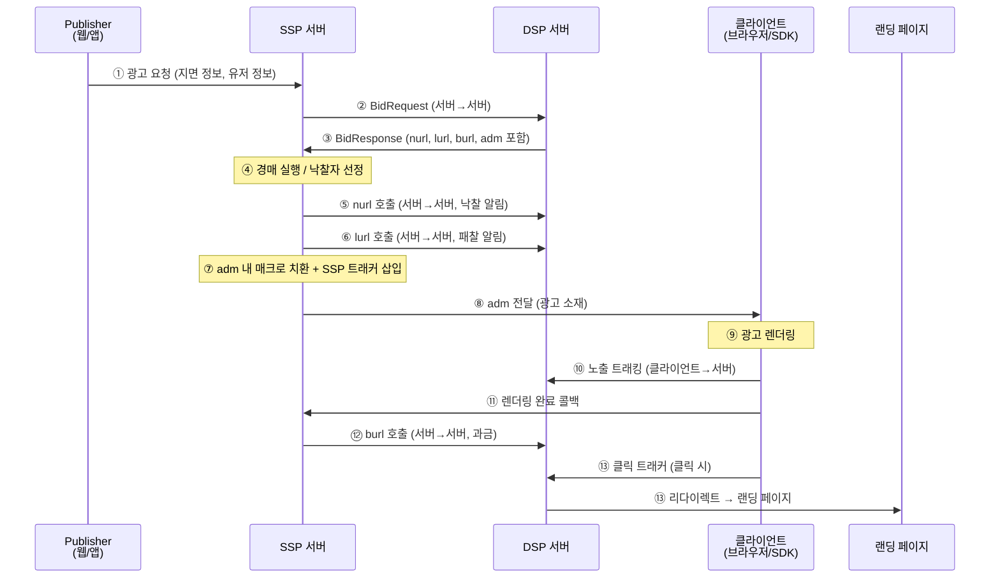

OpenRTB는 광고 지면을 실시간으로 사고파는 표준 프로토콜입니다. 처음 접하면 등장인물(Publisher, SSP, DSP)도 많고 nurl·burl·adm 같은 낯선 용어도 쏟아집니다. 이 글에서는 전체 흐름을 택배 비유로 먼저 잡은 뒤, 단계별로 무슨 일이 일어나는지 풀어 씁니다. 마지막에는 경매 방식(1st Price vs 2nd Price)까지 다뤄 OpenRTB의 핵심 개념을 한 자리에서 정리합니다.

---

## 택배 비유로 보는 전체 흐름

OpenRTB의 전체 흐름은 **온라인 경매 택배** 시스템과 닮아 있습니다.

1. **주문 접수 (광고 요청):** 쇼핑몰(Publisher)이 "이 자리에 광고 넣어줘"라고 물류센터(SSP)에 의뢰합니다.
2. **경매 (입찰):** 물류센터(SSP)가 여러 판매자(DSP)에게 "이 자리 얼마에 살래?"라고 묻고, 가장 높은 가격을 써낸 판매자가 낙찰됩니다.
3. **배송 (광고 전달):** 낙찰된 광고 소재(adm)가 택배(SSP → 클라이언트)로 배달됩니다.
4. **수취 확인 (렌더링 + 트래킹):** 받는 사람(브라우저/SDK)이 박스를 열고(렌더링), 받았다고 사인합니다(노출 트래킹).
5. **정산 (과금):** 수취 확인이 완료된 후 물류센터(SSP)가 판매자(DSP) 계좌에서 대금을 청구합니다(burl 호출).
6. **방문 (클릭):** 광고를 보고 마음에 들면 판매자의 가게(랜딩 페이지)를 직접 방문합니다.

핵심: **경매는 서버끼리, 광고 전달은 클라이언트로, 과금은 렌더링 이후**입니다.

---

## 전체 흐름 시퀀스 다이어그램



---

## 단계별 상세

### 1단계: 광고 요청 (Publisher → SSP → DSP)

| 호출 방향 | 구분 |
|---|---|
| Publisher → SSP | 서버-클라이언트 또는 서버-서버 |
| SSP → DSP | **서버-서버** |

Publisher(웹페이지, 앱)가 페이지 로드 시 SSP에 광고 슬롯 정보를 전송합니다. SSP는 수집한 지면 정보(크기, 위치)와 유저 정보(디바이스, 위치 등)를 바탕으로 **BidRequest**를 구성해 연동된 DSP들에게 동시에 전송합니다. 이 구간은 모두 **서버 간 통신**입니다. 브라우저는 관여하지 않습니다.

### 2단계: 입찰 및 경매 (DSP → SSP, 낙찰/패찰)

| 호출 방향 | 구분 |
|---|---|
| DSP → SSP (BidResponse) | **서버-서버** |
| SSP → DSP (nurl, lurl) | **서버-서버** |

DSP는 BidRequest를 분석해 입찰 여부와 금액을 결정하고 **BidResponse**를 반환합니다. BidResponse에는 `price`(입찰가), `adm`(광고 소재), `nurl`(낙찰 알림 URL), `lurl`(패찰 알림 URL), `burl`(과금 URL)이 포함됩니다. SSP는 모든 DSP의 응답을 수집해 **경매**를 실행하고 낙찰자를 선정한 뒤, 낙찰된 DSP에게 **nurl**을, 패찰된 DSP에게 **lurl**을 서버에서 직접 호출합니다.

`nurl`은 "낙찰됐어요" 알림이고, `burl`은 "이제 돈 받을게요" 과금 신호입니다. 둘은 다릅니다.

### 3단계: 광고 전달 (SSP → 클라이언트)

| 호출 방향 | 구분 |
|---|---|
| SSP → 클라이언트 | **서버-클라이언트** |

SSP는 낙찰된 광고 소재(`adm`) 안에 있는 **매크로를 치환**합니다. 예를 들어 `${AUCTION_PRICE}`는 실제 낙찰가로 바뀝니다. SSP 자체 트래킹 픽셀도 `adm` 안에 삽입한 뒤, 완성된 `adm`이 클라이언트(브라우저 또는 앱 SDK)로 내려갑니다.

### 4단계: 렌더링 및 트래킹 (클라이언트)

| 호출 방향 | 구분 |
|---|---|
| 클라이언트 → DSP (노출 트래킹) | **클라이언트-서버** |
| 클라이언트 → SSP (렌더링 완료 콜백) | **클라이언트-서버** |

클라이언트가 `adm`을 파싱해 광고를 화면에 **렌더링**합니다. 렌더링 과정에서 `adm` 안에 삽입된 트래킹 URL들이 자동 호출됩니다. DSP의 노출 트래킹 픽셀은 **클라이언트가 DSP 서버에 직접**, SSP 트래커는 **클라이언트가 SSP 서버에 직접** 호출합니다.

### 5단계: 과금 (SSP → DSP)

| 호출 방향 | 구분 |
|---|---|
| SSP → DSP (burl) | **서버-서버** |

SSP는 렌더링 완료 콜백을 수신한 후 **burl**을 DSP에 호출합니다. `burl` 호출이 실제 **과금의 기준**입니다. 이 호출은 SSP 서버가 수행하며, 클라이언트는 관여하지 않습니다.

### 6단계: 클릭 (클라이언트 → 랜딩 페이지)

| 호출 방향 | 구분 |
|---|---|
| 클라이언트 → DSP 클릭 트래커 | **클라이언트-서버** |
| DSP → 랜딩 페이지 | 리다이렉트 |

유저가 광고를 클릭하면 클라이언트가 DSP의 클릭 트래킹 URL을 호출합니다. DSP는 클릭을 기록한 후 유저를 랜딩 페이지로 리다이렉트합니다.

---

## 한눈에 보기 테이블

| 단계 | 호출 주체 | 대상 | 프로토콜 | 목적 |
|---|---|---|---|---|
| ① 광고 요청 | Publisher | SSP | HTTP | 광고 슬롯 정보 전달 |
| ② BidRequest | SSP 서버 | DSP 서버 | HTTP (OpenRTB) | 입찰 요청 |
| ③ BidResponse | DSP 서버 | SSP 서버 | HTTP (OpenRTB) | 입찰가 + 광고 소재 응답 |
| ④ 경매 | SSP 서버 | (내부 처리) | - | 낙찰자 선정 |
| ⑤ nurl | SSP 서버 | DSP 서버 | HTTP | 낙찰 알림 |
| ⑥ lurl | SSP 서버 | DSP 서버 | HTTP | 패찰 알림 |
| ⑦ 매크로 치환 | SSP 서버 | (내부 처리) | - | adm 완성 |
| ⑧ adm 전달 | SSP 서버 | 클라이언트 | HTTP | 광고 소재 전달 |
| ⑨ 렌더링 | 클라이언트 | (내부 처리) | - | 광고 화면 출력 |
| ⑩ 노출 트래킹 | 클라이언트 | DSP 서버 | HTTP (픽셀) | 노출 기록 |
| ⑪ 렌더링 콜백 | 클라이언트 | SSP 서버 | HTTP | 렌더링 완료 신호 |
| ⑫ burl | SSP 서버 | DSP 서버 | HTTP | **과금** |
| ⑬ 클릭 | 클라이언트 | DSP 클릭 트래커 | HTTP | 클릭 기록 + 랜딩 이동 |

---

## 미디어 타입별 차이

### Banner
`adm`은 HTML/JavaScript 코드입니다. 클라이언트가 iframe 또는 div에 삽입해 렌더링하며, 노출 트래킹은 `` 픽셀 태그 자동 로드로 처리됩니다.

### Video
`adm`은 VAST XML 형식입니다. 클라이언트(비디오 플레이어)가 VAST를 파싱해 영상을 재생하고 각 이벤트(impression, complete 등)마다 별도 트래킹 URL을 호출합니다. 노출 기준이 "재생 시작" 또는 "재생 2초 이상" 등으로 세분화됩니다.

### Native
`adm`은 JSON 형식으로 제목, 이미지 URL, 설명 등 구조화된 데이터입니다. 클라이언트가 직접 UI를 조합해 렌더링하며, 노출 트래킹 URL을 별도로 호출합니다. 광고가 지면 콘텐츠처럼 보이도록 Publisher가 스타일을 적용합니다.

---

## 흔한 오해 Q&A

**Q. nurl이 호출되면 과금인가요?**

아닙니다. `nurl`은 낙찰 **알림**일 뿐입니다. 실제 과금 기준은 `burl` 호출입니다. `nurl` 직후에는 아직 광고가 렌더링되지 않은 상태이므로 과금이 발생하지 않습니다.

---

**Q. 클라이언트가 burl을 호출하나요?**

아닙니다. `burl`은 **SSP 서버**가 DSP 서버에 호출합니다. 클라이언트(브라우저/SDK)는 렌더링 완료 콜백만 SSP에 보낼 뿐, burl 자체는 서버 간 통신입니다. 이 구조 덕분에 클라이언트 조작으로 과금을 임의로 발생시킬 수 없습니다.

---

**Q. adm 안의 트래킹 URL은 누가 호출하나요?**

**클라이언트**가 호출합니다. `adm`을 렌더링하는 과정에서 브라우저나 SDK가 소재 안에 포함된 `` 픽셀, JavaScript 코드 등을 실행하며 트래킹 URL에 자동으로 HTTP 요청을 보냅니다.

---

## 경매 방식: 1st Price vs 2nd Price

낙찰자가 결정됐을 때 **얼마를 실제로 내는가**가 경매 방식의 핵심입니다. OpenRTB 역사에서 두 가지 방식이 사용됐고, 현재는 1st Price가 표준입니다.

### 미술품 경매 비유

**1st Price Auction:** "500만원!" 하고 외쳤으면 500만원을 그대로 냅니다. 단순하고 투명합니다. 다만 구매자들은 "진짜 가치가 500만원인데, 300만원만 불러볼까?" 하고 눈치 게임을 합니다. 이것이 **Bid Shading**입니다.

**2nd Price Auction:** eBay 방식입니다. 1등이 낙찰되지만, 2등이 부른 가격에 아주 조금만 더 냅니다. "나는 500만원까지 괜찮아"라고 솔직하게 적어도 손해가 없어서 솔직한 입찰을 유도합니다. 하지만 경매사가 2등 가격을 속일 수 있다는 문제가 있어서 퇴조했습니다.

### 1st vs 2nd Price 비교

| | 2nd Price | 1st Price |
|--|-----------|-----------|
| 낙찰가 | 2등 입찰가 + α | 자기 입찰가 그대로 |
| 장점 | 솔직한 입찰 유도 | SSP 조작 방지, 투명 |
| 단점 | SSP가 2등 가격을 속일 수 있음 | bid shading 전략 필요 |
| 현재 위상 | 과거 주류 | **현재 표준** |

숫자로 보면 차이가 명확합니다.

```
1st Price 예시:
DSP A: 3.0 입찰 → 낙찰 → 3.0 지불
DSP B: 2.1 입찰
DSP C: 1.5 입찰

2nd Price 예시:
DSP A: 3.0 입찰 → 낙찰 → 2.11 지불 (2등 + 0.01)
DSP B: 2.1 입찰
DSP C: 1.5 입찰
```

### Bid Shading

1st Price 경매에서 DSP는 진짜 가치 그대로 입찰하면 낙찰 후 과다 지불이 발생합니다. 이를 방지하기 위해 **Bid Shading** 알고리즘을 사용합니다. 과거 낙찰 데이터, floor price, 경쟁 강도 등을 입력으로 받아 진짜 가치보다 낮은 최적 입찰가를 계산합니다. 낙찰 확률을 유지하면서 지불 비용을 줄이는 것이 목표입니다.

### Header Bidding과 1st Price 전환

Header Bidding의 확산이 업계의 1st Price 전환을 가속했습니다. Header Bidding 환경에서는 여러 SSP/Exchange가 동시에 경쟁하며 Publisher에게 최고가를 제시합니다. 이 구조에서는 각 Exchange가 독립적으로 경매를 수행하므로 통합된 2nd Price 경매를 운영하기 어렵고, 투명성 요구도 높아졌습니다. 결과적으로 Google을 포함한 주요 Exchange들이 2019년 전후로 1st Price로 전환했습니다.

OpenRTB에서 경매 방식은 `BidRequest.at` 필드로 명시합니다. `at=1`이면 1st Price, `at=2`이면 2nd Price입니다. DSP는 이 값을 읽어 Bid Shading 적용 여부를 결정합니다.
