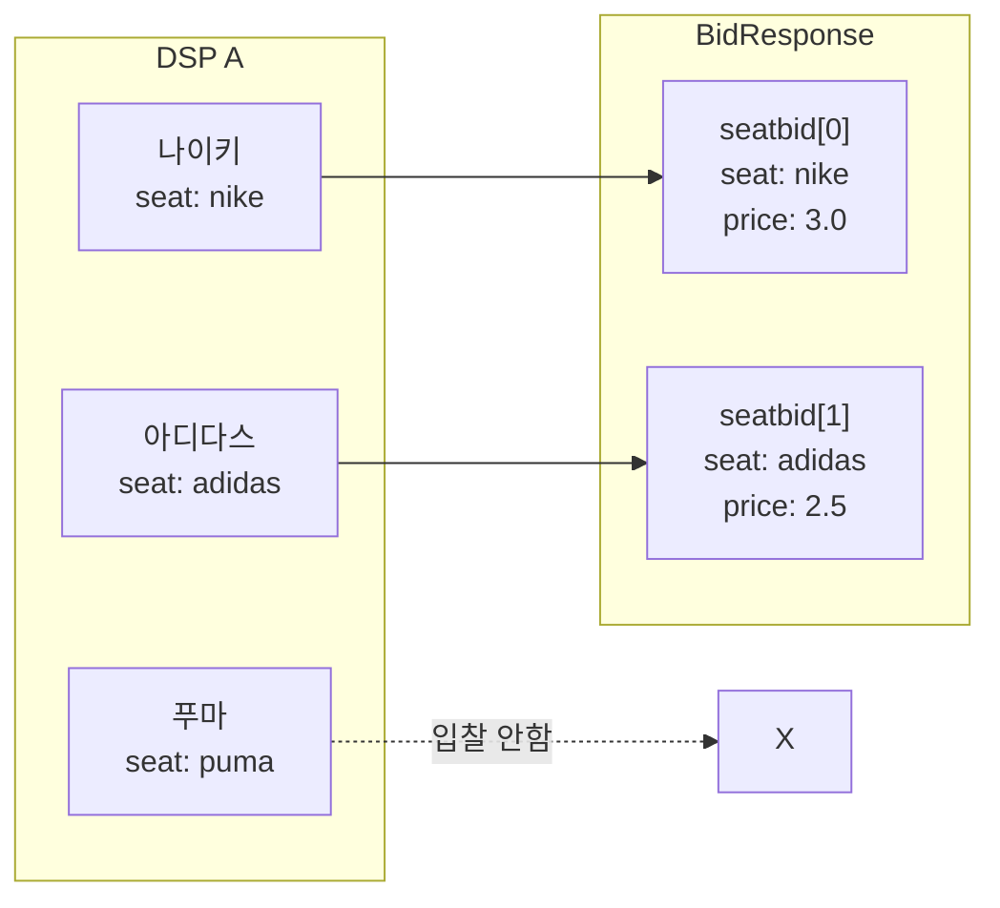
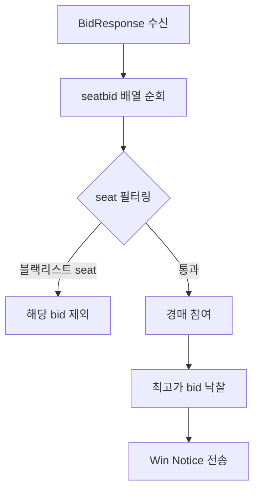
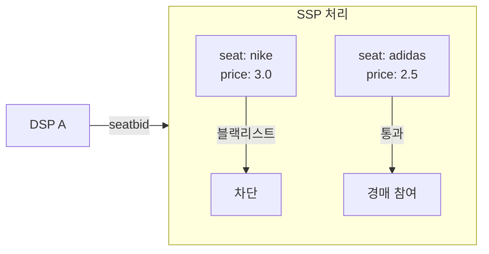

> DSP가 여러 광고주를 대신하여 입찰할 때 사용하는 SeatBid 구조에 대한 문서.

> **💡 Tip:** 부동산 중개사(DSP)가 여러 고객을 대리해서 같은 매물에 입찰하는 것을 상상해 보세요.
> - "나이키 고객님은 300만원에 입찰합니다" (seatbid[0])
> - "아디다스 고객님은 250만원에 입찰합니다" (seatbid[1])
>
> 이렇게 **광고주(seat)별로 입찰을 묶는 것**이 SeatBid입니다.
> SSP는 이 정보를 보고 "나이키 광고는 이 매체에서 차단"처럼 광고주 단위로 필터링할 수 있습니다.

---

## Seat이란?

**Seat = DSP 내의 광고주/바이어 계정**

DSP는 보통 여러 광고주를 대행한다.

```
DSP A
├── Seat "advertiser-nike"    (나이키)
├── Seat "advertiser-adidas"  (아디다스)
└── Seat "advertiser-puma"    (푸마)
```

---

## SeatBid 필드 정의

| 필드 | 타입 | 필수 여부 | 설명 |
|------|------|---------|------|
| `bid` | object[] | **필수** | 해당 seat의 입찰 목록. 하나의 seatbid에 여러 bid가 포함될 수 있음 |
| `seat` | string | 권장 | 입찰 주체인 광고주/바이어 식별자. 광고주 필터링 및 정산 분리에 사용 |
| `group` | integer | 선택 | `0`(기본): 각 bid는 독립적으로 낙찰 가능. `1`: 이 seatbid의 모든 bid가 동시에 낙찰되어야 함 (all-or-nothing) |
| `ext` | object | 선택 | 확장 필드 (거래소/DSP 간 커스텀 데이터) |

---

## group 필드: 묶음 입찰

`group = 1`로 설정하면 해당 seatbid 내의 모든 bid가 **함께 낙찰되거나 함께 탈락**한다.

**사용 사례:** 광고주가 배너 + 비디오를 동시에 게재하려 할 때, 둘 중 하나만 낙찰되는 상황을 방지하기 위해 사용한다.

```json
{
  "seatbid": [
    {
      "seat": "advertiser-samsung",
      "group": 1,
      "bid": [
        { "id": "bid-1", "impid": "imp-banner", "price": 2.0, "adm": "배너 소재" },
        { "id": "bid-2", "impid": "imp-video",  "price": 3.5, "adm": "<VAST>...</VAST>" }
      ]
    }
  ]
}
```

위 예시에서 `imp-banner`와 `imp-video` 중 어느 하나라도 낙찰되지 못하면 전체 seatbid가 무효 처리된다.

> **주의:** group 입찰은 SSP가 명시적으로 지원해야 처리된다. 미지원 SSP는 group 값을 무시하고 개별 bid로 처리할 수 있다.

---

## 왜 SeatBid가 여러 개인가

하나의 DSP가 **여러 광고주를 대신해서** 동시에 입찰할 수 있기 때문이다.

```json
{
  "seatbid": [
    {
      "seat": "advertiser-nike",
      "bid": [{ "price": 3.0, "adm": "나이키 광고 VAST" }]
    },
    {
      "seat": "advertiser-adidas",
      "bid": [{ "price": 2.5, "adm": "아디다스 광고 VAST" }]
    }
  ]
}
```

같은 지면에 나이키도 입찰하고, 아디다스도 입찰 가능하다.

---

## 구조 시각화



---

## SSP 관점에서의 처리

### 경매 처리 흐름

SSP는 BidResponse를 수신한 후 seatbid 배열을 순회하며 각 bid를 경매에 참여시킨다.



### seat을 활용한 광고주 블랙리스트 처리

퍼블리셔가 특정 광고주를 차단했을 때, SSP는 `seat` 필드와 `badv`(blocked advertiser domains)를 결합하여 필터링한다.



**seat 정보가 있기 때문에 DSP 전체가 아닌 특정 광고주만 필터링 가능하다.**

### seat을 활용한 정산 및 리포팅 분리

| 용도 | 설명 |
|------|------|
| **광고주 필터링** | 특정 광고주 블랙리스트 처리 가능 |
| **투명성** | 어떤 광고주가 입찰했는지 파악 |
| **정산 분리** | 광고주별 빌링/리포팅 가능 |
| **경쟁 방지** | 같은 DSP 내 광고주끼리 경쟁 조정 |

---

## 멀티 Imp 시나리오

BidRequest에 여러 개의 `imp[]`가 포함된 경우, 하나의 seatbid 내 bid들이 서로 다른 `impid`를 타게팅할 수 있다.

**BidRequest 예시 (배너 + 비디오 지면이 동시에 있는 경우):**

```json
{
  "id": "request-001",
  "imp": [
    { "id": "imp-banner", "banner": { "w": 320, "h": 50 } },
    { "id": "imp-video",  "video":  { "mimes": ["video/mp4"] } }
  ]
}
```

**BidResponse 예시 (하나의 seatbid가 두 imp에 각각 입찰):**

```json
{
  "id": "response-001",
  "seatbid": [
    {
      "seat": "advertiser-samsung",
      "bid": [
        {
          "id": "bid-1",
          "impid": "imp-banner",
          "price": 2.0,
          "adm": "<div>배너 소재</div>",
          "adomain": ["samsung.com"]
        },
        {
          "id": "bid-2",
          "impid": "imp-video",
          "price": 3.5,
          "adm": "<VAST version='4.0'>...</VAST>",
          "adomain": ["samsung.com"]
        }
      ]
    }
  ]
}
```

하나의 광고주(seat)가 동일한 페이지의 여러 광고 지면을 동시에 타게팅하는 패키지 구매 방식에 해당한다. `group = 1`과 함께 사용하면 모든 imp에 동시 낙찰을 조건으로 걸 수 있다.

---

## BidResponse 전체 구조 예시

```json
{
  "id": "response-123",
  "seatbid": [
    {
      "seat": "advertiser-nike",
      "group": 0,
      "bid": [
        {
          "id": "bid-1",
          "impid": "imp-456",
          "price": 3.0,
          "adm": "<VAST>...</VAST>",
          "adomain": ["nike.com"]
        }
      ]
    },
    {
      "seat": "advertiser-adidas",
      "group": 0,
      "bid": [
        {
          "id": "bid-2",
          "impid": "imp-456",
          "price": 2.5,
          "adm": "<VAST>...</VAST>",
          "adomain": ["adidas.com"]
        }
      ]
    }
  ]
}
```
