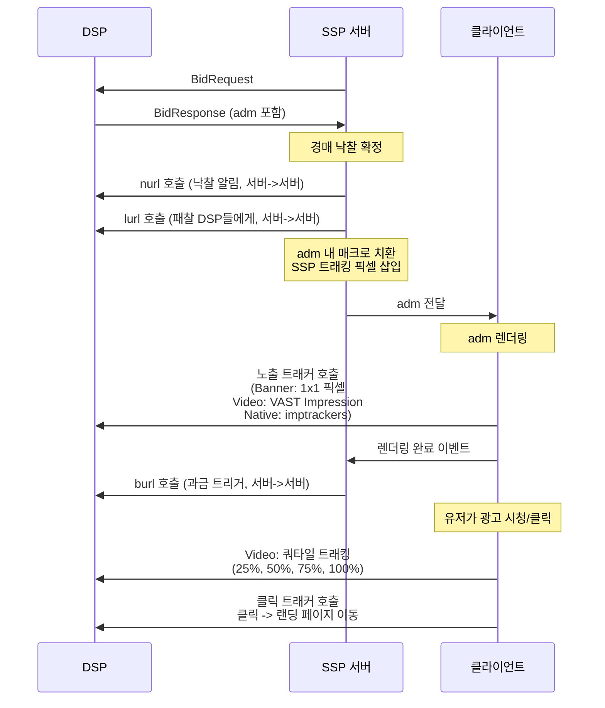

OpenRTB 연동을 처음 시작할 때 가장 많이 헷갈리는 것이 "이 URL은 누가 호출하는가?"다. nurl, burl, VAST Impression, 트래킹 픽셀 — 이름은 비슷해 보이지만 호출 주체와 시점이 완전히 다르다. 이걸 잘못 이해하면 과금 누락, 중복 집계, 트래킹 실패가 생긴다.

이 글은 OpenRTB 트래킹의 모든 URL을 한 자리에서 정리한다. 서버가 호출하는 URL과 클라이언트가 호출하는 URL을 구분하고, 미디어 타입(Banner, Video, Native)별 트래킹 방식과 SSP의 트래커 삽입 전략까지 다룬다.

---

## 한눈에 보기 — 호출 주체 총정리

먼저 전체 그림을 보자.

```
┌──────────────────────────────────────────────────────────────────┐
│                     호출 주체 총정리                              │
├────────────────┬──────────────┬──────────────┬──────────────────┤
│ URL            │ 호출 주체     │ 시점          │ 목적             │
├────────────────┼──────────────┼──────────────┼──────────────────┤
│ nurl           │ 서버 (SSP)   │ 낙찰 직후     │ 낙찰 알림        │
│ burl           │ 서버 (SSP)   │ 광고 렌더링 후 │ 과금 트리거      │
│ lurl           │ 서버 (SSP)   │ 패찰 시       │ 패찰 알림        │
├────────────────┼──────────────┼──────────────┼──────────────────┤
│ VAST Impression│ 클라이언트   │ 영상 로드 시   │ 노출 트래킹      │
│ VAST Tracking  │ 클라이언트   │ 재생 진행 시   │ 쿼타일 트래킹    │
│ VAST Click     │ 클라이언트   │ 유저 클릭 시   │ 클릭 트래킹      │
├────────────────┼──────────────┼──────────────┼──────────────────┤
│ Banner 픽셀    │ 클라이언트   │ HTML 렌더링 시 │ 노출 트래킹      │
│ Banner 클릭    │ 클라이언트   │ 유저 클릭 시   │ 클릭 트래킹      │
├────────────────┼──────────────┼──────────────┼──────────────────┤
│ Native imptr   │ 클라이언트   │ 광고 노출 시   │ 노출 트래킹      │
│ Native clicktr │ 클라이언트   │ 유저 클릭 시   │ 클릭 트래킹      │
└────────────────┴──────────────┴──────────────┴──────────────────┘

서버 = Server-to-Server (SSP 서버 -> DSP 서버)
클라이언트 = Client-Side (브라우저/앱/SDK -> DSP 서버)
```

판단 기준은 세 가지다:

1. **돈이 관련된 알림(nurl/burl/lurl)** → 서버 간 통신 (보안을 위해)
2. **"유저가 봤는가/클릭했는가" 판단** → 클라이언트 (사용자 기기만 알 수 있으므로)
3. **`${AUCTION_PRICE}` 매크로가 있으면** → 서버가 치환 (낙찰가는 서버만 알고 있으므로)

---

## 1. 서버 사이드 URL — nurl, burl, lurl

### nurl (Win Notice URL)

경매 낙찰 직후 SSP 서버가 DSP 서버에게 HTTP GET으로 호출한다. "당신이 낙찰되었습니다"라는 알림이다.

```
경매 종료
    |
    v
SSP 서버 --HTTP GET--> DSP 서버
    "https://dsp.com/win?id=123&price=${AUCTION_PRICE}"
    |
    v
DSP: "낙찰됐구나. 기록해두자."
```

**중요한 점:** nurl 호출은 광고 노출이 아니다. 유저가 실제로 광고를 봤는지는 이 시점에 알 수 없다. nurl만으로 과금하면 안 된다.

### burl (Billing Notice URL)

광고가 실제로 렌더링되어 노출이 확인된 후 SSP 서버가 호출한다. 이것이 과금 기준점이다.

```
1. 클라이언트가 광고를 렌더링
2. 클라이언트 -> SSP 서버: "렌더링 됐어요" (SDK 콜백)
3. SSP 서버 -> DSP 서버: burl 호출 (매크로 치환 포함)
```

클라이언트가 "트리거"하지만 실제 HTTP 호출은 SSP 서버가 한다. `${AUCTION_PRICE}`가 포함되어 있어 보안상 서버 간 통신이 필요하다.

### lurl (Loss Notice URL)

경매 패찰 시 SSP 서버가 패찰한 DSP 서버에게 호출한다. 패찰 사유(`${AUCTION_LOSS}`)와 최소 낙찰가(`${AUCTION_MIN_TO_WIN}`) 등 매크로를 전달한다.

```
SSP 서버 --HTTP GET--> DSP 서버
    "https://dsp.com/loss?id=123&reason=${AUCTION_LOSS}"
```

---

nurl/burl/lurl의 세부 사항(BidResponse 필드 정의, 매크로 목록 등)은 BidResponse 정리 글에서 다룬다. 여기서는 호출 주체와 시점에 집중한다.

---

## 2. 클라이언트 사이드 URL — 미디어 타입별 트래킹

클라이언트가 호출하는 URL들은 미디어 타입마다 구조가 다르다. 공통점은 "유저의 기기가 광고를 렌더링하거나 행동할 때" 호출된다는 것이다.

### 미디어 타입별 트래킹 구조 비교

| | Banner | Video | Native |
|--|--------|-------|--------|
| **adm 포맷** | HTML/JS 문자열 | VAST XML | JSON 문자열 |
| **노출 트래킹** | 1x1 픽셀 `` | `<Impression>` 태그 | `imptrackers[]` 배열 |
| **클릭 트래킹** | `<a href>` 하드코딩 | `<ClickTracking>` 태그 | `clicktrackers[]` 배열 |
| **SSP 노출 삽입** | 쉬움 | 쉬움 | 쉬움 |
| **SSP 클릭 삽입** | **어려움** | 쉬움 | 쉬움 |

Banner의 클릭 트래킹만 유독 어렵다. 그 이유와 해결책이 이 글의 핵심이다.

---

### 2.1 Banner 트래킹

#### adm 구조

Banner의 adm은 브라우저가 그대로 렌더링하는 HTML 문자열이다.

```html
<div id="ad-container">
  <!-- 유저가 클릭하면 href URL로 이동 -->
  <a href="https://dsp.com/click?campaign=abc&redirect=https://landing.nike.com">
    
  </a>
  <!-- HTML 렌더링 시 브라우저가 자동으로 HTTP GET -->
  
</div>
```

#### 노출 트래킹 (쉬움)

브라우저가 HTML을 렌더링할 때 `` 태그를 만나면 자동으로 HTTP GET을 호출한다. 1x1 픽셀이 바로 이 원리다.

```
브라우저가 HTML 렌더링
    |
    v
1x1 픽셀  태그를 만나면 자동으로 HTTP GET
    -> https://dsp.com/imp?id=123
```

SSP가 자체 노출 트래커를 추가하려면 `` 태그를 하나 더 삽입하면 된다.

```html


```

#### 클릭 트래킹 (어려움 — Banner만의 고질적 문제)

문제는 클릭이다. 유저가 배너를 클릭하면 브라우저는 `<a href="...">` 의 URL로 바로 이동한다. SSP가 이 클릭을 알 수 있는 구조적 자리가 없다.

왜 Banner만 어려운지는 다른 미디어 타입과 비교하면 명확하다:

```
Native:  clicktrackers: ["dsp.com/click", "ssp.com/click"]  <- 배열, 추가 가능
Video:   <ClickTracking>dsp.com/click</ClickTracking>        <- 태그, 추가 가능
         <ClickTracking>ssp.com/click</ClickTracking>

Banner:  <a href="https://dsp.com/click?redirect=landing">   <- 하드코딩! 하나뿐!
         -> SSP URL을 넣을 자리가 없음
```

| | Native | Video | Banner |
|--|--------|-------|--------|
| 클릭 트래커 구조 | **배열** (여러 개) | **여러 태그** (여러 개) | **`<a href>` 하나** (1개) |
| 트래커 추가 | 배열에 push | 태그 추가 | **불가능** |
| 랜딩 URL 분리 | `link.url` (별도) | `<ClickThrough>` (별도) | href에 **통합** |

근본 원인은 설계 철학의 차이다. Native와 Video는 "트래킹"과 "랜딩"이 분리된 구조인 반면, Banner HTML은 두 가지가 `<a href>` 하나에 합쳐져 있다.

#### Banner 클릭 트래킹 해결책 4가지

##### 해결책 1: Click Macro (업계 표준, 1순위)

DSP가 adm에 SSP 클릭 URL을 삽입할 수 있도록 매크로 자리를 미리 만들어둔다.

```
1. SSP가 DSP에게 "우리 클릭 매크로는 ${CLICK_URL}이야" 사전 가이드
2. DSP가 adm에 매크로를 포함하여 응답
3. SSP가 ${CLICK_URL}을 실제 URL로 치환
4. 치환된 HTML을 클라이언트에 전달
```

```html
<!-- DSP가 응답한 원본 adm -->
<a href="https://dsp.com/click?ssp_click=${CLICK_URL}&redirect=https://landing.com">

<!-- SSP가 치환한 결과 -->
<a href="https://dsp.com/click?ssp_click=https%3A%2F%2Fssp.com%2Fclick%3Fid%3D789&redirect=https://landing.com">
```

클릭 경로: 유저 클릭 -> dsp.com/click (DSP 기록) -> ssp.com/click (SSP 기록) -> landing.com

```go
func replaceClickMacro(adm string, sspClickURL string) string {
    encoded := url.QueryEscape(sspClickURL)
    return strings.ReplaceAll(adm, "${CLICK_URL}", encoded)
}
```

| 장점 | 단점 |
|------|------|
| 업계 표준, 정확한 집계 | DSP가 매크로를 지원해야 함 |
| 서버 사이드 치환 (보안) | DSP마다 매크로 형식이 다를 수 있음 |

##### 해결책 2: Redirect Wrapping (2순위)

SSP가 `<a href>` URL 자체를 SSP 리다이렉트 URL로 감싼다.

```html
<!-- 원본 -->
<a href="https://dsp.com/click?redirect=https://landing.com">

<!-- SSP가 변환 -->
<a href="https://ssp.com/click?id=789&redirect=https%3A%2F%2Fdsp.com%2Fclick%3Fredirect%3D...">
```

클릭 경로: 유저 클릭 -> ssp.com/click (SSP 기록) -> dsp.com/click (DSP 기록) -> landing.com

```go
func wrapClickURL(adm string, sspClickURL string) string {
    re := regexp.MustCompile(`href="([^"]+)"`)
    return re.ReplaceAllStringFunc(adm, func(match string) string {
        originalURL := re.FindStringSubmatch(match)[1]
        encoded := url.QueryEscape(originalURL)
        return fmt.Sprintf(`href="%s&redirect=%s"`, sspClickURL, encoded)
    })
}
```

| 장점 | 단점 |
|------|------|
| DSP 협조 불필요 | HTML 파싱/수정 필요 (구현 복잡) |
| 정확한 집계 | 리다이렉트 체인 길어짐 (레이턴시) |
| | 복잡한 HTML/JS에서 href 파싱 실패 가능 |

##### 해결책 3: MRAID (모바일 앱 전용, 3순위)

모바일 앱 환경에서 MRAID SDK가 `mraid.open()` 호출을 가로채서 SSP 클릭 트래커를 호출한 뒤 원래 URL로 이동시킨다.

```
광고가 mraid.open(url) 호출
    |
    v
SDK가 이 호출을 intercept
    |
    +--> SSP 클릭 트래커 호출
    +--> 원래 URL로 이동
```

| 장점 | 단점 |
|------|------|
| 정확한 클릭 집계 | 모바일 앱 전용 |
| DSP 협조 불필요 | MRAID 지원 광고만 가능 |

##### 해결책 4: HTML Wrapping (최후 수단)

SSP가 DSP HTML을 `<div onclick="...">` 으로 감싸서 클릭 이벤트를 JavaScript로 가로챈다.

```html
<div onclick="trackSSPClick()" style="position:relative;">
  <!-- DSP 원본 adm -->
  <a href="https://dsp.com/click?redirect=https://landing.com">
    
  </a>
</div>
<script>
function trackSSPClick() {
  var img = new Image();
  img.src = "https://ssp.com/click?id=789&t=" + Date.now();
}
</script>
```

| 장점 | 단점 |
|------|------|
| DSP 협조 불필요 | 정확도 낮음 (더블 카운팅 가능) |
| 모든 DSP에 적용 가능 | DOM 조작으로 광고 깨질 수 있음 |
| | 클릭 vs 스크롤 구분 어려움 |

#### Banner 클릭 트래킹 해결책 비교

| 방식 | 정확도 | DSP 협조 | 구현 난이도 | 권장도 |
|------|--------|---------|-----------|--------|
| **Click Macro** | 높음 | 필요 | 중 | **1순위 (표준)** |
| **Redirect Wrapping** | 높음 | 불필요 | 상 | 2순위 |
| **MRAID** | 높음 | 불필요 | 중 | 3순위 (앱 전용) |
| **HTML Wrapping** | 낮음 | 불필요 | 중 | 최후 수단 |

실무 권장 전략:
- 신규 DSP 연동 시 → Click Macro 방식 가이드 제공 (표준)
- Click Macro 미지원 DSP → Redirect Wrapping 적용
- 모바일 앱 환경 → MRAID 활용
- 어떤 것도 안 되면 → HTML Wrapping (정확도 낮음 감수)

---

### 2.2 Video/VAST 트래킹

Video 광고의 adm은 VAST XML이다. VAST(Video Ad Serving Template)는 비디오 광고의 레시피다. "이 URL에서 영상을 다운로드하고, 재생 시작 시 이 URL에 알리고, 25%가 되면 저 URL에 알려라" — 이런 지시가 XML로 구조화되어 있고, 비디오 플레이어가 이 지시를 순서대로 실행한다.

#### VAST 라이프사이클

```
1. SSP -> DSP: BidRequest (video.protocols, mimes, duration 포함)
2. DSP -> SSP: BidResponse (adm에 VAST XML 포함)
3. SSP -> DSP: nurl 호출 (Win Notice, 서버 간)
4. SSP -> 클라이언트: VAST XML 전달
5. 클라이언트(비디오 플레이어):
   |-- VAST 파싱 -> MediaFile URL에서 비디오 다운로드
   |-- <Impression> URL 호출 (재생 시작 시)
   |-- <TrackingEvents> 순서대로 호출:
   |   |-- start (재생 시작)
   |   |-- firstQuartile (25%)
   |   |-- midpoint (50%)
   |   |-- thirdQuartile (75%)
   |   +-- complete (100%)
   +-- 유저 클릭 시:
       |-- ClickTracking URL 호출 (트래킹)
       +-- ClickThrough URL로 이동 (랜딩)
6. SSP: burl 호출 (Billing Notice, 서버 간, 노출 확인 후)
```

#### VAST XML 구조

```xml
<?xml version="1.0" encoding="UTF-8"?>
<VAST version="3.0">
  <Ad id="12345">
    <InLine>
      <AdSystem>DSP Name</AdSystem>
      <AdTitle>나이키 동영상 광고</AdTitle>

      <!-- 재생 시작 시 클라이언트가 호출 (여러 개 가능) -->
      <Impression><![CDATA[https://dsp.com/imp?id=123]]></Impression>

      <Creatives>
        <Creative>
          <Linear>
            <Duration>00:00:15</Duration>

            <TrackingEvents>
              <!-- 재생 진행률에 따라 클라이언트가 호출 -->
              <Tracking event="start"><![CDATA[https://dsp.com/start]]></Tracking>
              <Tracking event="firstQuartile"><![CDATA[https://dsp.com/25pct]]></Tracking>
              <Tracking event="midpoint"><![CDATA[https://dsp.com/50pct]]></Tracking>
              <Tracking event="thirdQuartile"><![CDATA[https://dsp.com/75pct]]></Tracking>
              <Tracking event="complete"><![CDATA[https://dsp.com/100pct]]></Tracking>
              <Tracking event="skip"><![CDATA[https://dsp.com/skip]]></Tracking>
            </TrackingEvents>

            <VideoClicks>
              <!-- 유저 클릭 시 클라이언트가 호출 -->
              <ClickThrough><![CDATA[https://landing.nike.com]]></ClickThrough>
              <ClickTracking><![CDATA[https://dsp.com/click?id=123]]></ClickTracking>
            </VideoClicks>

            <MediaFiles>
              <MediaFile type="video/mp4" width="640" height="360" bitrate="2000">
                <![CDATA[https://cdn.com/video.mp4]]>
              </MediaFile>
            </MediaFiles>
          </Linear>
        </Creative>
      </Creatives>
    </InLine>
  </Ad>
</VAST>
```

#### VAST 내 URL 호출 주체 정리

| VAST 내 URL | 호출 주체 | 시점 |
|-------------|----------|------|
| `<Impression>` | 비디오 플레이어 | 재생 시작 시 |
| `<Tracking event="start">` | 비디오 플레이어 | 재생 시작 시 |
| `<Tracking event="firstQuartile">` | 비디오 플레이어 | 25% 재생 시 |
| `<Tracking event="midpoint">` | 비디오 플레이어 | 50% 재생 시 |
| `<Tracking event="thirdQuartile">` | 비디오 플레이어 | 75% 재생 시 |
| `<Tracking event="complete">` | 비디오 플레이어 | 100% 재생 시 |
| `<ClickTracking>` | 비디오 플레이어 | 유저 클릭 시 |
| `<ClickThrough>` | 비디오 플레이어 | 유저 클릭 시 (랜딩 이동) |

#### Wrapper Chain

VAST에는 InLine과 Wrapper 두 가지 타입이 있다. Wrapper는 실제 미디어 대신 다른 VAST URL을 가리키는 중간 단계다.

```
VAST Wrapper A
    |
    v  (HTTP 요청)
VAST Wrapper B
    |
    v  (HTTP 요청)
VAST InLine (실제 MediaFile + 트래킹 URL)
```

Wrapper Chain이 길어질수록 레이턴시가 증가한다. SSP는 보통 체인 깊이를 3~5단계로 제한하고, 초과 시 해당 입찰을 폐기한다.

BidRequest의 `video.protocols` 필드로 SSP가 지원하는 VAST 버전을 선언한다:

```json
{
  "imp": [{
    "video": {
      "protocols": [2, 3, 5, 6],
      "mimes": ["video/mp4"],
      "minduration": 5,
      "maxduration": 30
    }
  }]
}
```

값 2, 3은 VAST 2.0/3.0 InLine, 5, 6은 VAST 2.0/3.0 Wrapper를 의미한다.

#### VPAID vs VAST

| 구분 | VAST | VPAID |
|------|------|-------|
| 역할 | 비디오 전달/트래킹 포맷 | 인터랙티브 실행 환경 |
| 보안 | 안전 (XML만) | 위험 (JS 실행) |
| 추세 | 유지 | 폐기 중 (SIMID로 대체) |

VPAID는 JavaScript를 광고 환경에서 직접 실행하는 방식이라 보안 리스크가 크다. 업계가 SIMID로 이행 중이므로 신규 연동 시 VPAID 지원에 공을 들일 필요는 없다.

---

### 2.3 Native 트래킹

Native 광고의 adm은 구조화된 JSON이다. 데이터(assets)와 트래킹(imptrackers, clicktrackers)이 명확하게 분리되어 있어 트래커 삽입이 가장 쉽다.

```json
{
  "native": {
    "ver": "1.2",
    "assets": [
      { "id": 1, "title": { "text": "나이키 신상 운동화" } },
      { "id": 2, "img": { "url": "https://cdn.com/main.jpg", "w": 1200, "h": 627 } },
      { "id": 4, "data": { "type": 2, "value": "지금 바로 구매하세요" } }
    ],
    "link": {
      "url": "https://landing.nike.com/shoes",
      "clicktrackers": [
        "https://dsp.com/click?id=123",
        "https://thirdparty.com/click?id=456"
      ]
    },
    "imptrackers": [
      "https://dsp.com/imp?id=123",
      "https://thirdparty.com/imp?id=456"
    ],
    "eventtrackers": [
      { "event": 1, "method": 1, "url": "https://dsp.com/viewable?id=123" }
    ]
  }
}
```

앱 SDK가 JSON을 파싱하여 네이티브 UI 컴포넌트로 렌더링한다. HTML이 아니므로 앱이 렌더링을 완전히 제어한다.

**노출 트래킹:** 광고가 화면에 렌더링되면 SDK가 `imptrackers[]` 배열의 모든 URL을 HTTP GET으로 호출한다.

**클릭 트래킹:** 유저가 광고를 탭하면 SDK가 `link.clicktrackers[]`의 모든 URL을 호출한 뒤 `link.url`로 이동한다.

SSP 트래커 추가는 배열에 URL을 하나 push하면 된다:

```json
"imptrackers": [
  "https://dsp.com/imp?id=123",
  "https://ssp.com/imp?id=789"
]
```

`eventtrackers`는 뷰어빌리티(event=1) 같은 고급 이벤트 트래킹에 사용한다.

---

## 3. SSP의 트래커 삽입 — 미디어 타입별 구현

SSP는 자체 노출/클릭 집계를 위해 DSP의 adm에 SSP 트래킹 URL을 삽입해야 한다. 미디어 타입별 구현이 다르다.

```
SSP가 받은 DSP adm:
       <- DSP 노출 트래킹

SSP가 삽입 후 클라이언트에 전달:
       <- SSP 자체 노출 트래킹 (추가)
       <- DSP 노출 트래킹 (원본 유지)
```

### 통합 구현 (Go)

```go
func insertSSPTrackers(bid Bid, sspImpURL string, sspClickURL string) (string, error) {
    switch bid.MType {
    case 1: // Banner
        adm := bid.AdM
        // 노출: 1x1 픽셀 삽입
        impPixel := fmt.Sprintf(``, sspImpURL)
        adm = adm + impPixel

        // 클릭: Click Macro 치환 (있으면)
        if strings.Contains(adm, "${CLICK_URL}") {
            adm = strings.ReplaceAll(adm, "${CLICK_URL}", url.QueryEscape(sspClickURL))
        }
        // Click Macro가 없으면 -> Redirect Wrapping 또는 포기
        return adm, nil

    case 2: // Video (VAST)
        adm := bid.AdM
        // 노출: <Impression> 태그 추가
        impTag := fmt.Sprintf("<Impression><![CDATA[%s]]></Impression>", sspImpURL)
        adm = strings.Replace(adm, "<Impression>", impTag+"\n<Impression>", 1)

        // 클릭: <ClickTracking> 태그 추가
        clickTag := fmt.Sprintf("<ClickTracking><![CDATA[%s]]></ClickTracking>", sspClickURL)
        adm = strings.Replace(adm, "</VideoClicks>", clickTag+"\n</VideoClicks>", 1)
        return adm, nil

    case 4: // Native
        var native NativeResponse
        json.Unmarshal([]byte(bid.AdM), &native)

        // 노출: 배열에 추가
        native.ImpTrackers = append(native.ImpTrackers, sspImpURL)

        // 클릭: 배열에 추가
        native.Link.ClickTrackers = append(native.Link.ClickTrackers, sspClickURL)

        result, _ := json.Marshal(native)
        return string(result), nil

    default:
        return bid.AdM, fmt.Errorf("unknown mtype: %d", bid.MType)
    }
}
```

### SSP 트래커 삽입 난이도 정리

```
┌─────────────────────────────────────────────────────────┐
│                 SSP 트래커 삽입 난이도                     │
├───────────┬──────────────────┬──────────────────────────┤
│           │ 노출 (Impression) │ 클릭 (Click)              │
├───────────┼──────────────────┼──────────────────────────┤
│ Native    │ 매우 쉬움         │ 매우 쉬움                 │
│           │ imptrackers[]    │ clicktrackers[]           │
│           │ 에 URL 추가       │ 에 URL 추가               │
├───────────┼──────────────────┼──────────────────────────┤
│ Video     │ 쉬움             │ 쉬움                      │
│           │ <Impression>     │ <ClickTracking>           │
│           │ 태그 추가         │ 태그 추가                  │
├───────────┼──────────────────┼──────────────────────────┤
│ Banner    │ 쉬움             │ 어려움                    │
│           │ 1x1         │ <a href> 하드코딩          │
│           │ 태그 추가         │ Click Macro 등 필요        │
└───────────┴──────────────────┴──────────────────────────┘
```

---

## 4. 전체 흐름도 (시간 순서)



---

## 5. 판단 플로우차트 — "이 URL은 누가 호출하는가?"

```
이 URL이 무엇인가?
    |
    +-- nurl / burl / lurl ? --> 서버 (SSP가 DSP에게 호출)
    |
    +-- adm 안에 들어있는 URL?
    |       |
    |       +-- Banner HTML의  --> 클라이언트 (렌더링 시 자동)
    |       +-- Banner HTML의 <a href="..."> --> 클라이언트 (유저 클릭 시)
    |       +-- VAST <Impression> --> 클라이언트 (재생 시작 시)
    |       +-- VAST <Tracking event="..."> --> 클라이언트 (재생 진행 시)
    |       +-- VAST <ClickTracking> --> 클라이언트 (유저 클릭 시)
    |       +-- Native imptrackers[] --> 클라이언트 (렌더링 시)
    |       +-- Native clicktrackers[] --> 클라이언트 (유저 클릭 시)
    |
    +-- ${AUCTION_PRICE} 매크로가 포함되어 있는가?
            |
            +-- Yes --> 서버가 치환 (그 URL이 클라이언트에 전달되더라도)
            +-- No  --> adm 안이면 클라이언트, 아니면 케이스별 판단
```

---

## 6. 흔한 오해 Q&A

**Q: burl도 클라이언트가 호출하는 거 아닌가?**

아니다. burl은 SSP 서버가 호출한다. 클라이언트가 "렌더링 완료"를 SSP에 알리면(트리거), SSP 서버가 burl을 호출한다. burl에는 `${AUCTION_PRICE}`가 포함되어 있어 보안상 서버 간 통신이 필요하다. 클라이언트가 직접 호출하면 낙찰가가 노출된다.

**Q: nurl과 VAST Impression의 차이는?**

둘 다 "impression"처럼 보이지만 완전히 다르다.

| | nurl | VAST `<Impression>` |
|--|------|---------------------|
| 호출 주체 | SSP 서버 | 비디오 플레이어 (클라이언트) |
| 시점 | 경매 직후 (광고 노출 전) | 비디오 재생 시작 시 |
| 의미 | "낙찰됐다" 알림 | "유저가 실제로 봤다" 확인 |
| 과금 | 아님 | 보통 노출 기준 |

nurl은 낙찰 통지고, VAST Impression은 실제 노출이다.

**Q: `${AUCTION_PRICE}` 매크로는 누가 치환하는가?**

항상 SSP 서버가 치환한다. 낙찰가는 SSP 서버만 알고 있기 때문이다.

- nurl → 서버가 치환 후 서버가 호출
- burl → 서버가 치환 후 서버가 호출
- lurl → 서버가 치환 후 서버가 호출
- adm 내 매크로 → 서버가 치환 후 클라이언트에 전달

**Q: adm 안의 URL은 서버가 호출하는가, 클라이언트가 호출하는가?**

adm은 SSP 서버가 클라이언트에게 전달하는 콘텐츠다. adm 안에 들어있는 URL들은 클라이언트가 호출한다. 단, SSP 서버는 전달 전에 adm 내 매크로를 치환하고 SSP 자체 트래킹 픽셀을 삽입한다.

**Q: SSP는 Banner 클릭을 어떻게 트래킹하는가?**

가장 좋은 방법은 Click Macro다. DSP가 `${CLICK_URL}` 매크로를 지원하면 SSP가 서버 사이드에서 치환한다. 미지원 DSP에는 Redirect Wrapping을 적용한다. 상세한 4가지 방법과 비교는 위의 Banner 클릭 트래킹 섹션을 참고한다.

**Q: VAST Wrapper Chain이 왜 문제인가?**

Wrapper는 실제 미디어가 아니라 다른 VAST URL을 가리킨다. 플레이어가 InLine에 도달할 때까지 체인을 따라가며 HTTP 요청을 반복한다. 체인이 3단계면 광고 로드 전에 HTTP 요청이 3번 발생한다. 레이턴시가 누적되어 광고 시작이 늦어지고, 최악의 경우 타임아웃으로 광고가 표시되지 않는다.

---

## 요약

```
┌─────────────────────────────────────────────────────────────┐
│                     3가지 판단 원칙                          │
├─────────────────────────────────────────────────────────────┤
│                                                             │
│  1. 매크로(${AUCTION_PRICE})가 있으면 -> 서버가 치환          │
│                                                             │
│  2. "유저가 봤는가/클릭했는가"를 판단하는 건 -> 클라이언트    │
│                                                             │
│  3. "돈"이 관련된 알림(nurl/burl/lurl)은 -> 서버 간 통신     │
│                                                             │
└─────────────────────────────────────────────────────────────┘
```

| 질문 | 답 |
|------|---|
| 매크로 치환이 필요한가? | 서버 |
| 유저 행동을 감지해야 하는가? | 클라이언트 |
| 금액 정보가 포함되어 있는가? | 서버 |
| adm 안에 있는 URL인가? | 클라이언트 (렌더링 과정에서 호출) |
| Banner 클릭은 어떻게? | Click Macro (1순위) -> Redirect Wrapping -> MRAID -> HTML Wrapping |
