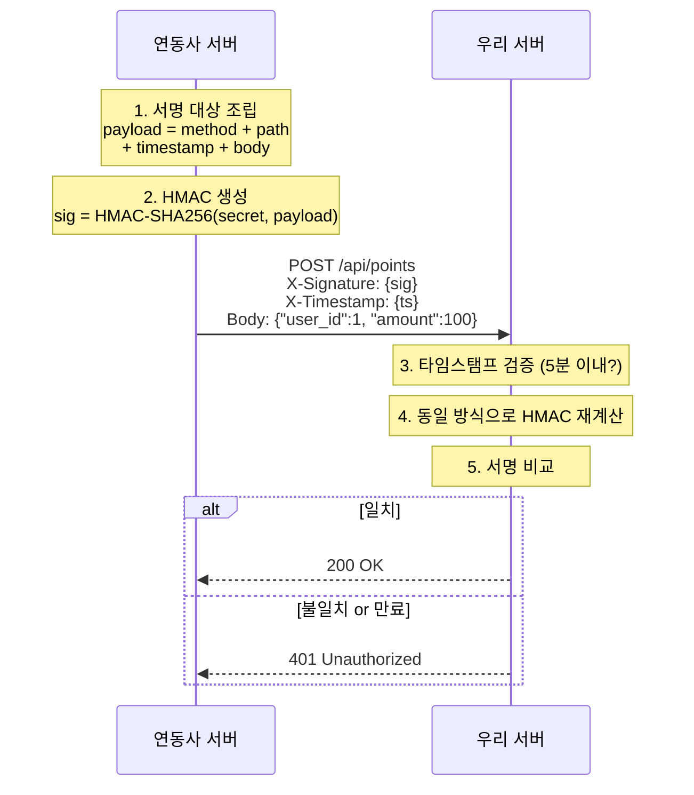

> 외부 업체에 포인트 지급 API를 열어줘야 한다. 인증 토큰은 이미 있다. 그런데 누군가 중간에서 `amount: 100`을 `amount: 10000`으로 바꾸면? 토큰은 여전히 유효하다. 이 글은 그 문제를 해결하는 HMAC에 대한 이야기다.

---

## 인증 토큰만으로는 안 되는 이유

API 키나 Bearer 토큰은 **"누구인가"**만 증명한다. 요청 본문이 도중에 바뀌었는지는 전혀 알 수 없다.

```
[연동사 서버] ---> amount: 100 ---> [중간자] ---> amount: 10000 ---> [우리 서버]
                                      ↑
                              토큰은 건드리지 않음
                              본문만 조작
```

우리 서버 입장에서는 유효한 토큰 + 정상적인 JSON이 들어온 것이다. 거부할 근거가 없다.

---

## HMAC: 메시지에 자물쇠를 채우는 방법

HMAC은 **H**ash-based **M**essage **A**uthentication **C**ode의 약자다.

핵심 아이디어는 단순하다: **비밀 키와 메시지를 함께 해싱**한다. 키를 모르는 사람은 올바른 해시값을 만들 수 없으므로, 수신 측에서 메시지가 조작되지 않았음을 검증할 수 있다.

```
발신: HMAC-SHA256(비밀키, 메시지) → 서명값 생성 → 메시지와 함께 전송
수신: 같은 방식으로 서명값 재계산 → 받은 서명값과 비교 → 일치하면 통과
```

단순 해시(`SHA256(메시지)`)와 다른 점은 **비밀 키**가 들어간다는 것이다. 해시는 누구나 계산할 수 있지만, HMAC은 키를 아는 당사자만 계산할 수 있다.

HMAC이 보장하는 것과 보장하지 않는 것을 명확히 하자:

| 보장하는 것 | 보장하지 않는 것 |
|---|---|
| 메시지 무결성 (1바이트라도 바뀌면 감지) | 기밀성 (메시지 자체는 평문) |
| 발신자 인증 (키 소유자만 생성 가능) | 부인 방지 (법적으로 누가 보냈는지 증명) |

기밀성이 필요하면 TLS 위에서 HMAC을 쓰면 된다. 대부분의 API 연동이 이 구조다.

---

## 실제 API 연동 흐름

외부 업체와 HMAC 기반 API를 연동할 때의 일반적인 프로토콜이다.



여기서 **타임스탬프**가 중요하다. 서명에 타임스탬프를 포함시키고 유효 시간(보통 5분)을 제한하지 않으면, 공격자가 과거의 유효한 요청을 그대로 다시 보내는 **리플레이 공격**이 가능해진다.

이 패턴은 업계 표준이다. Stripe, GitHub, Shopify, Slack, AWS 모두 HMAC-SHA256 기반 Webhook 서명을 사용한다.

---

## Go로 구현하기

Go의 `crypto/hmac` 패키지를 쓰면 코드가 놀라울 정도로 짧다.

### 서명 생성

```go
func generateHMAC(key, message []byte) string {
    mac := hmac.New(sha256.New, key)
    mac.Write(message)
    return hex.EncodeToString(mac.Sum(nil))
}
```

`mac.Sum(nil)`은 "지금까지 Write한 데이터의 HMAC 값을 새 바이트 슬라이스로 돌려달라"는 뜻이다. `Sum`의 인자는 결과를 append할 대상인데, `nil`이면 새로 만든다.

### 서명 검증

```go
func verifyHMAC(key, message []byte, receivedSig string) bool {
    expectedSig := generateHMAC(key, message)
    return hmac.Equal([]byte(expectedSig), []byte(receivedSig))
}
```

**여기서 `hmac.Equal`을 반드시 써야 한다.** `==`이나 `bytes.Equal`을 쓰면 안 된다.

이유는 타이밍 공격 때문이다:

```
bytes.Equal은 첫 번째 불일치 바이트에서 즉시 false를 반환한다.

시도 1: [00]xxx → 0.1ms에 실패 (첫 바이트부터 틀림)
시도 2: [a3]xxx → 0.2ms에 실패 (첫 바이트 맞고 두 번째에서 틀림)
시도 3: [a3][f2]xxx → 0.3ms에 실패 ...

응답 시간 차이를 측정하면 한 바이트씩 HMAC을 맞춰나갈 수 있다.
```

`hmac.Equal`은 항상 전체 바이트를 비교(constant-time comparison)하므로 결과와 무관하게 동일한 시간이 걸린다.

### HTTP 미들웨어 예시

실제 서비스에서는 미들웨어로 빼는 게 일반적이다:

```go
func HMACMiddleware(secret []byte) func(http.Handler) http.Handler {
    return func(next http.Handler) http.Handler {
        return http.HandlerFunc(func(w http.ResponseWriter, r *http.Request) {
            sig := r.Header.Get("X-Signature")
            ts := r.Header.Get("X-Timestamp")

            // 타임스탬프 검증 (5분)
            reqTime, err := strconv.ParseInt(ts, 10, 64)
            if err != nil || time.Since(time.Unix(reqTime, 0)) > 5*time.Minute {
                http.Error(w, "request expired", http.StatusUnauthorized)
                return
            }

            // 본문 읽기
            body, _ := io.ReadAll(r.Body)
            r.Body = io.NopCloser(bytes.NewReader(body))

            // 서명 대상: method + path + timestamp + body
            payload := fmt.Sprintf("%s%s%s%s", r.Method, r.URL.Path, ts, body)

            if !verifyHMAC(secret, []byte(payload), sig) {
                http.Error(w, "invalid signature", http.StatusUnauthorized)
                return
            }

            next.ServeHTTP(w, r)
        })
    }
}
```

---

## 실제 서비스들은 어떻게 쓰고 있나

앞서 "업계 표준"이라고 했는데, 실제로 어떤 구조인지 비교해 보자.

| 서비스 | 서명 헤더 | 서명 포맷 | 타임스탬프 | 리플레이 방지 |
|---|---|---|---|---|
| Stripe | `Stripe-Signature` | `t={ts},v1={sig}` | 헤더에 포함 | 5분 권장 |
| GitHub | `X-Hub-Signature-256` | `sha256={sig}` | 없음 | 없음 (별도 처리 필요) |
| Slack | `X-Slack-Signature` | `v0={sig}` | `X-Slack-Request-Timestamp` | 5분 |

같은 HMAC-SHA256이지만 세부 프로토콜은 서비스마다 다르다. 몇 가지 주목할 점을 짚어 보자.

### Stripe: 가장 정교한 설계

Stripe는 서명 헤더 하나에 타임스탬프와 서명을 함께 넣는다:

```
Stripe-Signature: t=1614556828,v1=5257a869e7ecebeda32affa62cdca3fa51cad7e77a0e56ff536d0ce8e108d8bd
```

서명 대상은 `{timestamp}.{raw_body}` 형태다. 타임스탬프를 서명에 포함시키므로 공격자가 타임스탬프만 바꿔서 리플레이하는 것도 불가능하다.

```go
// Stripe 방식 검증
payload := fmt.Sprintf("%s.%s", timestamp, rawBody)
expectedSig := generateHMAC(endpointSecret, []byte(payload))
```

Stripe는 또한 키 로테이션을 위해 `v1` 외에 `v2` 등 **여러 버전의 서명을 동시에 보낼 수 있다.** 수신 측은 하나라도 일치하면 통과시키면 된다.

### GitHub: 단순하지만 타임스탬프 없음

GitHub는 `sha256=` 접두사 뒤에 서명을 붙이는 가장 단순한 형태다:

```
X-Hub-Signature-256: sha256=d57c68ca6f92289e6987922ff26938930f6e66a2d161ef06abdf1859230aa23c
```

서명 대상은 요청 본문 전체다. **타임스탬프가 없으므로 리플레이 공격에 별도 대응이 필요하다.** GitHub은 이를 `X-GitHub-Delivery` (고유 ID)로 보완한다. 수신 측에서 이 ID를 저장하고 중복 요청을 거부하는 식이다.

### Slack: 버전 접두사로 확장성 확보

Slack은 서명 대상을 명시적으로 조립한다:

```
서명 대상 = "v0:" + timestamp + ":" + raw_body
서명 = "v0=" + HMAC-SHA256(signing_secret, 서명 대상)
```

`v0` 접두사는 서명 알고리즘의 버전이다. 나중에 알고리즘을 바꿔야 할 때 `v1`으로 올리면 하위 호환을 유지하면서 전환할 수 있다.

### 공통 패턴

세 서비스 모두 다르지만, 공통점이 있다:

1. **반드시 raw body로 검증한다.** JSON 파싱 후 재직렬화하면 공백이나 키 순서가 바뀌어 서명이 깨진다. 프레임워크가 자동으로 body를 파싱하기 전에 원본을 캡처해야 한다.
2. **constant-time 비교를 쓴다.** Stripe은 `secure_compare`, GitHub은 `timingSafeEqual`, Slack도 동일한 방식을 권장한다.
3. **서명 키는 엔드포인트별로 다르다.** 하나의 키가 유출되어도 다른 연동에는 영향이 없다.

---

## 키 관리: HMAC의 아킬레스건

HMAC의 보안은 전적으로 비밀 키에 의존한다. 키가 유출되면 HMAC은 무력화된다.

### 키가 유출되면

1. **즉시 해당 키를 무효화한다.** 서버에서 해당 키로 들어오는 요청을 전부 거부한다.
2. **새 키를 안전한 채널로 전달한다.** 이메일이 아니라 별도 암호화 통신이나 오프라인으로.
3. **유예 기간을 둔다.** 구/신 키를 동시에 허용하는 짧은 기간(예: 24시간)을 설정해 서비스 중단을 방지한다.
4. **로그를 감사한다.** 유출 시점 전후의 요청을 전수 검토해 위변조된 요청이 실제로 처리되지 않았는지 확인한다.

키 유출을 사후 대응하는 것보다 **정기 로테이션**(예: 90일)을 미리 잡아두는 게 훨씬 낫다. 유출이 있더라도 피해 범위가 로테이션 주기로 제한된다.

---

## 정리

외부 업체에 API를 열어줄 때 인증 토큰만으로는 메시지 위변조를 막을 수 없다. HMAC은 비밀 키 + 해시 함수 조합으로 이 문제를 해결하며, 구현은 Go 기준 10줄이면 충분하다.

기억할 것 세 가지:

1. **서명 대상에 타임스탬프를 포함시켜라.** 리플레이 공격 방지.
2. **비교는 반드시 `hmac.Equal`로.** 타이밍 공격 방지.
3. **키 로테이션을 정기적으로.** 유출 피해 범위 제한.

---

**참고 자료**
- [Go crypto/hmac 공식 문서](https://pkg.go.dev/crypto/hmac)
- [RFC 2104 - HMAC: Keyed-Hashing for Message Authentication](https://datatracker.ietf.org/doc/html/rfc2104)
