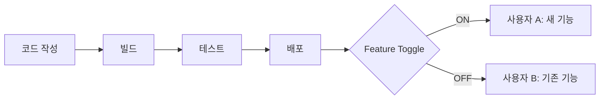
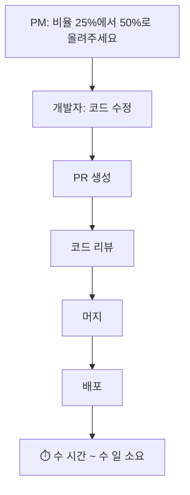
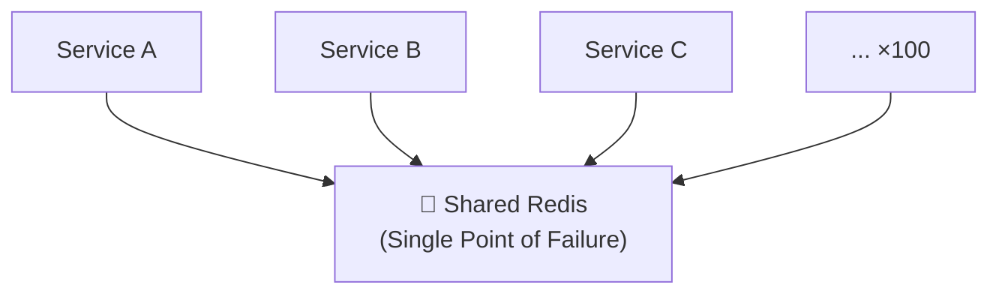
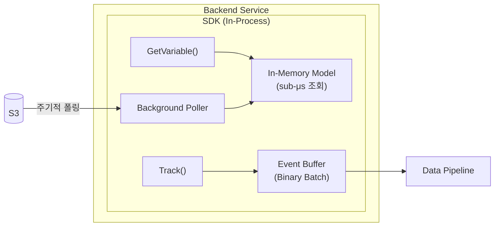
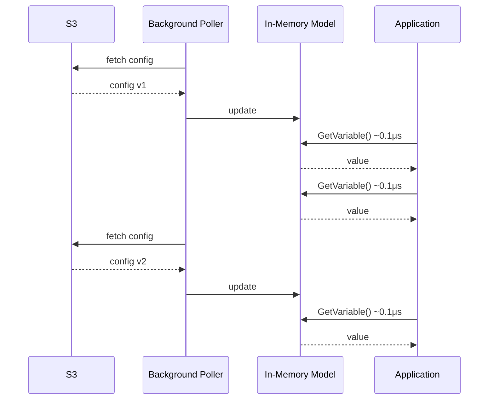

팀이 10개이고 동시에 돌리는 실험이 50개라면, 실험 비율 하나 바꾸는 데 코드 수정 → PR → 리뷰 → 배포 사이클을 매번 돌려야 할까? Grab이 직면했던 이 문제와 해결 과정을 정리했다.

## Feature Toggle이란

Feature toggle(feature flag)은 **코드 배포와 기능 릴리스를 분리**하는 기법이다. 코드는 이미 배포되어 있지만, 설정값에 따라 기능이 활성화되거나 비활성화된다.



주요 용도:
- **Feature rollout** — 신규 기능을 특정 비율의 사용자에게만 점진적으로 노출
- **A/B 테스트** — 두 가지 이상의 변형을 나눠서 효과를 비교
- **킬 스위치** — 문제가 생기면 코드 롤백 없이 기능을 즉시 끌 수 있음

가장 원시적인 형태는 이런 하드코딩이다:

```go
if userId % 2 == 0 {
    newAlgorithm(ctx)
} else {
    oldAlgorithm(ctx)
}
```

직관적이지만, 비율을 바꾸려면? 50%가 아니라 25%로 줄이려면? 특정 도시에서만 적용하려면? 매번 코드를 고치고 배포해야 한다. Grab이 직면한 문제가 정확히 이것이다.

---

## 레거시 방식의 문제

Grab은 2017년 이전까지 하드코딩 기반 실험과 공유 Redis를 사용했다.

### 하드코딩의 한계

실험 비율이나 대상을 바꾸려면 매번 이런 사이클을 돌려야 했다:



팀이 커지면서 "endless meetings"과 수 주간의 반복이 발생했다. 실험 50개를 동시에 운영하면서 각각의 비율을 코드로 관리한다고 생각해보면, 왜 이게 지속 불가능한지 쉽게 알 수 있다.

### 공유 Redis: Single Point of Failure

레거시 시스템은 모든 마이크로서비스가 하나의 Redis를 바라보는 구조였다.

```go
// 레거시 코드
sitevar.GetFeatureFlagOrDefault("someFeatureFlagKey", 10, false)
```



서비스가 수백 개로 늘어나면서 문제가 분명해졌다:
- Redis가 죽으면 **모든 서비스의 feature flag가 동작하지 않는다**
- 네트워크 지터와 지연이 서비스 성능에 영향을 준다
- 규모가 커질수록 Redis에 대한 부하가 선형으로 증가한다

---

## Grab SDK 아키텍처

Grab은 이 문제를 SDK 기반 아키텍처로 해결했다. 핵심 설계 원칙은 하나다: **`GetVariable()` 호출 시 네트워크 I/O가 전혀 발생하지 않는다.**

### 전체 아키텍처



### 핵심 API: GetVariable()과 Track()

SDK는 두 가지 함수만 노출한다:

```go
type Client interface {
    // 변수 값을 가져온다 (네트워크 호출 없음)
    GetVariables(ctx context.Context, name string, facets Facets) Variables

    // 이벤트를 추적한다
    Track(ctx context.Context, eventName string, value float64, facets Facets)
}
```

실제 사용:

```go
// 도시와 드라이버에 따라 다른 값을 반환
threshold := client.GetVariable(ctx, "myFeature", sdk.NewFacets().
    Driver(driverID).
    City(cityID),
).Int64(10)  // 기본값 10
```

`Int64(10)`의 기본값은 실험/롤아웃이 설정되지 않았거나, 조건에 매치되지 않거나, 에러가 발생했을 때 사용된다.

### S3 폴링: 왜 네트워크 호출이 없는가

비결은 **백그라운드 폴링 + 인메모리 캐시**다:

1. SDK가 **백그라운드에서 S3를 주기적으로 폴링**하여 실험/롤아웃 설정 JSON을 가져온다
2. 가져온 설정을 **인메모리 모델**로 구성한다
3. `GetVariable()` 호출은 순수 메모리 연산 → **sub-microsecond** 응답



왜 S3인가?
- AWS의 **Tier-0 서비스**로 가용성이 극도로 높다 (99.99%)
- S3가 일시적으로 불가해도, SDK는 **이미 메모리에 캐시된 설정으로 계속 동작**한다
- 공유 Redis와 달리 SPOF가 아니다

| 비교 | 공유 Redis | S3 + 인메모리 |
|------|-----------|---------------|
| 조회 방식 | 매번 네트워크 호출 | 메모리에서 읽기 |
| 조회 지연 | ~1ms (네트워크) | ~0.1μs (메모리) |
| Redis/S3 장애 시 | **서비스 장애** | 캐시된 설정으로 계속 동작 |
| 확장성 | 서비스 수 ∝ Redis 부하 | 서비스 수와 무관 |

---

### 설정의 형식화

실험과 롤아웃 설정을 JSON으로 형식화했다. 웹 포털에서 PM이나 마케터가 직접 수정할 수 있다. 개발자의 코드 변경이 필요 없다.

롤아웃 정의 예시:

```json
{
  "variable": "automatedMessageDelay",
  "rolloutBy": "city",
  "rollouts": [
    {
      "value": 60,
      "string": "60s delay",
      "constraints": [
        {"target": "city", "op": "=", "value": "6"},
        {"target": "svc", "op": "in", "value": "[302, 11]"}
      ]
    },
    {
      "value": 90,
      "string": "90s delay",
      "constraints": [
        {"target": "city", "op": "=", "value": "10"},
        {"target": "pax", "op": "/", "value": "0.25"}
      ]
    }
  ],
  "default": 30,
  "version": 1515051871,
  "schema": 1
}
```

이 정의가 의미하는 것:
- **싱가포르**(City=6)의 차량 타입 302, 11 → `automatedMessageDelay = 60`
- **자카르타**(City=10)의 승객 25% → `automatedMessageDelay = 90`
- **그 외 모든 경우** → `automatedMessageDelay = 30` (기본값)

비율 변경이나 도시 추가는 이 JSON만 수정하면 된다. 코드 배포 없이.

---

### Facets: 컨텍스트 전달 체계

`Facets`는 의사결정과 추적에 사용되는 속성 집합이다:

```go
Passenger  int64   // 승객 식별자
Driver     int64   // 드라이버 식별자
Service    int64   // 차량 타입
Booking    string  // 예약 코드
Location   string  // 위치 (geohash)
City       int64   // 도시
Session    string  // 세션 식별자
Device     string  // 디바이스 식별자
Tag        string  // 사용자 정의 태그
```

하나의 `GetVariable()` 호출에 이 컨텍스트를 함께 전달하면, SDK가 **조건 매칭**과 **이벤트 추적**을 동시에 처리한다. 예를 들어 "싱가포르의 드라이버 12345에게 이 기능이 켜져 있는가?"를 판단하면서, 동시에 "드라이버 12345가 이 값을 받았다"를 기록한다.

---

### 트래킹: 바이너리 배치 전송

A/B 테스트 분석을 위해 모든 `GetVariable()` 호출은 **어떤 유저가 어떤 값을 받았는지** 자동으로 기록된다.

```go
// 명시적 트래킹도 가능
client.Track(ctx, "myEvent", 42, sdk.NewFacets().
    Passenger(123).
    Booking("ADR-123-2-001").
    City(10),
)
```

문제는 이 이벤트를 어떻게 서버에 보내느냐다. Grab이 운영하는 동남아시아 시장의 특수성을 고려해야 한다:

- 드라이버들은 비싼 데이터 요금제를 쓸 수 없다
- 모바일 네트워크가 불안정하다
- 매 `GetVariable()` 호출마다 네트워크 요청을 보내면 비용과 성능 모두 문제다

Grab의 해결책: **바이너리 인코딩 + 배치 전송 + 문자열 중복 제거**

**일반적인 JSON 전송** — 매 이벤트마다 키 이름과 문자열이 반복된다:

```json
{"passenger":123,"city":10,"var":"myFeature",...}
{"passenger":123,"city":10,"var":"myFeature",...}
{"passenger":456,"city":10,"var":"myFeature",...}
```

**Grab의 바이너리 배치** — 문자열을 정수 ID로 치환하고, String Table에 한 번만 기록한다:

| String Table | ID |
|---|---|
| `"passenger"` | 0 |
| `"city"` | 1 |
| `"myFeature"` | 2 |

이벤트 데이터는 variable-size integer encoding으로 `[0:123, 1:10, 2:...]` 형태로 압축된다.

한 번 쓴 문자열은 **정수 ID로 치환**되므로, 배치 안에서 같은 문자열이 반복되지 않는다. Protocol Buffers, Avro, JSON보다 효율적이다.

---

## 정리: 레거시 vs SDK

| 구분 | 레거시 | SDK |
|------|--------|-----|
| 설정 변경 | 코드 수정 → PR → 배포 | 웹 포털에서 즉시 |
| 저장소 | 공유 Redis (SPOF) | S3 + 인메모리 캐시 |
| 조회 지연 | ~1ms (네트워크 호출) | ~0.1μs (메모리) |
| 장애 격리 | Redis 죽으면 전체 영향 | S3 죽어도 캐시로 동작 |
| 트래킹 | 없음 | 바이너리 배치 자동 전송 |
| 실험 관리 | 개발자만 가능 | PM/마케터도 가능 |

---

## Feature Toggle 설계 시 고려사항

Grab의 사례에서 일반화할 수 있는 설계 원칙들이다.

### 1. 핫패스에서 네트워크를 제거하라

`GetVariable()`이 요청 처리 경로(hot path)에 있다면, 네트워크 호출은 치명적이다. 인메모리 평가가 핵심이다.

### 2. 설정 저장소의 가용성을 확보하라

S3처럼 가용성이 극도로 높은 저장소를 쓰되, 저장소가 일시 불가해도 마지막으로 가져온 설정으로 동작할 수 있어야 한다. "graceful degradation"의 전형.

### 3. 설정을 형식화하라

하드코딩 대신 JSON/YAML로 형식화하면:
- 코드 변경 없이 설정 변경 가능
- 비개발자도 웹 UI로 관리 가능
- 버전 관리와 감사(auditing) 가능

### 4. 네트워크 환경에 맞춰 트래킹을 설계하라

Grab처럼 네트워크가 비싸거나 불안정한 환경이라면, 바이너리 배치 전송이 효과적이다. 배치 크기와 전송 주기를 튜닝할 수 있어야 한다.

---

## 참고자료

- [Reliable and Scalable Feature Toggles and A/B Testing SDK at Grab](https://engineering.grab.com/feature-toggles-ab-testing) — 원문
- [Martin Fowler - Feature Toggles](https://martinfowler.com/articles/feature-toggles.html) — Feature toggle의 유형과 패턴에 대한 체계적 분류
