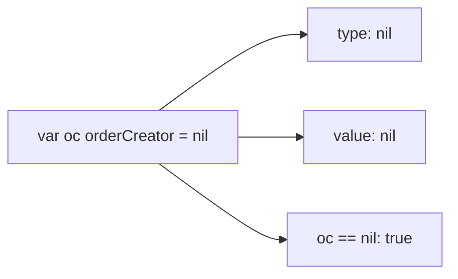
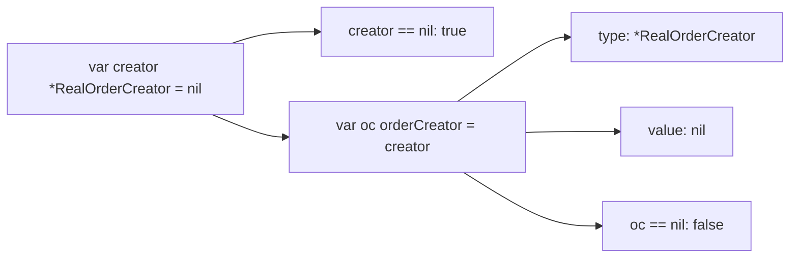
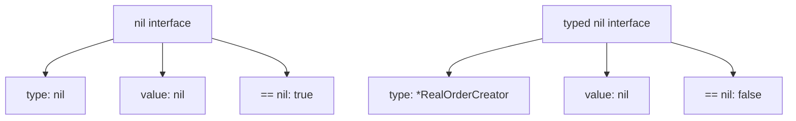
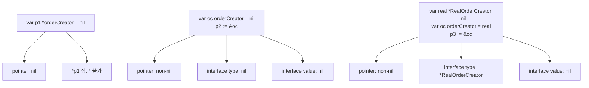
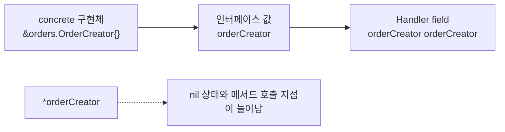

Go에서 인터페이스를 쓰다 보면 한 번쯤 이런 코드를 만난다.

```go
var creator *RealOrderCreator = nil
var oc orderCreator = creator

fmt.Println(creator == nil) // true
fmt.Println(oc == nil)      // false
```

처음 보면 이상하다.

`creator`가 nil인데, 그걸 담은 `oc`는 왜 nil이 아닐까?

이 현상을 흔히 typed nil 문제라고 부른다. 원인은 인터페이스 값의 구조에 있다.

---

## 인터페이스는 타입과 값을 함께 들고 있다

Go 인터페이스 값은 포인터 하나가 아니다.

개념적으로는 이렇게 볼 수 있다.

```text
interface value = (concrete type, concrete value)
```

완전히 nil인 인터페이스는 타입도 없고 값도 없다.



반대로 typed nil은 타입은 들어 있는데 값만 nil인 상태다.



다시 코드를 보자.

```go
var creator *RealOrderCreator = nil
var oc orderCreator = creator
```

`creator`는 nil pointer다. 그래서 `creator == nil`은 true다.

하지만 `oc`에는 concrete type 정보가 들어 있다.

```text
type  = *RealOrderCreator
value = nil
```

인터페이스 자체는 완전히 비어 있지 않다. 그래서 `oc == nil`은 false다.

---

## nil interface와 typed nil은 다르다

둘을 나란히 보면 차이가 드러난다.



nil interface:

```go
var oc orderCreator = nil
fmt.Println(oc == nil) // true
```

typed nil:

```go
var real *RealOrderCreator = nil
var oc orderCreator = real

fmt.Println(oc == nil) // false
```

이 차이를 모르면 생성자나 handler에서 nil 체크를 했는데도 나중에 panic이 나는 코드를 만들 수 있다.

---

## 인터페이스 포인터는 더 헷갈린다

여기서 한 발 더 나가서 인터페이스의 포인터를 쓰면 nil 상태가 더 늘어난다.

```go
type Handler struct {
	creator *orderCreator
}
```

이제 봐야 하는 상태가 하나가 아니다.



첫 번째는 포인터 자체가 nil인 경우다.

```go
var p1 *orderCreator = nil
```

두 번째는 포인터는 nil이 아닌데, 그 안의 인터페이스 값이 nil인 경우다.

```go
var oc orderCreator = nil
p2 := &oc
```

세 번째는 포인터도 nil이 아니고, 인터페이스도 nil이 아니지만, 인터페이스 안의 concrete value가 nil인 경우다.

```go
var real *RealOrderCreator = nil
var oc orderCreator = real
p3 := &oc
```

이쯤 되면 nil 체크 지점이 늘어난다.

```go
if creator == nil {
	// 포인터 자체만 nil인지 확인
}

if *creator == nil {
	// 인터페이스 값이 nil인지 확인
}
```

그런데 typed nil이면 `*creator == nil`도 기대와 다르게 false가 될 수 있다.

---

## 메서드 호출도 불편해진다

인터페이스 값을 필드로 두면 호출 형태는 그대로다.

```go
type Handler struct {
	creator orderCreator
}

func (h *Handler) Serve(ctx context.Context, cmd orders.CreateOrderCommand) error {
	_, err := h.creator.CreateOrder(ctx, cmd)
	return err
}
```

하지만 인터페이스 포인터를 필드로 두면 바로 호출할 수 없다.

```go
type Handler struct {
	creator *orderCreator
}

func (h *Handler) Serve(ctx context.Context, cmd orders.CreateOrderCommand) error {
	_, err := h.creator.CreateOrder(ctx, cmd) // 컴파일되지 않음
	return err
}
```

`h.creator`는 인터페이스가 아니라 인터페이스를 가리키는 포인터이기 때문이다.

굳이 하려면 역참조해야 한다.

```go
func (h *Handler) Serve(ctx context.Context, cmd orders.CreateOrderCommand) error {
	_, err := (*h.creator).CreateOrder(ctx, cmd)
	return err
}
```

코드가 어색해지고, nil 상태를 볼 지점도 늘어난다. 얻는 이득은 거의 없다.

---

## 의존성 주입에서는 이렇게 기억한다

HTTP handler가 usecase에 의존한다면 보통 이렇게 쓴다.

```go
type orderCreator interface {
	CreateOrder(ctx context.Context, cmd orders.CreateOrderCommand) (orders.CreateOrderResult, error)
}

type Handler struct {
	orderCreator orderCreator
}

func NewHandler(orderCreator orderCreator) *Handler {
	return &Handler{orderCreator: orderCreator}
}
```

실제 구현체는 포인터로 만들어 넘긴다.

```go
creator := &orders.OrderCreator{}
handler := api.NewHandler(creator)
```

그림으로 보면 이 정도 관계다.



이 기준으로 두면 된다.

- 인터페이스는 value로 받는다.
- concrete 구현체는 필요하면 pointer로 넘긴다.
- 인터페이스의 pointer는 거의 만들지 않는다.

typed nil 문제를 완전히 없앨 수는 없지만, 인터페이스 포인터를 만들지 않으면 nil 상태를 추적할 곳이 줄어든다.
