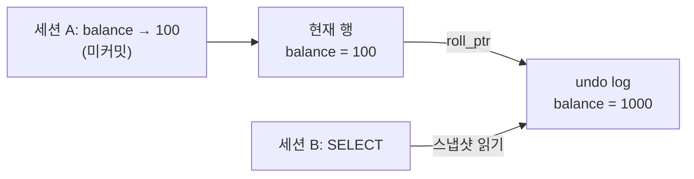
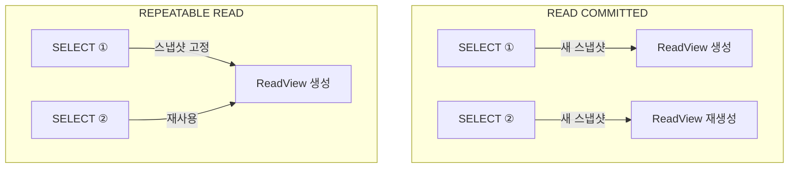
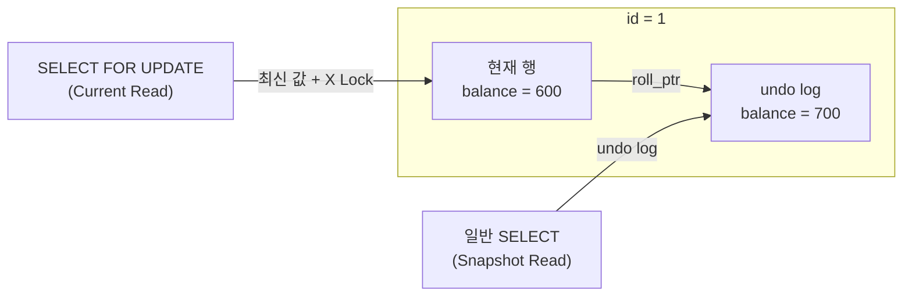
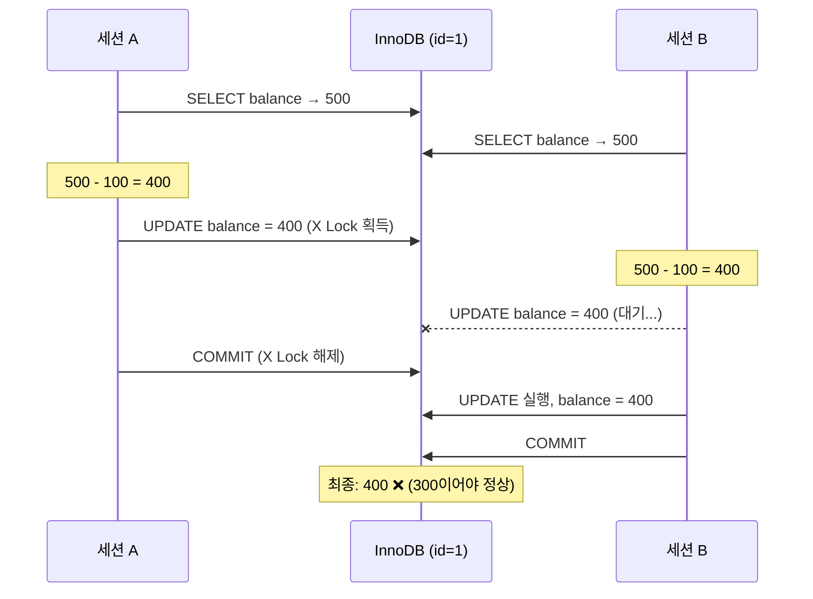
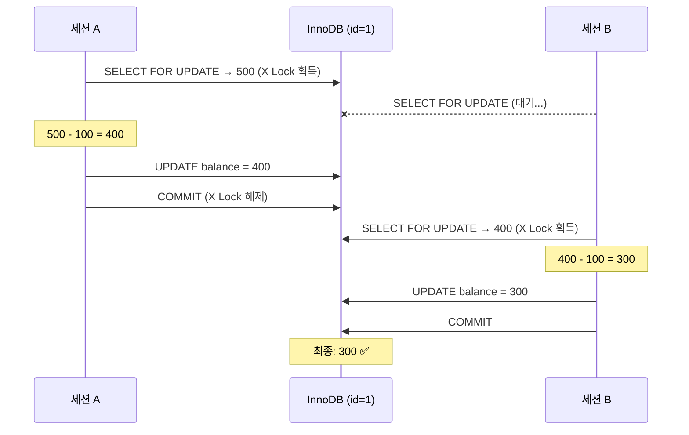
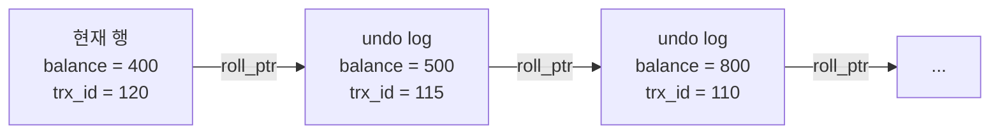
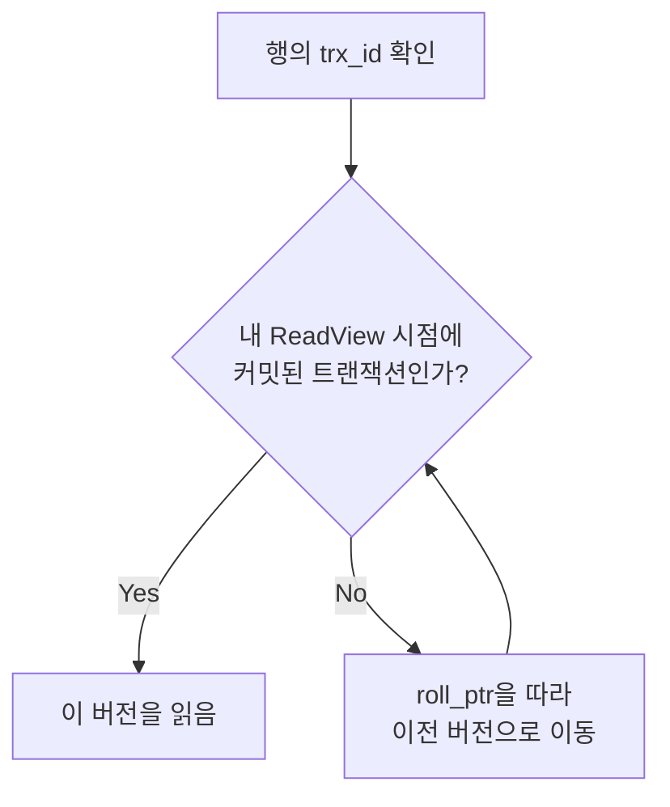

"REPEATABLE READ는 같은 값을 반복해서 읽을 수 있다"는 설명을 읽고 고개를 끄덕인 적은 있지만, 정말 그런지 직접 확인해본 적은 없었다. 터미널 두 개를 열고 실습해보니 MVCC와 락의 동작이 훨씬 선명하게 잡혔다.

## 준비

Docker로 MySQL을 띄우고 터미널 두 개(세션 A, 세션 B)로 접속한다.

```bash
docker run --name mysql-lab -e MYSQL_ROOT_PASSWORD=password -d -p 3306:3306 mysql:latest
# 터미널 두 개에서 각각 실행
docker exec -it mysql-lab mysql -uroot -ppassword
```

테스트용 테이블을 만든다.

```sql
CREATE DATABASE IF NOT EXISTS innodb_lab;
USE innodb_lab;

CREATE TABLE account (
  id BIGINT PRIMARY KEY,
  owner_name VARCHAR(50) NOT NULL,
  balance INT NOT NULL,
  version INT NOT NULL DEFAULT 0,
  updated_at TIMESTAMP NOT NULL DEFAULT CURRENT_TIMESTAMP ON UPDATE CURRENT_TIMESTAMP
) ENGINE=InnoDB;

INSERT INTO account (id, owner_name, balance, version)
VALUES (1, 'junghwan', 1000, 0), (2, 'alice', 500, 0);
```

InnoDB의 기본 격리 수준을 확인한다.

```sql
SELECT @@transaction_isolation;
-- REPEATABLE-READ
```

---

## Lab 1 — Dirty Read 방지

커밋되지 않은 데이터를 다른 세션에서 볼 수 있는가?

| 순서 | 세션 A | 세션 B |
|:---:|---|---|
| 1 | `START TRANSACTION;` | |
| 2 | `UPDATE account SET balance = 100 WHERE id = 1;` | |
| 3 | `SELECT * FROM account WHERE id = 1;` → **100** | |
| 4 | | `SELECT * FROM account WHERE id = 1;` → **1000** |
| 5 | `ROLLBACK;` | |

세션 A가 100으로 바꿨지만 아직 커밋하지 않았다. 세션 B에서는 여전히 1000이 보인다. InnoDB는 UPDATE 시 원본 값을 undo log에 보관하고, 다른 세션은 그 undo log의 스냅샷을 읽기 때문이다.



세션 B는 현재 행이 아닌 undo log의 원본(1000)을 읽는다. 이것이 Dirty Read 방지다.

---

## Lab 2 — READ COMMITTED vs. REPEATABLE READ

### READ COMMITTED: 매번 새 스냅샷

| 순서 | 세션 A | 세션 B |
|:---:|---|---|
| 1 | `SET SESSION TRANSACTION ISOLATION LEVEL READ COMMITTED;` | |
| 2 | `START TRANSACTION;` | |
| 3 | `SELECT balance FROM account WHERE id = 1;` → **1000** | |
| 4 | | `UPDATE account SET balance = 800 WHERE id = 1;` |
| 5 | `SELECT balance FROM account WHERE id = 1;` → **800** | |
| 6 | `COMMIT;` | |

같은 트랜잭션 안에서 같은 쿼리를 두 번 했는데 결과가 달라졌다. READ COMMITTED는 **매 SELECT마다 새 스냅샷**을 찍기 때문이다. 이것이 Non-Repeatable Read 현상이다.

### REPEATABLE READ: 스냅샷 고정

| 순서 | 세션 A | 세션 B |
|:---:|---|---|
| 1 | `SET SESSION TRANSACTION ISOLATION LEVEL REPEATABLE READ;` | |
| 2 | `START TRANSACTION;` | |
| 3 | `SELECT balance FROM account WHERE id = 1;` → **800** | |
| 4 | | `UPDATE account SET balance = 700 WHERE id = 1;` |
| 5 | `SELECT balance FROM account WHERE id = 1;` → **800** | |
| 6 | `COMMIT;` | |

세션 B가 700으로 커밋했지만 세션 A에는 여전히 800이 보인다. REPEATABLE READ는 **트랜잭션 내 첫 SELECT 시점에 스냅샷을 고정**하고, 이후 모든 SELECT에서 그 스냅샷을 재사용한다.



| 항목 | READ COMMITTED | REPEATABLE READ |
|---|---|---|
| ReadView 생성 시점 | 매 SELECT마다 | 트랜잭션 내 첫 SELECT에서 1회 |
| Non-Repeatable Read | 발생 | 방지 |
| 같은 쿼리 반복 시 | 중간 커밋이 있으면 결과가 바뀜 | 항상 같은 결과 |

---

## Lab 3 — Snapshot Read vs. Current Read

일반 SELECT와 `SELECT ... FOR UPDATE`는 전혀 다른 데이터를 읽는다.

| 순서 | 세션 A | 세션 B |
|:---:|---|---|
| 1 | `START TRANSACTION;` | |
| 2 | `SELECT balance FROM account WHERE id = 1;` → **700** | |
| 3 | | `UPDATE account SET balance = 600 WHERE id = 1;` |
| 4 | `SELECT balance FROM account WHERE id = 1;` → **700** | |
| 5 | `SELECT balance FROM account WHERE id = 1 FOR UPDATE;` → **600** | |
| 6 | `COMMIT;` | |

같은 트랜잭션에서 같은 행을 조회했는데 일반 SELECT는 700, FOR UPDATE는 600을 반환한다.



| | 일반 SELECT | SELECT ... FOR UPDATE |
|---|---|---|
| 읽기 방식 | Snapshot Read (MVCC 스냅샷) | Current Read (최신 커밋 값) |
| 락 | 없음 | X Lock (배타 락) |
| 용도 | 단순 조회 | 수정 전 조회, 경합 방지 |

FOR UPDATE가 최신 값을 읽어야 하는 이유는 명확하다. 스냅샷(700)을 기준으로 UPDATE하면, 세션 B가 커밋한 600이 덮어씌워져서 Lost Update가 발생한다.

### X Lock의 차단 범위

FOR UPDATE로 X Lock을 잡으면, 다른 세션에서 같은 행에 대해:

| 다른 세션의 시도 | 차단 여부 | 이유 |
|---|---|---|
| 일반 SELECT | 통과 | 스냅샷을 읽으므로 락 불필요 |
| SELECT ... FOR SHARE | **대기** | S Lock 필요, X Lock과 충돌 |
| SELECT ... FOR UPDATE | **대기** | X Lock 필요, X Lock과 충돌 |
| UPDATE / DELETE | **대기** | X Lock 필요, X Lock과 충돌 |

"읽기는 쓰기를 막지 않고, 쓰기는 읽기를 막지 않는다." MVCC의 핵심이다.

---

## Lab 4 — Lost Update

balance=500에서 두 세션이 동시에 100씩 차감한다. 정상이라면 300이 되어야 한다.

### FOR UPDATE 없이 (위험)

| 순서 | 세션 A | 세션 B |
|:---:|---|---|
| 1 | `START TRANSACTION;` | `START TRANSACTION;` |
| 2 | `SELECT balance ...` → **500** | `SELECT balance ...` → **500** |
| 3 | `UPDATE ... SET balance = 400;` | |
| 4 | | `UPDATE ... SET balance = 400;` → **대기** |
| 5 | `COMMIT;` | (대기 해제, 실행) |
| 6 | | `COMMIT;` |
| | **최종 balance: 400** | |



둘 다 스냅샷(500)을 읽고 애플리케이션에서 `500 - 100 = 400`을 계산해서 UPDATE했다. 차감이 한 번 증발했다.

### FOR UPDATE로 해결

| 순서 | 세션 A | 세션 B |
|:---:|---|---|
| 1 | `START TRANSACTION;` | `START TRANSACTION;` |
| 2 | `SELECT ... FOR UPDATE;` → **500** | |
| 3 | | `SELECT ... FOR UPDATE;` → **대기** |
| 4 | `UPDATE ... SET balance = 400;` | |
| 5 | `COMMIT;` | (대기 해제) |
| 6 | | → **400** (최신 값을 읽음) |
| 7 | | `UPDATE ... SET balance = 300;` |
| 8 | | `COMMIT;` |
| | **최종 balance: 300** | |



핵심은 **락이 걸리는 시점**이다:

| 방식 | 락 시점 | 결과 |
|---|---|---|
| SELECT → 계산 → UPDATE | UPDATE에서 비로소 락 | 읽기-계산 사이 gap에서 Lost Update |
| SELECT FOR UPDATE → 계산 → UPDATE | SELECT에서 이미 락 | gap 없음, 안전 |

---

## Lab 5 — 음수 차감 방지

balance=300에서 두 세션이 동시에 250씩 출금을 시도한다. 하나만 성공해야 한다.

### 방법 1: FOR UPDATE + 애플리케이션 체크

| 순서 | 세션 A | 세션 B |
|:---:|---|---|
| 1 | `SELECT ... FOR UPDATE;` → **300** (X Lock) | |
| 2 | | `SELECT ... FOR UPDATE;` → **대기** |
| 3 | 300 >= 250 → `UPDATE ... SET balance = 50;` | |
| 4 | `COMMIT;` | (대기 해제) |
| 5 | | → **50** (최신 값) |
| 6 | | 50 < 250 → `ROLLBACK;` |

### 방법 2: WHERE 절 조건

```sql
UPDATE account SET balance = balance - 250
WHERE id = 1 AND balance >= 250;
```

| 순서 | 세션 A | 세션 B |
|:---:|---|---|
| 1 | `UPDATE ... AND balance >= 250;` → Rows matched: **1** | |
| 2 | | `UPDATE ... AND balance >= 250;` → **대기** |
| 3 | `COMMIT;` | (대기 해제) |
| 4 | | Rows matched: **0** (조건 불일치) |

DB가 직접 강제하므로 애플리케이션이 체크를 빼먹어도 안전하다.

| 방식 | 장점 | 단점 |
|---|---|---|
| FOR UPDATE + 앱 체크 | 복잡한 비즈니스 로직 가능 | 앱이 빼먹으면 뚫림 |
| WHERE 절 조건 | DB가 강제, 확실함 | 단순 조건만 가능 |
| **둘 다 겹쳐 쓰기 (실무)** | 벨트 + 멜빵 | — |

---

## MVCC는 어떻게 동작하는가

여기까지의 실습을 이해하려면 InnoDB가 다중 버전을 관리하는 방식을 알아야 한다.

InnoDB의 모든 행에는 숨겨진 컬럼이 있다:

| 숨겨진 컬럼 | 역할 |
|---|---|
| **trx_id** | 이 행을 마지막으로 수정한 트랜잭션 ID |
| **roll_ptr** | 이전 버전의 undo log를 가리키는 포인터 |

undo log는 링크드 리스트처럼 이전 버전들이 체인으로 연결된다:



트랜잭션이 시작되면 InnoDB는 **ReadView**를 생성한다. ReadView에는 현재 활성 트랜잭션 ID 목록이 담겨 있다. SELECT 시 InnoDB는 이렇게 판단한다:



이 구조 덕분에 일반 SELECT는 **락 없이도 일관된 과거 버전**을 읽을 수 있다. 행 자체를 건드리는 것이 아니라 undo log 체인에서 자기 시점에 맞는 버전을 골라 읽기 때문이다.

READ COMMITTED와 REPEATABLE READ의 차이도 여기서 나온다. READ COMMITTED는 매 SELECT마다 ReadView를 새로 만들고, REPEATABLE READ는 트랜잭션 내 첫 SELECT에서 만든 ReadView를 계속 재사용한다.

---

## 정리

| 개념 | 핵심 |
|---|---|
| MVCC | undo log 체인으로 다중 버전 관리. 읽기와 쓰기가 서로 차단하지 않음 |
| READ COMMITTED | 매 SELECT마다 새 스냅샷. Non-Repeatable Read 발생 가능 |
| REPEATABLE READ | 첫 SELECT에서 스냅샷 고정. 같은 트랜잭션 내 일관된 읽기 보장 |
| Snapshot Read | 일반 SELECT. MVCC 스냅샷을 읽고 락 없음 |
| Current Read | FOR UPDATE. 최신 커밋 값을 읽고 X Lock |
| Lost Update 방지 | FOR UPDATE로 읽는 시점부터 락을 잡아 gap 제거 |
| 음수 방지 | FOR UPDATE + 앱 체크 + WHERE 절 조건을 겹쳐 사용 |
