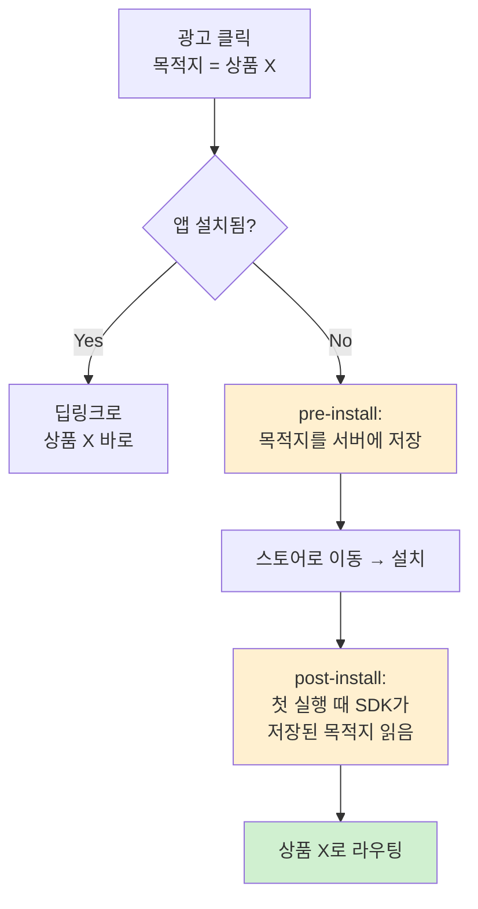

광고주가 여러 매체에 광고를 돌린다. 어떤 매체가 앱 설치를 만들어냈을까? 순진하게 생각하면 각 광고 네트워크에 물어보면 될 것 같다. 문제는 — **물어보면 다들 "내 덕"이라고 답한다.** 같은 설치 한 건을 A 네트워크도, B 네트워크도 자기 성과로 보고한다. 광고비를 집행하는 입장에서는 중복 집계된, 서로 모순되는 숫자만 쌓인다.

이 구조적 이해상충을 풀려고 등장한 게 **MMP(Mobile Measurement Partner)**다. 앞선 [유저 제스처와 딥링크 글](/ad-tech/deep-link/2026/06/20/user-gesture-deep-link/)에서 "딥링크 처리는 끝단 MMP의 몫"이라고만 짚고 넘어갔는데, 이번엔 그 MMP가 정확히 무엇을 하는 물건인지 본다. AppsFlyer·Adjust·Branch·Singular·Airbridge 같은 이름들이 모두 이 범주다.

---

## MMP는 제3자 측정 레이어다

MMP를 한 줄로 정의하면 **광고 클릭·노출을 앱 설치·인앱 이벤트에 매칭하는 중립적 제3자 측정 플랫폼**이다. [AppsFlyer의 정의](https://www.appsflyer.com/glossary/mmp/)를 빌리면 캠페인 성과를 균일하게 평가하기 위해 앱 데이터를 어트리뷰션하고 모으는 플랫폼이고, 이 역할은 **중립성**을 전제로 한다 — 경쟁하는 광고 네트워크들 사이에서 어느 매체에 크레딧을 줄지 판정하는 역할이다.

왜 제3자여야 하나?

- **자기 보고는 못 믿는다.** 광고 네트워크가 스스로 성과를 집계하면 부풀려진다. 이해당사자가 심판을 겸할 수 없다.
- **표준화가 필요하다.** 매체마다 식별자·포맷·콜백이 제각각이다. MMP는 그 위에 하나의 표준 측정 레이어를 깐다.
- **광고주가 직접 하기 어렵다.** 모든 매체와 개별 연동하고 중복 제거하는 건 비용이 크다.

> 주의: "유일하게 전체 여정을 보는 중립자"라는 표현은 벤더 마케팅 문구이기도 하다. 뒤에서 보겠지만 프라이버시 변화 이후 iOS 어트리뷰션은 상당 부분 Apple이 통제하는 집계 방식으로 넘어갔다. MMP가 모든 걸 보는 시대는 지났다.

---

## 어트리뷰션 = 매칭 문제

어트리뷰션은 **engagement(클릭/노출)를 install과 그 이후 인앱 이벤트(가입·구매 등)에 연결**하는 매칭이다. "이 설치는 어제 그 클릭에서 왔다"를 알아내는 것. 어떻게 두 사건을 같은 사람의 것이라고 묶느냐 — 여기서 방식이 셋으로 갈린다.

### 1. Deterministic — ID/referrer로 1:1 매칭

광고 식별자(안드로이드 GAID, iOS IDFA)나 click ID를 클릭과 설치 양쪽에서 확인해 **결정적으로** 묶는 방식이다.

안드로이드에는 특히 직접적인 수단이 있다 — **Google Play Install Referrer**. 동작은 이렇다.

1. 광고 클릭 링크에 캠페인 파라미터를 붙인다.
2. 그 정보가 클릭과 함께 **플레이 스토어로 전달**된다.
3. 설치 후 앱이 처음 실행될 때, SDK가 `getInstallReferrer()`로 그 문자열(referrer URL, 클릭/설치 타임스탬프, 앱 버전)을 읽어 어트리뷰션 서버로 보낸다.

[AppsFlyer는 이 방식이 "모바일 어트리뷰션에서 가능한 한 100%에 가까운 정확도"](https://www.appsflyer.com/glossary/install-referrer/)라고 말한다. 다만 이건 **벤더 자기주장**이고, 플레이 스토어 광고 클릭·안드로이드 한정이라는 단서가 붙는다.

### 2. Probabilistic — fingerprint로 확률 추정

결정적 ID가 없을 때만 쓰는 **폴백**이다. 클릭 시점에 device "snapshot"을 찍고, 설치 후의 snapshot과 **확률적으로 대조**한다. [Branch의 표현](https://www.branch.io/resources/blog/deferred-deep-linking-with-device-snapshotting/)으로는 snapshot은 "타임스탬프, IP 주소, OS, OS 버전, 기기 모델, 화면 크기 등"의 특성 집합이다. 둘이 일정 기준 이상 일치하면 같은 사람으로 본다.

당연히 결정적이지 않다. 실세계 정확도는 70~90% 수준으로 알려져 있고, **같은 WiFi를 쓰는 카페처럼 공유 네트워크에서는 오탐**이 난다. IP·기기 특성이 겹치는 남을 나로 착각하는 것이다.

### 3. SKAdNetwork — Apple의 집계 어트리뷰션

iOS에서 Apple이 직접 제공하는 프라이버시 보존형 방식. 유저 단위가 아니라 **캠페인 단위로 집계된** 포스트백을 준다. 누가 설치했는지는 모르고, "이 캠페인이 설치 N건"만 안다. 개별 매칭을 OS가 대신 해주고 결과만 익명·집계해서 돌려주는 모델이다.

---

## deferred deep link — 설치를 건너뛴 의도 복원

MMP가 어트리뷰션과 함께 책임지는 게 딥링크, 특히 **deferred deep link(디퍼드 딥링크)**다. 앱이 안 깔린 유저가 광고를 눌렀을 때, 스토어를 거쳐 설치한 뒤에도 **원래 보려던 화면으로 데려가는** 기능이다.

[Airbridge 글](https://www.airbridge.io/en/blog/deferred-deeplink-implementation-guide-for-ios-android)대로 이건 **2단계 프로세스**다.

- **pre-install** — 클릭 시 목적지(클릭 컨텍스트)를 **서버에 저장**하고 유저를 스토어로 보낸다.
- **post-install** — 설치 후 첫 실행에서 SDK가 그 목적지를 **읽어와 라우팅**한다(deferred deep link 콜백).

설치 직전과 직후를 어떻게 같은 사람으로 잇느냐가 다시 위 매칭 문제다. 안드로이드는 Install Referrer로 결정적으로, iOS는 (ATT 이후) 주로 fingerprint로 확률적으로 잇는다.

놓치기 쉬운 디테일 하나 — **매칭 시간 창은 provider별로 다르고 설정 가능하다.** [Branch는 기본 2시간](https://www.branch.io/resources/blog/deferred-deep-linking-with-device-snapshotting/)(클릭 후 앱 오픈의 99% 이상이 60분 내에 일어나기 때문), Airbridge는 약 1시간, AppsFlyer의 lookback은 15분. 이 창을 넘겨서 설치하면 저장된 목적지는 버려지고 기본/홈 화면으로 떨어진다. "약 1시간"을 보편 상수처럼 외우면 안 되는 이유다.

---

## 프라이버시 변화가 흔든 것

위 매칭 방식들은 지난 몇 년간 프라이버시 정책에 직격탄을 맞았다. MMP를 보려면 이 흐름까지 같이 봐야 한다.

- **Apple ATT (App Tracking Transparency, 2021)** — IDFA를 opt-in으로 바꿨다. 유저가 허락해야 광고 식별자를 쓸 수 있으니, **deterministic ID 매칭이 대폭 약화**됐다.
- **iCloud Private Relay (iOS 15+)** — Safari·인앱 Safari에서 IP를 가린다. fingerprint에서 비중이 큰 IP가 사라지니 **probabilistic 매칭도 약화**된다. (iOS 17은 fingerprinting 자체를 더 제약했다.)
- **SKAdNetwork / Android Privacy Sandbox** — 둘 다 유저 단위에서 **집계 단위**로 옮겨간다. [Android의 Attribution Reporting API](https://developer.android.com/design-for-safety/privacy-sandbox/guides/attribution)는 source(클릭/노출)와 trigger(전환)를 서버에서 매칭하되, event-level 리포트의 `trigger_data`를 **1~3비트로 잘라낸다**. 고유 식별자 대신 엔트로피가 낮은 신호만 흘려 정보 누출을 막는 설계다.

결과적으로 MMP의 일은 "유저 단위 결정 매칭"에서 "**플랫폼이 주는 집계 API를 잘 다루는 것**"으로 무게가 옮겨가고 있다. iOS 성과가 예전만큼 선명하게 안 잡히고, deferred deep link가 iOS에서 더 자주 깨지는 근본 배경이 이것이다.

---

## 남는 것

- **MMP는 광고 네트워크들의 자기 보고를 그대로 믿지 않기 위한 중립 측정 레이어**다. 클릭·노출을 설치·이벤트에 매칭(어트리뷰션)하고, 그 과정에서 딥링크를 끝단에서 처리한다.
- 어트리뷰션은 결국 **매칭 문제**다. 결정적(ID/referrer) → 확률적(fingerprint) → 집계(SKAdNetwork) 순으로 정확도와 프라이버시가 트레이드오프된다.
- **deferred deep link는 pre-install 저장 + post-install 복원의 2단계**이고, 매칭 시간 창은 provider별·설정값이다.
- ATT·Private Relay·Privacy Sandbox가 결정적·확률적 매칭을 차례로 깎아내면서, 어트리뷰션의 무게중심이 **유저 단위에서 집계 단위로** 이동 중이다.

"어떤 광고가 이 설치를 만들었나"라는 질문 하나가 식별자, 딥링크, 프라이버시 정책을 모두 끌고 들어온다. MMP는 그 질문에 답하려고 존재하는 레이어다. 그리고 그 답은 프라이버시 보호가 강해질수록 덜 선명해진다.

---

*1차 출처: [AppsFlyer — What is an MMP](https://www.appsflyer.com/glossary/mmp/) · [AppsFlyer — Install referrer](https://www.appsflyer.com/glossary/install-referrer/) · [AppsFlyer — Probabilistic modeling](https://www.appsflyer.com/glossary/probabilistic-modeling/) · [Branch — Deferred deep linking with device snapshotting](https://www.branch.io/resources/blog/deferred-deep-linking-with-device-snapshotting/) · [Airbridge — Deferred deeplink implementation guide](https://www.airbridge.io/en/blog/deferred-deeplink-implementation-guide-for-ios-android) · [Adjust — Deferred deep linking](https://dev.adjust.com/en/sdk/ios/features/deep-links/deferred/) · [Android — Privacy Sandbox Attribution Reporting](https://developer.android.com/design-for-safety/privacy-sandbox/guides/attribution)*
