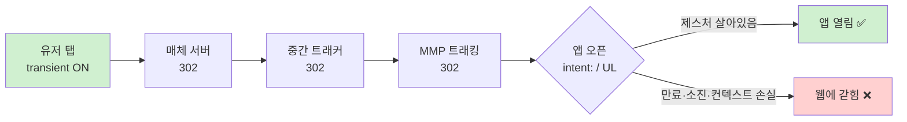

광고를 눌렀는데 앱이 안 열리고 모바일 웹 브라우저에 갇힌 적이 있을 것이다. 분명 그 앱이 깔려 있는데도. 광고 트래킹을 다루다 보면 "리다이렉트를 한 단 더 끼웠더니 딥링크가 깨졌다"는 이야기를 자주 만난다.

원인은 거의 항상 하나로 수렴한다. **유저 제스처(user gesture)가 만료되거나 소진됐기 때문이다.** 그래서 먼저 브라우저가 말하는 user activation이 무엇인지 보고, 안드로이드 `intent:`와 iOS Universal Links가 그 상태를 어떻게 쓰는지, 광고 클릭의 302 리다이렉트 체인이 어디서 권한을 잃는지 따라가 본다.

---

## 유저 제스처는 느낌이 아니라 명세된 상태다

"사용자가 방금 눌렀다"는 건 직관적인 말이지만, 브라우저 안에서는 [HTML 명세의 **user activation 모델**](https://html.spec.whatwg.org/multipage/interaction.html)이라는 형식화된 상태로 존재한다. `window.open()`으로 팝업을 띄우거나, 전체화면에 들어가거나, 외부 앱을 여는 것처럼 **사용자 경험을 해칠 수 있는 민감한 동작은 이 상태가 켜져 있을 때만** 허용된다.

모델은 두 개의 상태로 나뉜다.

| 상태 | 의미 | 노출 API |
|---|---|---|
| **sticky activation** | 페이지 로드 후 **한 번이라도** 상호작용했으면 이후 영구히 참. 한번 켜지면 다시 꺼지지 않는다. | `navigator.userActivation.hasBeenActive` |
| **transient activation** | **최근에** 상호작용했을 때만 짧은 시간 동안 참. 시간이 지나면 꺼진다. | `navigator.userActivation.isActive` |

Chrome은 이걸 내부적으로 [sticky bit와 transient bit, 두 비트로 구현](https://developer.chrome.com/blog/user-activation)한다. 앱 오픈처럼 위험한 동작을 게이트하는 건 **transient activation** 쪽이다. "예전에 한 번 눌렀다"로는 부족하고, "방금 눌렀다"여야 한다.

게이팅의 목적은 분명하다. MDN의 표현을 빌리면, [스크립트가 제멋대로 팝업을 띄울 수 없고 "UI 요소의 이벤트 핸들러에서 트리거되어야 한다"](https://developer.mozilla.org/en-US/docs/Glossary/Transient_activation). 즉 페이지가 로드되자마자 `window.open()`을 부르는 코드는 막히고, 사용자가 버튼을 탭했을 때 그 핸들러 안에서 부르는 건 통과한다.

---

## transient activation을 죽이는 두 가지 경로

실무에서 딥링크가 깨지는 모든 시나리오는 결국 이 둘 중 하나다.

### 1. 만료 (timeout)

transient activation은 **마지막 상호작용 후 정해진 시간이 지나면 자동으로 꺼진다.** 문제는 이 시간이 명세에 박혀 있지 않다는 점이다. 명세는 ["user-agent가 정하는 상수이며, 기껏해야 몇 초(at most a few seconds)"](https://html.spec.whatwg.org/multipage/interaction.html)라고만 말한다. 그리고 [WebKit은 이 값을 "JavaScript가 관측할 수 없도록 의도적으로 숨겼다"](https://webkit.org/blog/13862/the-user-activation-api/)고 명시한다. 사이트가 정확한 만료 시점을 알아내 우회하는 걸 막으려는 설계다.

엔진별로 알려진 값:

- **Chrome**: 약 5초. (개발자 블로그의 "약 1초"는 초기 버전 기준의 오래된 수치다. 명세가 값을 고정하지 않으므로 버전에 따라 달라질 수 있다.)
- **Firefox/Gecko**: [기본 5000ms](https://bugzilla.mozilla.org/show_bug.cgi?id=1509933), `dom.user_activation.transient.timeout` pref로 조정 가능.
- **Safari/WebKit**: 상수가 있으나 공개 수치 없음(위 정책대로 숨김).

> 그래서 코드나 글에서 "정확히 N초"라고 단정하면 안 된다. "몇 초, 엔진마다 다름, 관측 불가"가 정확한 서술이다.

### 2. 소진 (consume)

이쪽이 더 함정이다. `window.open()` 같은 일부 API는 **transient activation을 "써버린다".** 명세는 이를 [window의 last activation timestamp를 음의 무한대(−∞)로 설정](https://html.spec.whatwg.org/multipage/interaction.html)하는 것으로 정의한다 — 타임스탬프가 −∞이니 "최근"일 수가 없고, 따라서 transient는 즉시 거짓이 된다.

왜 이런 설계를 했나? 명세의 주석이 직접 답한다. **"사이트가 중첩 프레임을 악용해 activation-consuming API를 여러 번 호출하는 것을 막기 위해서"**다. 한 번의 탭으로 팝업을 하나만 띄울 수 있게, 여러 개를 못 띄우게.

실무 함의: **한 번의 탭에서 앱 오픈을 두 번 시도하면 두 번째는 실패한다.** 앞단 로직이 무언가 게이트된 API를 먼저 호출해 제스처를 소진했다면, 정작 딥링크를 열어야 할 시점엔 권한이 남아 있지 않다. 시계는 아직 5초가 안 지났는데도 깨진다.

transient activation은 **만료되거나 소진되거나** 둘 중 하나로 사라진다. sticky는 그대로 남지만, 앱 오픈 권한으로는 부족하다.

### 합성 이벤트는 제스처를 못 만든다

하나 더. activation을 부여하는 입력은 [`isTrusted` 속성이 `true`여야 한다](https://developer.mozilla.org/en-US/docs/Web/Security/User_activation). 실제 클릭·탭·키 입력만 해당하고, 스크립트가 `dispatchEvent`로 만든 합성 이벤트는 `isTrusted=false`라 정의상 제외된다. "코드로 클릭을 흉내 내서 앱을 열자"는 시도가 막히는 이유다.

---

## 안드로이드: `intent:` 스킴과 차단 조건

안드로이드 크롬에서 웹이 앱을 여는 표준 방법은 `intent:` URI다. [Chrome 공식 문서](https://developer.chrome.com/docs/android/intents)의 문법은 이렇다.

```
intent:HOST/URI-path#Intent;package=...;action=...;category=...;component=...;scheme=...;end;
```

`end`로 끝나는 게 특징이다. 앱이 없을 때를 대비해 `S.browser_fallback_url`로 폴백 URL을 지정하는 패턴이 흔하지만, **폴백을 생략했을 때 크롬이 자동으로 플레이 스토어를 연다는 건 사실이 아니다** — 이 글을 쓰며 돌린 검증에서 그 주장(2차 출처발)은 반증됐다. 미설치 동작을 보장하려면 폴백을 명시해야 한다.

크롬은 `intent:`를 만났다고 무조건 앱을 열지 않는다. 공식 문서가 명시하는 차단 조건:

- **유저 제스처 없이 시작된 intent** — `The Intent URI is initiated without user gesture.`
- **JS 타이머가 유저 제스처 없이 앱을 열려는 경우** — `A JavaScript timer tried to open an application without a user gesture.`
- **주소창에 타이핑된 URL에서 리다이렉트된 intent** — `The Intent URI is redirected from a typed in URL.`

마지막 항목이 헷갈리는 부분이다. 크롬은 **링크 클릭과 주소창 직접 입력을 구분**한다. 사용자가 직접 친 URL이 리다이렉트를 타고 `intent:`에 도달하면, "이건 사용자가 그 앱을 열려고 누른 게 아니다"로 보고 차단한다.

이게 UX 정책에 그치지 않고 보안 모델로 다뤄진 사례도 있다. 과거 [Firefox 모바일은 숨겨진 iframe 안의 `intent://` URL이 유저 상호작용 없이 외부 앱을 실행할 수 있는 버그](https://github.com/mozilla-mobile/android-components/issues/3857)가 있었고(나중에 CVE-2021-23957로 이어졌다), Mozilla는 이를 "Android Intents URLs shouldn't start without user's gesture"라는 제목의 정식 버그로 처리했다. **제스처 요건은 자동 앱 오픈 악용을 막는 방어선이다.**

> 반대로 말하면 — 안드로이드에서 **사용자가 링크를 직접 탭한 직후 즉시** `intent:`에 도달하면 정상적으로 앱이 열린다. "302가 한 번이라도 끼면 무조건 깨진다"는 건 과장이다. 진짜 문제는 뒤에서 다룬다.

---

## iOS: Universal Links의 무효화 정책

iOS는 `intent:` 같은 게 없고 Universal Links(`https://...` 주소가 앱이 있으면 앱으로, 없으면 웹으로)를 쓴다. 그런데 [Apple의 기술 노트 TN3155](https://developer.apple.com/documentation/technotes/tn3155-debugging-universal-links)는 안드로이드와 **놀랍도록 같은 철학**의 규칙을 명시한다.

- **(a) 주소창 직접 입력은 절대 앱을 안 연다.** *"Entering the URL directly into the web browser's address bar will never open the app."* — 안드로이드의 "typed in URL" 차단과 정확히 대응된다.
- **(b) 비-유니버설 링크가 유니버설 링크로 리다이렉트되면, 앱을 직접 열지 않고 브라우저를 경유한다.** *"If the link tapped on by the user is not a universal link but redirects to one, the user will be routed through the web browser... Redirection is allowed, although not preferred."* 리다이렉트가 금지는 아니지만 "선호되지 않는다"는 표현에 주목.
- **(c) 유니버설 링크가 직전 내비게이션과 같은 도메인이면 앱을 안 연다.** Safari는 "사용자가 브라우저 안에서 계속 탐색하고 싶어 한다"고 해석한다.

세 규칙 모두 한 방향을 가리킨다. **"사용자가 진짜로, 직접, 그 앱을 열려고 누른 것"이 아니면 앱을 열지 않는다.** 리다이렉트 체인은 이 "직접성"을 흐린다.

> 단, (c)의 동일 도메인·주소창 규칙은 Safari 기준이며 iOS 크롬 등 다른 브라우저에서는 동작이 다를 수 있다. iOS 쪽 세부 정책은 안드로이드만큼 1차 출처가 촘촘하지 않으니 단정은 피하는 게 좋다.

---

## 그래서 광고 클릭의 302 체인은 어디서 깨지나

이제 조각을 맞출 수 있다. 광고 클릭은 추적을 위해 보통 서버를 한두 단 거쳐 최종 도착지로 간다.



탭 한 번이 transient activation을 켠다. 그 다음 302가 한 단씩 쌓일 때마다 브라우저는 "새 페이지 이동"으로 취급하고, 두 가지가 동시에 위협받는다.

1. **시간**: 리다이렉트 체인과 네트워크 지연이 누적되면 transient 창(몇 초)을 넘긴다. 마지막에 딥링크를 만나도 남은 제스처가 없다. → **만료.**
2. **컨텍스트**: 체인을 타고 오면서 "사용자가 직접 탭한 링크"라는 성질이 흐려진다. 안드로이드는 이를 "typed URL에서 리다이렉트됨"이나 "no user gesture"로, iOS는 "리다이렉트는 브라우저 경유" 또는 "동일 도메인"으로 분류해 앱 오픈을 강등하거나 차단한다. → **직접성 손실.**

여기에 앞단 로직이 게이트된 API를 먼저 호출했다면 **소진**까지 겹친다. 세 가지가 같은 방향으로 작용하니, 홉이 늘어날수록 위험은 순수하게 커지기만 한다.

> 비유하자면 — 친구에게 직접 부탁하면 들어주지만, 사람 셋을 거쳐 전달된 부탁은 "진짜 네가 한 거 맞아?" 하고 안 들어준다. **앱 열기 권한은 전달될수록 힘을 잃는다.**

---

## 원리에서 나오는 일반 원칙

위 동작을 기준으로 보면 업계에서 통용되는 몇 가지 원칙이 나온다. 한 줄로 줄이면 **"진짜 탭의 권한이 살아 있는 동안, 가능한 한 적은 홉으로 앱 오픈에 도달하라"**다.

- **홉이 적을수록 실패 지점도 줄어든다.** 리다이렉트가 한 단 줄면 시간 창 안에 들어올 확률과 클릭 컨텍스트가 보존될 확률이 동시에 올라간다.
- **딥링크 처리는 파이프라인 끝단의 몫이다.** 이건 MMP(Mobile Measurement Partner) 벤더들이 공통으로 내세우는 모델이다. 중간 서버가 딥링크를 직접 살리려 하기보다, 마지막 단의 SDK/스마트 링크가 디바이스 컨텍스트(OS·브라우저·앱 설치 여부)를 보고 스킴/App Links/Universal Links 중 맞는 방식을 **클라이언트 사이드에서** 고른다. 클라이언트에서 처리하면 서버 302 체인이 깎아먹는 "직접성"을 우회할 수 있다.
- **앞단에서 게이트된 API를 함부로 부르지 않는다.** 앱 오픈 전에 `window.open()` 류를 호출하면 제스처가 소진된다. "한 번의 탭에는 한 번의 앱 오픈"이라고 생각하는 게 안전하다.
- **합성 클릭으로 우회할 수 없다.** `isTrusted=false`라 정의상 막힌다.

> 이 원칙들의 인과 사슬 자체("302 체인 → 만료/소진/컨텍스트 손실 → 깨짐")는 명세와 벤더 공개 문서에서 연역한 합성적 추론이다. 단일 1차 출처가 이 문구 그대로 검증하지는 않으니, 신뢰도는 "원리는 high, 구체 처방은 medium" 정도로 잡는 게 정직하다.

---

## 디버깅할 때 볼 것

- 유저 제스처는 느낌이 아니라 HTML 명세의 **user activation** 상태다. 앱 오픈을 게이트하는 건 "방금 눌렀다"인 **transient activation**이고, "예전에 눌렀다"인 sticky로는 안 된다.
- transient는 **만료(몇 초, 엔진마다 다르고 관측 불가)** 또는 **소진(`window.open` 등이 −∞로 써버림)**으로 사라진다. 합성 이벤트(`isTrusted=false`)는 애초에 제스처를 못 만든다.
- 안드로이드 `intent:`와 iOS Universal Links는 같은 철학으로, **사용자가 직접 탭한 게 아니거나(주소창 입력·리다이렉트·타이머) 컨텍스트가 흐려지면** 앱을 안 연다.
- 광고 클릭의 302 체인은 **시간·직접성·소진**을 동시에 위협한다. 그래서 **홉을 줄이고, 딥링크는 끝단 MMP의 클라이언트 사이드에 맡기는 것**이 정석이다.

"앱이 안 열리고 브라우저에 갇힌다"를 디버깅할 때, 이제 질문은 하나로 좁혀진다. **마지막 앱 오픈 시점에 진짜 탭의 권한이 살아 있었는가?**

---

*1차 출처: [WHATWG HTML — interaction](https://html.spec.whatwg.org/multipage/interaction.html) · [MDN — Transient activation](https://developer.mozilla.org/en-US/docs/Glossary/Transient_activation) · [MDN — User activation](https://developer.mozilla.org/en-US/docs/Web/Security/User_activation) · [WebKit — The User Activation API](https://webkit.org/blog/13862/the-user-activation-api/) · [Chrome — User activation](https://developer.chrome.com/blog/user-activation) · [Chrome — Android intents](https://developer.chrome.com/docs/android/intents) · [Apple — TN3155 Debugging Universal Links](https://developer.apple.com/documentation/technotes/tn3155-debugging-universal-links) · [Mozilla android-components #3857](https://github.com/mozilla-mobile/android-components/issues/3857)*
